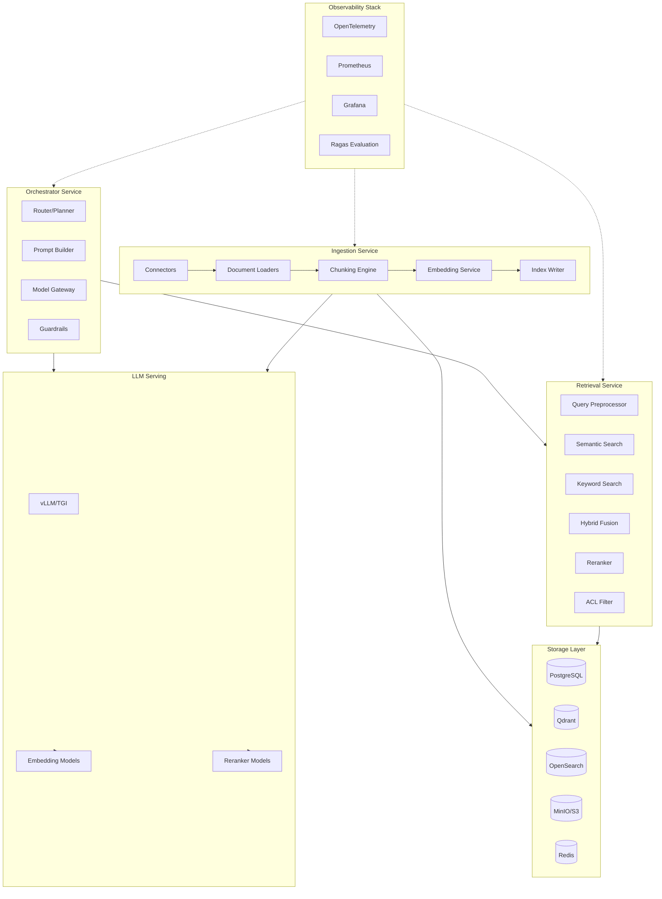
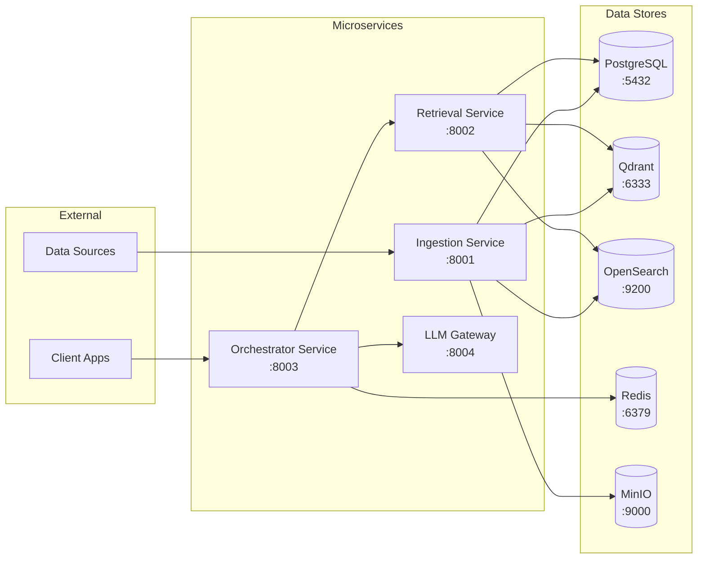
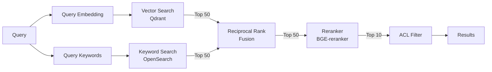
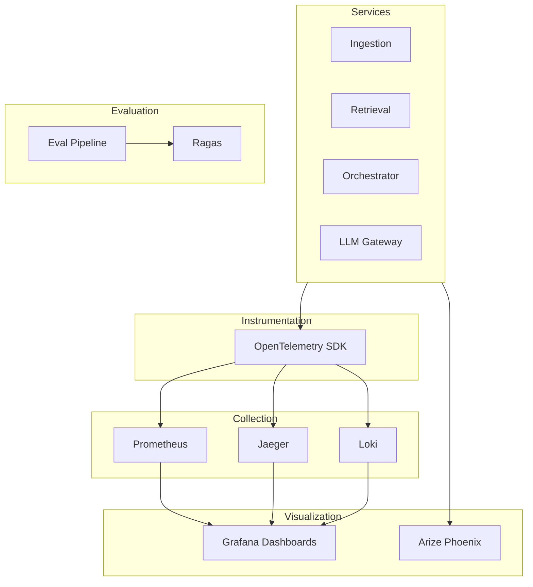
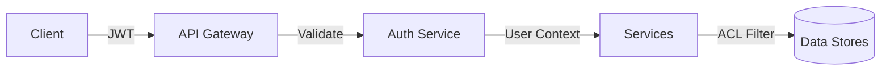
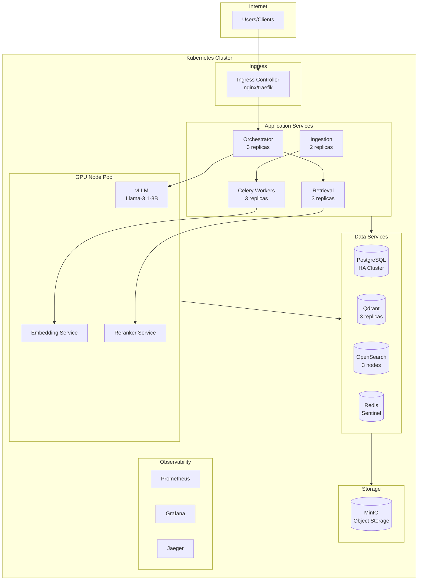

# Ultimate RAG Pipeline Architecture

> **Version:** 1.0  
> **Status:** Production Reference Architecture  
> **Last Updated:** December 2025

## Executive Summary

This document defines a production-grade Retrieval-Augmented Generation (RAG) architecture that is modular, observable, and data-centric. The architecture cleanly separates ingestion, retrieval, orchestration, and evaluation concerns, enabling independent scaling and component swapping as the ecosystem evolves.

---

## Table of Contents

1. [Architecture Overview](#architecture-overview)
2. [Technology Stack](#technology-stack)
3. [Service Architecture](#service-architecture)
4. [Data Schemas](#data-schemas)
5. [API Contracts](#api-contracts)
6. [Chunking & Embedding Strategy](#chunking--embedding-strategy)
7. [Hybrid Search & Reranking](#hybrid-search--reranking)
8. [Observability & Evaluation](#observability--evaluation)
9. [Security & Compliance](#security--compliance)
10. [Deployment Architecture](#deployment-architecture)
11. [Cost & Performance Optimization](#cost--performance-optimization)

---

## Architecture Overview



### Core Pipeline Stages

| Stage | Purpose | Key Outputs |
|-------|---------|-------------|
| **Ingestion** | Load, chunk, embed, and index documents | Vectors + metadata in stores |
| **Retrieval** | Find relevant context for queries | Ranked document chunks |
| **Orchestration** | Coordinate LLM calls and business logic | Generated responses |
| **Evaluation** | Measure and improve system quality | Metrics, feedback loops |

---

## Technology Stack

### Reference Implementation (Open Source First)

| Layer | Technology | Rationale |
|-------|------------|-----------|
| **Language** | Python 3.11+ | Ecosystem maturity, ML library support |
| **Package Manager** | `uv` or `poetry` | Reproducible environments |
| **API Framework** | FastAPI + Pydantic v2 | Async support, auto OpenAPI docs, typed validation |
| **Task Queue** | Celery + Redis | Distributed ingestion, re-embedding jobs |
| **Vector Database** | **Qdrant** | High-performance HNSW, excellent filtering, hybrid search, easy ops |
| **Keyword Search** | **OpenSearch** | BM25, rich analyzers, production-ready |
| **Metadata DB** | PostgreSQL 16+ | ACID, JSON support, mature tooling |
| **Object Storage** | MinIO / S3 | Raw document storage |
| **Cache** | Redis | Query cache, embedding cache |
| **Orchestration** | **LangGraph** (LangChain) | Stateful workflows, graph-based control flow |
| **LLM Serving** | **vLLM** | High-throughput, OpenAI-compatible API |
| **Embedding Models** | `BAAI/bge-large-en-v1.5` | Top MTEB performance, MIT license |
| **Reranker** | `BAAI/bge-reranker-v2-m3` | Cross-encoder, multilingual |
| **Evaluation** | Ragas + Arize Phoenix | RAG-specific metrics, LLM observability |
| **Tracing** | OpenTelemetry → Jaeger | Distributed tracing |
| **Metrics** | Prometheus + Grafana | Dashboards, alerting |

### Model Recommendations

#### Embedding Models (MTEB Benchmarks)

| Model | Dimensions | Context | Best For |
|-------|------------|---------|----------|
| `BAAI/bge-large-en-v1.5` | 1024 | 512 | **Primary - English** |
| `BAAI/bge-m3` | 1024 | 8192 | Multilingual, long context |
| `intfloat/e5-large-v2` | 1024 | 512 | Alternative high-quality |
| `thenlper/gte-large` | 1024 | 512 | Alibaba, strong retrieval |

#### LLM Models

| Model | Parameters | Use Case |
|-------|------------|----------|
| `meta-llama/Llama-3.1-8B-Instruct` | 8B | **Default** - fast, capable |
| `meta-llama/Llama-3.1-70B-Instruct` | 70B | Complex reasoning, fallback |
| `mistralai/Mixtral-8x7B-Instruct-v0.1` | 47B | High-throughput alternative |

#### Reranker Models

| Model | Latency | Quality |
|-------|---------|---------|
| `BAAI/bge-reranker-v2-m3` | ~50ms/batch | **Best quality** |
| `BAAI/bge-reranker-base` | ~20ms/batch | Faster, slightly lower quality |

---

## Service Architecture

### Service Layout



### 1. Ingestion Service

**Responsibilities:**
- Source connectors (files, databases, APIs, web)
- Document parsing and validation
- Chunking with configurable strategies
- Embedding generation (batched, parallelized)
- Index writing to vector and keyword stores
- Metadata enrichment and PII detection

**Components:**

```
ingestion-service/
├── api/
│   ├── routes.py          # FastAPI endpoints
│   └── schemas.py         # Pydantic models
├── connectors/
│   ├── filesystem.py      # Local/S3 file connector
│   ├── database.py        # SQL database connector
│   ├── web.py             # Web scraper connector
│   └── api.py             # REST API connector
├── processors/
│   ├── parsers/
│   │   ├── pdf.py         # PDF parsing (PyMuPDF, Unstructured)
│   │   ├── docx.py        # Word documents
│   │   └── html.py        # HTML/web pages
│   ├── chunking.py        # Chunking strategies
│   └── enrichment.py      # Metadata extraction
├── embedding/
│   ├── service.py         # Embedding generation
│   └── cache.py           # Embedding cache (Redis)
├── indexing/
│   ├── qdrant.py          # Vector store writer
│   ├── opensearch.py      # Keyword index writer
│   └── postgres.py        # Metadata store
└── tasks/
    ├── ingest.py          # Celery ingestion tasks
    └── reembed.py         # Re-embedding tasks
```

### 2. Retrieval Service

**Responsibilities:**
- Query understanding and rewriting
- Hybrid search (semantic + keyword)
- Result fusion (RRF)
- Reranking
- ACL enforcement
- Retrieval logging

**Components:**

```
retrieval-service/
├── api/
│   ├── routes.py
│   └── schemas.py
├── query/
│   ├── preprocessor.py    # Query normalization
│   ├── expansion.py       # HyDE, query reformulation
│   └── language.py        # Language detection
├── search/
│   ├── semantic.py        # Qdrant vector search
│   ├── keyword.py         # OpenSearch BM25
│   └── hybrid.py          # Fusion strategies (RRF)
├── ranking/
│   ├── reranker.py        # Cross-encoder reranking
│   └── filters.py         # ACL, metadata filters
└── logging/
    └── retrieval_log.py   # Log all retrievals
```

### 3. Orchestrator Service

**Responsibilities:**
- Intent classification and routing
- RAG vs direct LLM decision
- Prompt construction with templates
- LLM call management
- Response validation and guardrails
- Citation alignment

**Components:**

```
orchestrator-service/
├── api/
│   ├── routes.py          # /chat, /generate endpoints
│   └── schemas.py
├── workflows/
│   ├── rag_workflow.py    # LangGraph RAG flow
│   ├── nodes/
│   │   ├── classify.py    # Intent classification
│   │   ├── retrieve.py    # Call retrieval service
│   │   ├── prompt.py      # Build prompts
│   │   ├── generate.py    # LLM calls
│   │   └── validate.py    # Response validation
│   └── edges.py           # Conditional routing
├── prompts/
│   ├── templates/         # Jinja2 prompt templates
│   └── manager.py         # Template selection
├── guardrails/
│   ├── input.py           # Input validation
│   ├── output.py          # Output validation
│   └── citations.py       # Citation extraction
└── state/
    ├── conversation.py    # Conversation storage
    └── cache.py           # Response cache
```

### 4. LLM Gateway Service

**Responsibilities:**
- Model routing (cheap vs expensive)
- Request batching
- Retry/backoff logic
- Rate limiting
- Usage tracking

**Deployment:** vLLM with OpenAI-compatible API

```yaml
# vLLM deployment
model: meta-llama/Llama-3.1-8B-Instruct
tensor_parallel_size: 1
max_model_len: 8192
api_key: ${VLLM_API_KEY}
```

---

## Data Schemas

### PostgreSQL Schema

```sql
-- Source documents metadata
CREATE TABLE source_documents (
    id UUID PRIMARY KEY DEFAULT gen_random_uuid(),
    tenant_id UUID NOT NULL,
    source_type VARCHAR(50) NOT NULL,  -- FILE, WEB, DB, API
    source_uri TEXT NOT NULL,
    external_id VARCHAR(255),
    title TEXT,
    raw_location TEXT,  -- S3/MinIO URI
    content_hash VARCHAR(64),  -- SHA-256 for deduplication
    ingested_at TIMESTAMPTZ DEFAULT NOW(),
    updated_at TIMESTAMPTZ DEFAULT NOW(),
    version INTEGER DEFAULT 1,
    schema_version VARCHAR(20) DEFAULT '1.0',
    visibility VARCHAR(50) DEFAULT 'private',
    allowed_groups UUID[],
    metadata JSONB DEFAULT '{}',
    
    CONSTRAINT unique_tenant_source UNIQUE (tenant_id, source_uri, content_hash)
);

CREATE INDEX idx_docs_tenant ON source_documents(tenant_id);
CREATE INDEX idx_docs_source_type ON source_documents(source_type);
CREATE INDEX idx_docs_metadata ON source_documents USING GIN(metadata);

-- Document chunks
CREATE TABLE chunks (
    id UUID PRIMARY KEY DEFAULT gen_random_uuid(),
    document_id UUID NOT NULL REFERENCES source_documents(id) ON DELETE CASCADE,
    chunk_index INTEGER NOT NULL,
    content TEXT NOT NULL,
    token_count INTEGER,
    embedding_model VARCHAR(100),
    embedding_version VARCHAR(20),
    created_at TIMESTAMPTZ DEFAULT NOW(),
    metadata JSONB DEFAULT '{}',
    
    CONSTRAINT unique_doc_chunk UNIQUE (document_id, chunk_index)
);

CREATE INDEX idx_chunks_document ON chunks(document_id);

-- Embedding jobs for re-embedding
CREATE TABLE embedding_jobs (
    id UUID PRIMARY KEY DEFAULT gen_random_uuid(),
    status VARCHAR(20) DEFAULT 'pending',  -- pending, running, completed, failed
    embedding_model VARCHAR(100),
    target_scope JSONB,  -- filter for documents to re-embed
    started_at TIMESTAMPTZ,
    completed_at TIMESTAMPTZ,
    error_message TEXT,
    stats JSONB DEFAULT '{}'
);

-- Retrieval logs for debugging and evaluation
CREATE TABLE retrieval_logs (
    id UUID PRIMARY KEY DEFAULT gen_random_uuid(),
    tenant_id UUID NOT NULL,
    user_id UUID,
    query TEXT NOT NULL,
    effective_query TEXT,
    retrieved_chunk_ids UUID[],
    scores JSONB,
    filters_applied JSONB,
    latency_ms INTEGER,
    created_at TIMESTAMPTZ DEFAULT NOW()
);

CREATE INDEX idx_retrieval_logs_tenant ON retrieval_logs(tenant_id, created_at);

-- Conversations and messages
CREATE TABLE conversations (
    id UUID PRIMARY KEY DEFAULT gen_random_uuid(),
    tenant_id UUID NOT NULL,
    user_id UUID,
    created_at TIMESTAMPTZ DEFAULT NOW(),
    updated_at TIMESTAMPTZ DEFAULT NOW(),
    metadata JSONB DEFAULT '{}'
);

CREATE TABLE messages (
    id UUID PRIMARY KEY DEFAULT gen_random_uuid(),
    conversation_id UUID NOT NULL REFERENCES conversations(id) ON DELETE CASCADE,
    role VARCHAR(20) NOT NULL,  -- user, assistant, system
    content TEXT NOT NULL,
    citations JSONB,
    metadata JSONB DEFAULT '{}',
    created_at TIMESTAMPTZ DEFAULT NOW()
);

CREATE INDEX idx_messages_conversation ON messages(conversation_id, created_at);

-- Evaluation datasets and runs
CREATE TABLE eval_datasets (
    id UUID PRIMARY KEY DEFAULT gen_random_uuid(),
    name VARCHAR(255) NOT NULL,
    description TEXT,
    created_at TIMESTAMPTZ DEFAULT NOW()
);

CREATE TABLE eval_examples (
    id UUID PRIMARY KEY DEFAULT gen_random_uuid(),
    dataset_id UUID NOT NULL REFERENCES eval_datasets(id) ON DELETE CASCADE,
    query TEXT NOT NULL,
    ground_truth_answer TEXT,
    relevant_chunk_ids UUID[],
    metadata JSONB DEFAULT '{}'
);

CREATE TABLE eval_runs (
    id UUID PRIMARY KEY DEFAULT gen_random_uuid(),
    dataset_id UUID NOT NULL REFERENCES eval_datasets(id),
    pipeline_version VARCHAR(50),
    embedding_model VARCHAR(100),
    llm_model VARCHAR(100),
    started_at TIMESTAMPTZ DEFAULT NOW(),
    completed_at TIMESTAMPTZ,
    metrics JSONB DEFAULT '{}'
);
```

### Qdrant Collection Schema

```python
from qdrant_client import QdrantClient
from qdrant_client.models import (
    VectorParams, Distance, PayloadSchemaType
)

# Collection configuration
collection_config = {
    "collection_name": "documents",
    "vectors_config": VectorParams(
        size=1024,  # BGE-large dimensions
        distance=Distance.COSINE,
        on_disk=True  # For large collections
    ),
    "hnsw_config": {
        "m": 16,
        "ef_construct": 100,
        "full_scan_threshold": 10000
    },
    "payload_schema": {
        "tenant_id": PayloadSchemaType.KEYWORD,
        "document_id": PayloadSchemaType.KEYWORD,
        "chunk_index": PayloadSchemaType.INTEGER,
        "source_type": PayloadSchemaType.KEYWORD,
        "source_uri": PayloadSchemaType.TEXT,
        "title": PayloadSchemaType.TEXT,
        "section_heading": PayloadSchemaType.TEXT,
        "language": PayloadSchemaType.KEYWORD,
        "allowed_groups": PayloadSchemaType.KEYWORD,
        "created_at": PayloadSchemaType.DATETIME
    }
}
```

### OpenSearch Index Mapping

```json
{
  "settings": {
    "number_of_shards": 3,
    "number_of_replicas": 1,
    "analysis": {
      "analyzer": {
        "default": {
          "type": "standard",
          "stopwords": "_english_"
        }
      }
    }
  },
  "mappings": {
    "properties": {
      "chunk_id": { "type": "keyword" },
      "document_id": { "type": "keyword" },
      "tenant_id": { "type": "keyword" },
      "content": { 
        "type": "text",
        "analyzer": "standard"
      },
      "title": { "type": "text" },
      "source_uri": { "type": "keyword" },
      "source_type": { "type": "keyword" },
      "language": { "type": "keyword" },
      "allowed_groups": { "type": "keyword" },
      "metadata": { "type": "object", "enabled": false },
      "created_at": { "type": "date" }
    }
  }
}
```

---

## API Contracts

### Ingestion Service API

> **Base URL:** `http://localhost:8001`
> **API Version:** v1

#### POST /api/v1/ingest

Ingest a new document.

**Request:**
```json
{
  "tenant_id": "uuid",
  "source_type": "FILE",
  "source_uri": "s3://bucket/path/document.pdf",
  "title": "Document Title",
  "metadata": {
    "author": "John Doe",
    "department": "Engineering"
  },
  "visibility": "private",
  "allowed_groups": ["group-uuid-1", "group-uuid-2"]
}
```

**Response:**
```json
{
  "document_id": "uuid",
  "status": "queued",
  "job_id": "uuid",
  "estimated_completion": "2025-12-18T12:00:00Z"
}
```

#### POST /api/v1/ingest/sync

Trigger incremental sync for a source.

**Request:**
```json
{
  "tenant_id": "uuid",
  "source_type": "DATABASE",
  "source_config": {
    "connection_string": "postgresql://...",
    "table": "articles",
    "updated_since": "2025-12-01T00:00:00Z"
  }
}
```

#### POST /api/v1/ingest/reembed

Start re-embedding job with new model.

**Request:**
```json
{
  "embedding_model": "BAAI/bge-m3",
  "target_scope": {
    "tenant_id": "uuid",
    "source_types": ["FILE", "WEB"]
  }
}
```

### Retrieval Service API

> **Base URL:** `http://localhost:8002`
> **API Version:** v1

#### POST /api/v1/retrieve

Search for relevant chunks.

**Request:**
```json
{
  "query": "How do I reset my SSO password?",
  "tenant_id": "uuid",
  "user_id": "uuid",
  "top_k": 20,
  "filters": {
    "source_types": ["kb_article", "policy"],
    "language": "en",
    "date_range": {
      "after": "2024-01-01"
    }
  },
  "options": {
    "hybrid": true,
    "use_reranker": true,
    "semantic_weight": 0.7,
    "keyword_weight": 0.3
  }
}
```

**Response:**
```json
{
  "query": "How do I reset my SSO password?",
  "effective_query": "reset single sign-on password company account",
  "results": [
    {
      "chunk_id": "uuid",
      "document_id": "uuid",
      "score": 0.87,
      "rank": 1,
      "content": "To reset your SSO password, navigate to...",
      "metadata": {
        "source_uri": "https://kb.example.com/articles/123",
        "title": "Resetting your SSO password",
        "section_heading": "Reset steps"
      }
    }
  ],
  "debug": {
    "semantic_results": 50,
    "keyword_results": 50,
    "after_fusion": 50,
    "after_rerank": 20,
    "latency_ms": {
      "embedding": 15,
      "semantic_search": 45,
      "keyword_search": 30,
      "fusion": 5,
      "rerank": 120,
      "total": 215
    }
  },
  "retrieval_id": "uuid"
}
```

### Orchestrator Service API

> **Base URL:** `http://localhost:8003`
> **API Version:** v1

#### POST /api/v1/query

Main chat endpoint with RAG.

**Request:**
```json
{
  "conversation_id": "uuid",
  "tenant_id": "uuid",
  "user_id": "uuid",
  "messages": [
    {
      "role": "user",
      "content": "How do I reset my SSO password?"
    }
  ],
  "options": {
    "mode": "qa",
    "max_tokens": 512,
    "temperature": 0.2,
    "stream": false,
    "include_citations": true
  }
}
```

**Response:**
```json
{
  "conversation_id": "uuid",
  "message": {
    "role": "assistant",
    "content": "To reset your SSO password, follow these steps:\n\n1. Go to the SSO portal at https://sso.company.com\n2. Click 'Forgot Password'\n3. Enter your email address\n4. Check your email for the reset link\n5. Follow the link to create a new password\n\nIf you don't receive the email within 5 minutes, check your spam folder or contact IT support.",
    "citations": [
      {
        "chunk_id": "uuid",
        "document_id": "uuid",
        "source_uri": "https://kb.example.com/articles/123",
        "title": "Resetting your SSO password",
        "span": [0, 180]
      }
    ]
  },
  "debug": {
    "retrieval_id": "uuid",
    "used_rag": true,
    "model": "llama-3.1-8b-instruct",
    "tokens": {
      "prompt": 1250,
      "completion": 120,
      "total": 1370
    },
    "latency_ms": {
      "retrieval": 215,
      "generation": 450,
      "total": 680
    }
  }
}
```

#### POST /api/v1/query/stream (Streaming)

**Request:** Same as above with `"stream": true`

**Response:** Server-Sent Events (SSE)
```
event: start
data: {"conversation_id": "uuid", "message_id": "uuid"}

event: delta
data: {"content": "To reset"}

event: delta
data: {"content": " your SSO password"}

event: citations
data: {"citations": [...]}

event: done
data: {"tokens": {"prompt": 1250, "completion": 120}}
```

---

## Chunking & Embedding Strategy

### Chunking Configuration

```python
from dataclasses import dataclass
from enum import Enum

class ChunkingStrategy(Enum):
    FIXED_SIZE = "fixed_size"
    RECURSIVE = "recursive"
    SEMANTIC = "semantic"
    DOCUMENT_STRUCTURE = "document_structure"

@dataclass
class ChunkingConfig:
    strategy: ChunkingStrategy = ChunkingStrategy.RECURSIVE
    target_tokens: int = 300  # ~200-400 tokens optimal
    max_tokens: int = 512
    overlap_tokens: int = 50  # 10-20% overlap
    separators: list = None  # For recursive: ["\n\n", "\n", ". ", " "]
    
    # Metadata to preserve
    preserve_headings: bool = True
    include_document_title: bool = True
    include_section_path: bool = True
```

### Recommended Defaults

| Document Type | Strategy | Target Tokens | Overlap |
|--------------|----------|---------------|---------|
| **General text** | Recursive | 300 | 50 |
| **Technical docs** | Document structure | 400 | 80 |
| **FAQs** | Per Q&A block | Variable | 0 |
| **Code** | Function/class based | 200 | 20 |
| **Legal/contracts** | Paragraph-based | 500 | 100 |

### Embedding Pipeline

```python
from sentence_transformers import SentenceTransformer
import torch

class EmbeddingService:
    def __init__(
        self,
        model_name: str = "BAAI/bge-large-en-v1.5",
        batch_size: int = 32,
        device: str = "cuda" if torch.cuda.is_available() else "cpu"
    ):
        self.model = SentenceTransformer(model_name)
        self.model.to(device)
        self.batch_size = batch_size
        
    def embed_documents(self, texts: list[str]) -> list[list[float]]:
        """Embed documents without instruction prefix."""
        return self.model.encode(
            texts,
            batch_size=self.batch_size,
            normalize_embeddings=True,
            show_progress_bar=True
        ).tolist()
    
    def embed_query(self, query: str) -> list[float]:
        """Embed query with instruction prefix for BGE models."""
        instruction = "Represent this sentence for searching relevant passages: "
        return self.model.encode(
            instruction + query,
            normalize_embeddings=True
        ).tolist()
```

---

## Hybrid Search & Reranking

### Hybrid Search Architecture



### Reciprocal Rank Fusion (RRF)

```python
def reciprocal_rank_fusion(
    semantic_results: list[dict],
    keyword_results: list[dict],
    k: int = 60,  # RRF constant
    semantic_weight: float = 0.7,
    keyword_weight: float = 0.3
) -> list[dict]:
    """
    Combine semantic and keyword search results using RRF.
    
    RRF score = sum(weight / (k + rank))
    """
    scores = {}
    
    # Score semantic results
    for rank, result in enumerate(semantic_results, 1):
        chunk_id = result["chunk_id"]
        scores[chunk_id] = scores.get(chunk_id, 0) + semantic_weight / (k + rank)
        
    # Score keyword results  
    for rank, result in enumerate(keyword_results, 1):
        chunk_id = result["chunk_id"]
        scores[chunk_id] = scores.get(chunk_id, 0) + keyword_weight / (k + rank)
    
    # Sort by combined score
    combined = sorted(scores.items(), key=lambda x: x[1], reverse=True)
    
    return [{"chunk_id": cid, "rrf_score": score} for cid, score in combined]
```

### Reranking Service

```python
from transformers import AutoModelForSequenceClassification, AutoTokenizer
import torch

class RerankerService:
    def __init__(
        self,
        model_name: str = "BAAI/bge-reranker-v2-m3",
        device: str = "cuda" if torch.cuda.is_available() else "cpu"
    ):
        self.tokenizer = AutoTokenizer.from_pretrained(model_name)
        self.model = AutoModelForSequenceClassification.from_pretrained(model_name)
        self.model.to(device)
        self.model.eval()
        self.device = device
        
    def rerank(
        self,
        query: str,
        documents: list[dict],
        top_k: int = 10
    ) -> list[dict]:
        """Rerank documents using cross-encoder."""
        pairs = [[query, doc["content"]] for doc in documents]
        
        with torch.no_grad():
            inputs = self.tokenizer(
                pairs,
                padding=True,
                truncation=True,
                max_length=512,
                return_tensors="pt"
            ).to(self.device)
            
            scores = self.model(**inputs).logits.squeeze(-1).cpu().tolist()
        
        # Add scores and sort
        for doc, score in zip(documents, scores):
            doc["rerank_score"] = score
            
        return sorted(documents, key=lambda x: x["rerank_score"], reverse=True)[:top_k]
```

---

## Observability & Evaluation

### Metrics Architecture



### Key Metrics

#### System Metrics

| Metric | Type | Description | Target |
|--------|------|-------------|--------|
| `ingestion_documents_total` | Counter | Documents ingested | - |
| `ingestion_latency_seconds` | Histogram | Time to ingest document | p95 < 30s |
| `retrieval_latency_seconds` | Histogram | Search latency | p95 < 300ms |
| `generation_latency_seconds` | Histogram | LLM response time | p95 < 2s |
| `retrieval_results_count` | Histogram | Results per query | - |
| `llm_tokens_total` | Counter | Tokens consumed | - |
| `cache_hit_ratio` | Gauge | Query cache effectiveness | > 0.3 |

#### Quality Metrics (Ragas)

| Metric | Description | Target |
|--------|-------------|--------|
| `context_precision` | Relevance of retrieved chunks | > 0.8 |
| `context_recall` | Coverage of ground truth | > 0.7 |
| `faithfulness` | Grounded in retrieved context | > 0.9 |
| `answer_relevancy` | Answer matches query intent | > 0.8 |

### Evaluation Pipeline

```python
from ragas import evaluate
from ragas.metrics import (
    context_precision,
    context_recall,
    faithfulness,
    answer_relevancy
)

async def run_evaluation(
    dataset_id: str,
    pipeline_version: str
) -> dict:
    """Run Ragas evaluation on a dataset."""
    
    # Load evaluation examples
    examples = await load_eval_examples(dataset_id)
    
    # Generate predictions
    predictions = []
    for example in examples:
        result = await rag_pipeline.query(example.query)
        predictions.append({
            "question": example.query,
            "answer": result.answer,
            "contexts": [c.content for c in result.contexts],
            "ground_truth": example.ground_truth_answer
        })
    
    # Run Ragas evaluation
    results = evaluate(
        predictions,
        metrics=[
            context_precision,
            context_recall,
            faithfulness,
            answer_relevancy
        ]
    )
    
    return {
        "pipeline_version": pipeline_version,
        "dataset_id": dataset_id,
        "metrics": results.to_dict(),
        "timestamp": datetime.utcnow().isoformat()
    }
```

---

## Security & Compliance

### Authentication & Authorization



#### Token Structure

```json
{
  "sub": "user-uuid",
  "tenant_id": "tenant-uuid",
  "groups": ["group-1", "group-2"],
  "roles": ["user", "admin"],
  "permissions": ["read:documents", "write:documents"],
  "exp": 1735000000
}
```

### ACL Enforcement

```python
class ACLFilter:
    def build_filter(self, user_context: dict) -> dict:
        """Build Qdrant/OpenSearch filter based on user permissions."""
        return {
            "must": [
                {"key": "tenant_id", "match": {"value": user_context["tenant_id"]}},
                {
                    "should": [
                        {"key": "visibility", "match": {"value": "public"}},
                        {
                            "key": "allowed_groups",
                            "match": {"any": user_context["groups"]}
                        }
                    ]
                }
            ]
        }
```

### Data Protection

| Concern | Solution |
|---------|----------|
| **Encryption at rest** | AES-256 for S3, PostgreSQL TDE, Qdrant disk encryption |
| **Encryption in transit** | TLS 1.3 for all connections |
| **PII detection** | Microsoft Presidio during ingestion |
| **Secrets management** | HashiCorp Vault or Kubernetes Secrets |
| **Audit logging** | All API calls logged with user context |

---

## Deployment Architecture

### Kubernetes Deployment

```yaml
# Namespace
apiVersion: v1
kind: Namespace
metadata:
  name: rag-pipeline

---
# Ingestion Service Deployment
apiVersion: apps/v1
kind: Deployment
metadata:
  name: ingestion-service
  namespace: rag-pipeline
spec:
  replicas: 2
  selector:
    matchLabels:
      app: ingestion-service
  template:
    metadata:
      labels:
        app: ingestion-service
    spec:
      containers:
      - name: api
        image: rag-pipeline/ingestion-service:latest
        ports:
        - containerPort: 8001
        resources:
          requests:
            memory: "512Mi"
            cpu: "250m"
          limits:
            memory: "2Gi"
            cpu: "1000m"
        env:
        - name: DATABASE_URL
          valueFrom:
            secretKeyRef:
              name: rag-secrets
              key: database-url
        - name: QDRANT_URL
          value: "http://qdrant:6333"
        - name: REDIS_URL
          value: "redis://redis:6379"

---
# Celery Worker for Ingestion
apiVersion: apps/v1
kind: Deployment
metadata:
  name: ingestion-worker
  namespace: rag-pipeline
spec:
  replicas: 3
  selector:
    matchLabels:
      app: ingestion-worker
  template:
    spec:
      containers:
      - name: worker
        image: rag-pipeline/ingestion-service:latest
        command: ["celery", "-A", "tasks", "worker", "-l", "info"]
        resources:
          requests:
            memory: "2Gi"
            cpu: "1000m"
          limits:
            memory: "8Gi"
            cpu: "4000m"

---
# vLLM Deployment
apiVersion: apps/v1
kind: Deployment
metadata:
  name: vllm-llama
  namespace: rag-pipeline
spec:
  replicas: 1
  selector:
    matchLabels:
      app: vllm-llama
  template:
    spec:
      containers:
      - name: vllm
        image: vllm/vllm-openai:latest
        args:
        - "--model"
        - "meta-llama/Llama-3.1-8B-Instruct"
        - "--tensor-parallel-size"
        - "1"
        - "--max-model-len"
        - "8192"
        ports:
        - containerPort: 8000
        resources:
          limits:
            nvidia.com/gpu: 1
            memory: "32Gi"
```

### Infrastructure Diagram



---

## Cost & Performance Optimization

### Cost Optimization Strategies

| Strategy | Implementation | Savings |
|----------|----------------|---------|
| **Query caching** | Redis cache for repeated queries | 20-40% |
| **Embedding cache** | Cache by content hash | 30-50% |
| **Model tiering** | Llama-8B default, 70B for complex | 60-70% |
| **Batching** | Batch embedding requests | 40% latency |
| **Context truncation** | Limit to 2000 tokens | 30% tokens |

### Performance Budgets

| Stage | Target p95 | Max p99 |
|-------|------------|---------|
| Query embedding | 20ms | 50ms |
| Semantic search | 50ms | 100ms |
| Keyword search | 30ms | 80ms |
| Reranking | 150ms | 300ms |
| LLM generation | 1500ms | 3000ms |
| **Total E2E** | **2000ms** | **4000ms** |

### Caching Strategy

```python
import hashlib
from redis import Redis

class RAGCache:
    def __init__(self, redis: Redis, ttl: int = 3600):
        self.redis = redis
        self.ttl = ttl
    
    def cache_key(self, query: str, filters: dict) -> str:
        """Generate cache key from query and filters."""
        content = f"{query}:{json.dumps(filters, sort_keys=True)}"
        return f"rag:query:{hashlib.sha256(content.encode()).hexdigest()[:16]}"
    
    async def get_cached_response(self, query: str, filters: dict) -> dict | None:
        """Get cached RAG response."""
        key = self.cache_key(query, filters)
        cached = await self.redis.get(key)
        return json.loads(cached) if cached else None
    
    async def cache_response(self, query: str, filters: dict, response: dict):
        """Cache RAG response."""
        key = self.cache_key(query, filters)
        await self.redis.setex(key, self.ttl, json.dumps(response))
```

---

## Appendix

### A. Decision Matrix: Vector Database Selection

| Requirement | Qdrant | pgvector | Weaviate | Milvus |
|-------------|--------|----------|----------|--------|
| **< 10M vectors** | ✅ | ✅ | ✅ | ✅ |
| **10-100M vectors** | ✅ | ⚠️ | ✅ | ✅ |
| **> 100M vectors** | ⚠️ | ❌ | ⚠️ | ✅ |
| **Hybrid search** | ✅ | ⚠️ | ✅ | ✅ |
| **Filtering** | ✅ | ✅ | ✅ | ✅ |
| **Operational simplicity** | ✅ | ✅ | ⚠️ | ❌ |
| **Existing Postgres** | ❌ | ✅ | ❌ | ❌ |

**Recommendation:** Qdrant for new deployments; pgvector if already using PostgreSQL with < 50M vectors.

### B. Orchestration Framework Comparison

| Framework | Best For | Overhead | Token Efficiency |
|-----------|----------|----------|------------------|
| **LangGraph** | Complex stateful workflows | ~14ms | Medium |
| **LlamaIndex** | Data ingestion & indexing | ~6ms | High |
| **Haystack** | Production deployments | ~6ms | Highest |
| **DSPy** | Minimal boilerplate | ~3.5ms | Medium |

**Recommendation:** LangGraph for complex agentic workflows; Haystack for production simplicity.

### C. Quick Start Commands

```bash
# Clone repository
git clone https://github.com/your-org/ultimate-rag-pipeline.git
cd ultimate-rag-pipeline

# Start infrastructure with Docker Compose
docker-compose up -d postgres redis qdrant opensearch minio

# Install dependencies
uv sync

# Run database migrations
alembic upgrade head

# Start services
uvicorn ingestion_service.api:app --port 8001 &
uvicorn retrieval_service.api:app --port 8002 &
uvicorn orchestrator_service.api:app --port 8003 &

# Start Celery workers
celery -A ingestion_service.tasks worker -l info

# Run health checks
curl http://localhost:8001/health
curl http://localhost:8002/health
curl http://localhost:8003/health
```

---

## References

- [Qdrant Documentation](https://qdrant.tech/documentation/)
- [LangGraph Documentation](https://langchain-ai.github.io/langgraph/)
- [vLLM Documentation](https://docs.vllm.ai/)
- [BGE Embedding Models](https://huggingface.co/BAAI/bge-large-en-v1.5)
- [Ragas Evaluation Framework](https://docs.ragas.io/)
- [OpenTelemetry Python](https://opentelemetry.io/docs/languages/python/)
