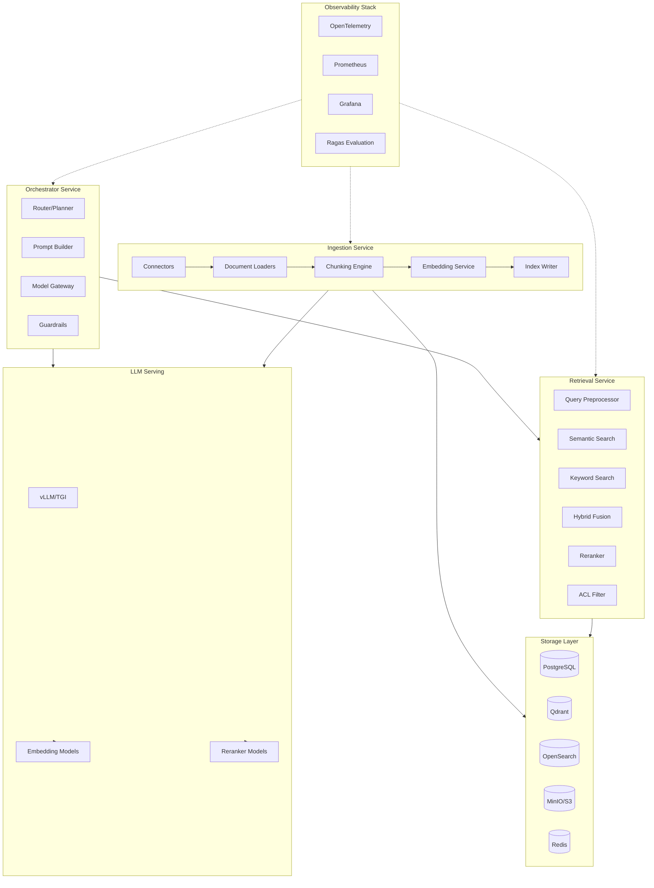
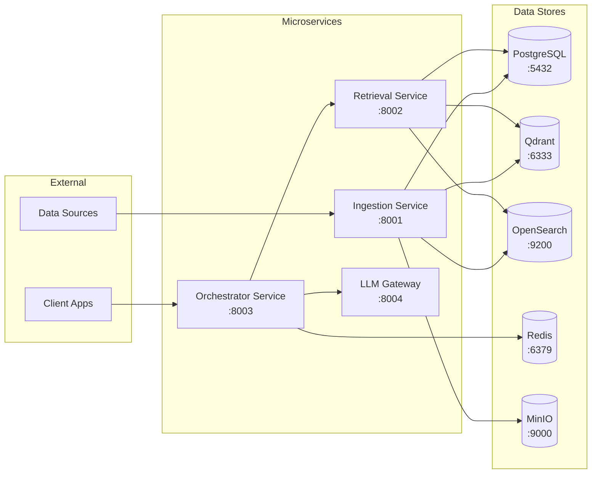
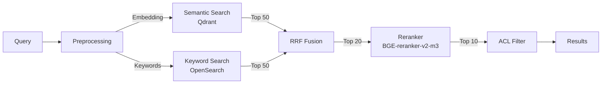
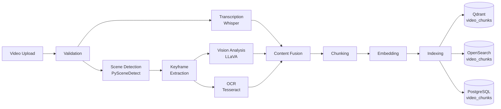
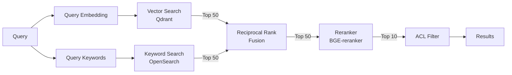
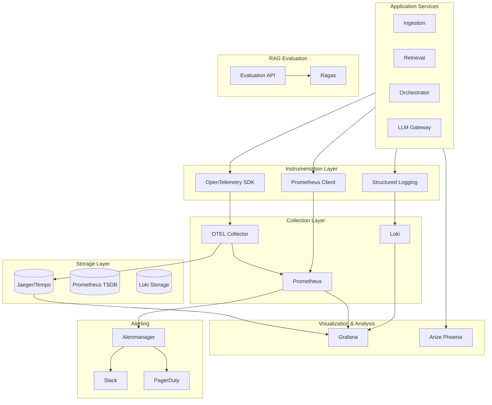
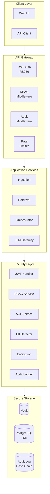
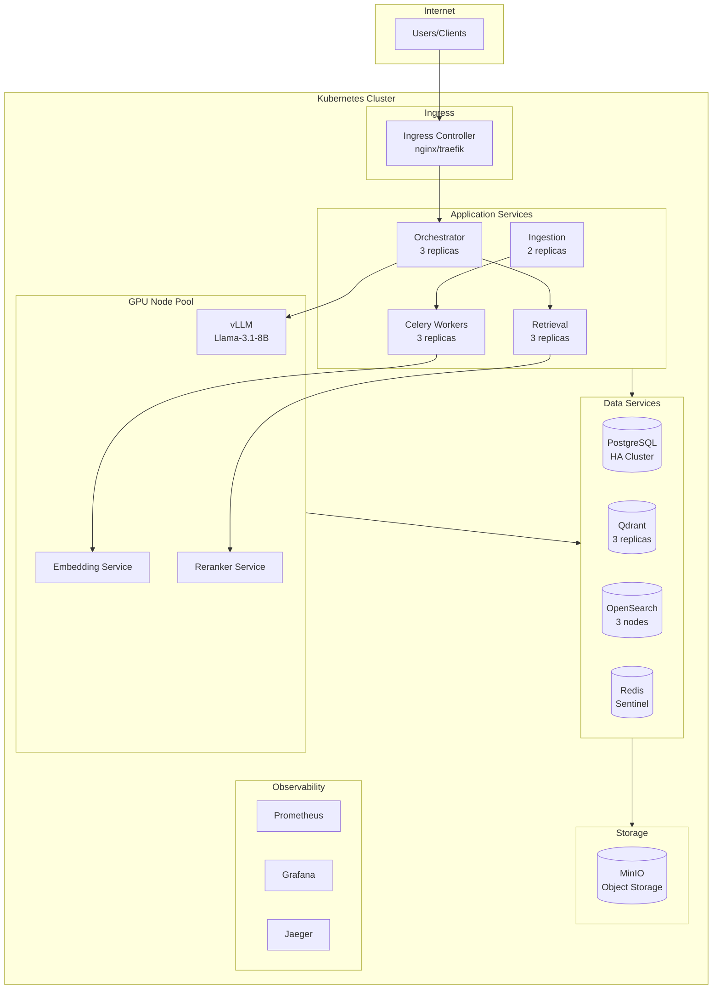

# Ultimate RAG Pipeline Architecture

> **Version:** 1.1
> **Status:** Production Reference Architecture
> **Last Updated:** January 2026

## Executive Summary

This document defines a production-grade Retrieval-Augmented Generation (RAG) architecture that is modular, observable, and data-centric. The architecture cleanly separates ingestion, retrieval, orchestration, and evaluation concerns, enabling independent scaling and component swapping as the ecosystem evolves.

---

## Table of Contents

1. [Architecture Overview](#architecture-overview)
2. [Technology Stack](#technology-stack)
3. [Service Architecture](#service-architecture)
4. [Data Schemas](#data-schemas)
5. [API Contracts](#api-contracts)
6. [Chunking & Embedding Strategy](#chunking--embedding-strategy)
7. [Hybrid Search & Reranking](#hybrid-search--reranking)
8. [Observability & Evaluation](#observability--evaluation)
9. [Security & Compliance](#security--compliance)
10. [Deployment Architecture](#deployment-architecture)
11. [Cost & Performance Optimization](#cost--performance-optimization)

---

## Architecture Overview



### Core Pipeline Stages

| Stage | Purpose | Key Outputs |
|-------|---------|-------------|
| **Ingestion** | Load, chunk, embed, and index documents | Vectors + metadata in stores |
| **Retrieval** | Find relevant context for queries | Ranked document chunks |
| **Orchestration** | Coordinate LLM calls and business logic | Generated responses |
| **Evaluation** | Measure and improve system quality | Metrics, feedback loops |

---

## Technology Stack

### Reference Implementation (Open Source First)

| Layer | Technology | Rationale |
|-------|------------|-----------|
| **Language** | Python 3.11+ | Ecosystem maturity, ML library support |
| **Package Manager** | `uv` or `poetry` | Reproducible environments |
| **API Framework** | FastAPI + Pydantic v2 | Async support, auto OpenAPI docs, typed validation |
| **Task Queue** | Celery + Redis | Distributed ingestion, re-embedding jobs |
| **Vector Database** | **Qdrant** | High-performance HNSW, excellent filtering, hybrid search, easy ops |
| **Keyword Search** | **OpenSearch** | BM25, rich analyzers, production-ready |
| **Metadata DB** | PostgreSQL 16+ | ACID, JSON support, mature tooling |
| **Object Storage** | MinIO / S3 | Raw document storage |
| **Cache** | Redis | Query cache, embedding cache |
| **Orchestration** | **LangGraph** (LangChain) | Stateful workflows, graph-based control flow |
| **LLM Serving** | **vLLM** | High-throughput, OpenAI-compatible API |
| **Embedding Models** | `BAAI/bge-large-en-v1.5` | Top MTEB performance, MIT license |
| **Reranker** | `BAAI/bge-reranker-v2-m3` | Cross-encoder, multilingual |
| **Evaluation** | Ragas + Arize Phoenix | RAG-specific metrics, LLM observability |
| **Tracing** | OpenTelemetry → Jaeger | Distributed tracing |
| **Metrics** | Prometheus + Grafana | Dashboards, alerting |

### Model Recommendations

#### Embedding Models (MTEB Benchmarks)

| Model                    | Dimensions | Context | Best For                  |
| ------------------------ | ---------- | ------- | ------------------------- |
| `BAAI/bge-large-en-v1.5` | 1024       | 512     | **Primary - English**     |
| `BAAI/bge-m3`            | 1024       | 8192    | Multilingual, long context|
| `intfloat/e5-large-v2`   | 1024       | 512     | Alternative high-quality  |
| `thenlper/gte-large`     | 1024       | 512     | Alibaba, strong retrieval |

#### LLM Models

| Model                                   | Parameters | Use Case                     |
| --------------------------------------- | ---------- | ---------------------------- |
| `Qwen/Qwen2.5-7B-Instruct`              | 7B         | **Default** - fast, capable  |
| `meta-llama/Llama-3.1-8B-Instruct`      | 8B         | Alternative, strong reasoning|
| `meta-llama/Llama-3.1-70B-Instruct`     | 70B        | Complex reasoning, fallback  |
| `mistralai/Mixtral-8x7B-Instruct-v0.1`  | 47B        | High-throughput alternative  |

#### Reranker Models

| Model                     | Latency     | Quality                      |
| ------------------------- | ----------- | ---------------------------- |
| `BAAI/bge-reranker-v2-m3` | ~50ms/batch | **Best quality**             |
| `BAAI/bge-reranker-base`  | ~20ms/batch | Faster, slightly lower quality|

---

## Service Architecture

### Service Layout



### 1. Ingestion Service

**Responsibilities:**
- Source connectors (files, databases, APIs, web)
- Document parsing and validation
- Chunking with configurable strategies
- Embedding generation (batched, parallelized)
- Index writing to vector and keyword stores
- Metadata enrichment and PII detection

**Components:**

```
ingestion-service/
├── api/
│   ├── routes.py          # FastAPI endpoints
│   └── schemas.py         # Pydantic models
├── connectors/
│   ├── filesystem.py      # Local/S3 file connector
│   ├── database.py        # SQL database connector
│   ├── web.py             # Web scraper connector
│   └── api.py             # REST API connector
├── processors/
│   ├── parsers/
│   │   ├── pdf.py         # PDF parsing (PyMuPDF, Unstructured)
│   │   ├── docx.py        # Word documents
│   │   └── html.py        # HTML/web pages
│   ├── chunking.py        # Chunking strategies
│   └── enrichment.py      # Metadata extraction
├── embedding/
│   ├── service.py         # Embedding generation
│   └── cache.py           # Embedding cache (Redis)
├── indexing/
│   ├── qdrant.py          # Vector store writer
│   ├── opensearch.py      # Keyword index writer
│   └── postgres.py        # Metadata store
└── tasks/
    ├── ingest.py          # Celery ingestion tasks
    └── reembed.py         # Re-embedding tasks
```

### 2. Retrieval Service

The Retrieval Service is the core search component, implementing a multi-stage hybrid search pipeline with semantic and keyword search, fusion algorithms, cross-encoder reranking, and ACL-based access control.

**Responsibilities:**

- Query preprocessing (normalization, classification, expansion, HyDE)
- Hybrid search combining semantic (Qdrant) and keyword (OpenSearch) search
- Result fusion using Reciprocal Rank Fusion (RRF) with configurable weights
- Cross-encoder reranking via LLM Gateway
- ACL enforcement based on user context (tenant, groups, visibility)
- Query and result caching (Redis-backed)
- Comprehensive observability (structured logging, Prometheus metrics, OpenTelemetry tracing)

**Search Pipeline:**



**Components:**

```
retrieval-service/
├── api/
│   ├── main.py              # FastAPI app with lifespan management
│   ├── routes/
│   │   ├── retrieve.py      # POST /retrieve, multi-query endpoints
│   │   └── health.py        # Health checks for Kubernetes
│   ├── schemas/
│   │   ├── retrieve.py      # Request/response Pydantic models
│   │   └── common.py        # Shared models
│   └── dependencies.py      # Dependency injection setup
├── acl/                     # Access Control Layer
│   ├── models.py            # UserContext, DocumentACL, Visibility enums
│   ├── filter.py            # ACLFilter for Qdrant/OpenSearch
│   ├── context.py           # UserContextExtractor for JWT parsing
│   └── middleware.py        # FastAPI dependencies
├── search/                  # Hybrid search implementation
│   ├── base.py              # BaseSearcher abstract interface
│   ├── semantic.py          # SemanticSearcher (Qdrant)
│   ├── keyword.py           # KeywordSearcher (OpenSearch)
│   ├── fusion.py            # RRF, Linear, DBSF fusion algorithms
│   ├── hybrid.py            # HybridSearcher orchestrator
│   ├── models.py            # SearchResultItem, FusedResult, configs
│   └── exceptions.py        # Custom exceptions
├── query/                   # Query Preprocessing Pipeline
│   ├── preprocessor.py      # QueryPreprocessor main pipeline
│   ├── expander.py          # QueryExpander (synonyms + LLM)
│   ├── hyde.py              # HyDEGenerator, MultiQueryGenerator
│   ├── cache.py             # QueryCache (Redis-backed)
│   └── models.py            # ProcessedQuery, QueryType configs
├── reranking/               # Cross-encoder Reranking
│   ├── reranker.py          # RerankerService calling LLM Gateway
│   ├── models.py            # RerankRequest, RerankResult, configs
│   └── exceptions.py        # Reranking exceptions
├── cache/                   # Result Caching
│   └── retrieval_cache.py   # RetrievalCache (Redis)
├── observability/           # Metrics & Logging
│   ├── retrieval_logger.py  # Structured JSON logging with structlog
│   ├── metrics.py           # Prometheus metrics
│   ├── tracing.py           # OpenTelemetry setup for Jaeger
│   └── middleware.py        # LoggingMiddleware
├── config.py                # RetrievalConfig with pydantic-settings
├── run.py                   # Uvicorn entry point
└── tests/                   # Comprehensive test suite (190+ tests, >90% coverage)
```

**Hybrid Search Configuration:**

| Parameter        | Default | Description                       |
|------------------|---------|-----------------------------------|
| Semantic weight  | 0.7     | Weight for vector search in RRF   |
| Keyword weight   | 0.3     | Weight for BM25 search in RRF     |
| RRF constant (k) | 60      | RRF ranking constant              |
| Semantic top-k   | 50      | Candidates from vector search     |
| Keyword top-k    | 50      | Candidates from keyword search    |
| Rerank top-k     | 20      | Candidates for cross-encoder      |
| Final top-k      | 10      | Results returned to client        |

> **Full Documentation:** See [docs/retrieval-service/README.md](retrieval-service/README.md) for detailed API reference, configuration, and usage examples.

### 2.1 Video RAG Pipeline

The Retrieval Service includes comprehensive video search and retrieval capabilities, enabling semantic search within video content using multi-modal analysis.

**Video Processing Pipeline:**



**Video Processing Stages:**

| Stage | Technology | Output |
|-------|------------|--------|
| **Validation** | FFprobe | Duration, resolution, codec validation |
| **Transcription** | Whisper (large-v3) | Word-level timestamped transcript |
| **Scene Detection** | PySceneDetect | Scene boundaries with timestamps |
| **Keyframe Extraction** | FFmpeg | Representative frame per scene |
| **Vision Analysis** | LLaVA / GPT-4V | Scene descriptions, object detection |
| **OCR** | Tesseract | On-screen text extraction |
| **Content Fusion** | LLM | Combined multi-modal chunk text |
| **Chunking** | Scene-based | 10-60 second segments with overlap |

**Video Chunk Schema:**

```python
# Qdrant video_chunks collection
video_chunk_payload = {
    "tenant_id": "uuid",
    "video_id": "uuid",
    "chunk_id": "uuid",
    "chunk_index": 0,
    "start_time_ms": 0,
    "end_time_ms": 30000,
    "transcript": "Hello and welcome to...",
    "scene_description": "Person speaking at desk with laptop",
    "ocr_text": "Company Logo",
    "fused_text": "Combined content for embedding...",
    "keyframe_path": "videos/{tenant}/{video}/keyframes/0.jpg",
    "source_modalities": ["transcript", "vision", "ocr"],
    "created_at": "2025-01-14T12:00:00Z"
}
```

**Video Retrieval Endpoints:**

| Endpoint | Method | Description |
|----------|--------|-------------|
| `/api/v1/retrieve/video` | POST | Hybrid search across video chunks |
| `/api/v1/retrieve/video/{id}` | GET | Search within a specific video |
| `/api/v1/videos/{id}/clip` | GET | Generate and cache video clip |
| `/api/v1/videos/{id}/chunks` | GET | List all chunks for a video |

**Timeline Response Format:**

The video retrieval API returns results grouped by video with timeline information:

```json
{
  "videos": [
    {
      "video_id": "uuid",
      "title": "Product Demo",
      "matches": [
        {
          "chunk_id": "uuid",
          "start_time_ms": 30000,
          "end_time_ms": 60000,
          "start_seconds": 30.0,
          "end_seconds": 60.0,
          "score": 0.92,
          "transcript_preview": "To reset your password...",
          "scene_description": "Settings screen with password form",
          "keyframe_url": "https://minio/presigned-keyframe.jpg"
        }
      ],
      "total_matches": 3
    }
  ],
  "metrics": {
    "total_videos": 5,
    "total_matches": 12,
    "latency_ms": 185
  }
}
```

**Clip Generation & Caching:**

The clip service extracts video segments on-demand with intelligent caching:

```
retrieval-service/
├── video/
│   ├── retriever.py         # VideoRetriever with hybrid search
│   ├── models.py             # VideoMatch, VideoResult, VideoTimelineResponse
│   ├── clip_generator.py     # FFmpeg-based clip extraction
│   ├── clip_cache.py         # MinIO-backed clip caching
│   └── exceptions.py         # VideoRetrievalError
```

**Clip Cache Configuration:**

| Parameter | Default | Description |
|-----------|---------|-------------|
| `cache_ttl_hours` | 24 | Time before cached clips expire |
| `presigned_url_expiry_hours` | 4 | Presigned URL validity |
| `max_clip_duration_seconds` | 120 | Maximum clip length |
| `padding_seconds` | 2.0 | Padding around requested segment |
| `use_stream_copy` | true | Fast copy vs re-encode |

**Video Management API:**

The Ingestion Service provides full CRUD operations for videos:

| Endpoint | Method | Description |
|----------|--------|-------------|
| `/api/v1/videos` | GET | List videos with pagination & filtering |
| `/api/v1/videos` | POST | Upload new video |
| `/api/v1/videos/{id}` | GET | Get video details |
| `/api/v1/videos/{id}` | PUT | Update video metadata |
| `/api/v1/videos/{id}` | DELETE | Delete video with cascade |
| `/api/v1/videos/{id}/reprocess` | POST | Re-process video |

**Cascade Deletion:**

When a video is deleted, all associated data is removed:

1. Qdrant vectors (video_chunks collection)
2. OpenSearch documents (video_chunks index)
3. PostgreSQL chunks (video_chunks table)
4. MinIO objects (source video, keyframes, cached clips)

Deletion counts are returned in the response for audit purposes.

### 3. Orchestrator Service

**Responsibilities:**

- Intent classification and routing (simple/complex/no_retrieval strategies)
- RAG vs direct LLM decision via query router
- Prompt construction with Jinja2 templates
- LLM call management via Model Gateway
- Response validation and guardrails (PII detection, injection prevention)
- Streaming support with SSE events and TTFT tracking
- Conversation memory with Redis + PostgreSQL persistence
- Graceful degradation with circuit breakers

**Components:**

```
orchestrator-service/
├── api/
│   ├── app.py                 # FastAPI application factory
│   ├── dependencies.py        # Dependency injection
│   ├── routes/
│   │   ├── query.py           # /api/v1/query, /query/stream, /feedback
│   │   ├── sessions.py        # Session CRUD endpoints
│   │   └── health.py          # Health check endpoints
│   └── models/
│       ├── requests.py        # Request schemas
│       └── responses.py       # Response schemas
├── workflow/
│   ├── graph.py               # LangGraph StateGraph definition
│   ├── state.py               # RAGState TypedDict
│   └── nodes/
│       ├── input_validation.py
│       ├── routing.py
│       ├── retrieval.py
│       ├── prompt_building.py
│       ├── generation.py
│       └── output_validation.py
├── routing/
│   ├── router.py              # QueryRouter class
│   ├── classifiers.py         # Intent/complexity classifiers
│   └── models.py              # RoutingResult, QueryIntent enums
├── prompts/
│   ├── builder.py             # PromptBuilder class
│   ├── templates.py           # Jinja2 prompt templates
│   └── context.py             # Context formatting utilities
├── gateway/
│   ├── client.py              # ModelGateway async client
│   ├── streaming.py           # SSE stream parsing
│   └── models.py              # ChatCompletionRequest/Response
├── guardrails/
│   ├── pipeline.py            # GuardrailPipeline orchestrator
│   ├── input.py               # InputGuardrail (PII, injection)
│   ├── output.py              # OutputGuardrail (harmful content)
│   └── detection.py           # Detection utilities
├── memory/
│   ├── session.py             # SessionManager
│   ├── store.py               # RedisSessionStore
│   ├── persistence.py         # PostgresConversationStore
│   ├── summarizer.py          # HistorySummarizer
│   └── models.py              # Message, ConversationSession
├── streaming/
│   ├── manager.py             # StreamManager
│   ├── models.py              # StreamEvent, StreamEventType
│   ├── validation.py          # Event sequence validation
│   ├── metrics.py             # TTFT tracking, Prometheus
│   └── buffer.py              # TokenBuffer for batching
├── resilience/
│   ├── circuit_breaker.py     # CircuitBreaker class
│   ├── fallbacks.py           # FallbackHandlers
│   ├── degradation.py         # DegradationManager
│   └── config.py              # Resilience configuration
├── config.py                  # OrchestratorConfig settings
├── run.py                     # Application entry point
└── tests/                     # 883 unit tests, 96% coverage
```

> **Full Documentation:** See [docs/orchestrator-service/README.md](orchestrator-service/README.md) for detailed API reference, configuration, and usage examples.

### 4. LLM Serving Layer

The LLM Serving Layer provides a unified, OpenAI-compatible API gateway for all language model operations including text generation, embeddings, and reranking.

**Services:**

| Service   | Port | Model                     | Purpose                    |
| --------- | ---- | ------------------------- | -------------------------- |
| Gateway   | 8004 | -                         | Unified API entry point    |
| vLLM      | 8000 | Qwen/Qwen2.5-7B-Instruct  | Text generation            |
| Embedding | 8001 | BAAI/bge-large-en-v1.5    | Vector embeddings (1024d)  |
| Reranker  | 8002 | BAAI/bge-reranker-v2-m3   | Cross-encoder reranking    |

**Gateway Responsibilities:**

- OpenAI-compatible API contract (`/v1/chat/completions`, `/v1/embeddings`, `/v1/rerank`)
- JWT authentication (RS256) with JWKS support
- API key validation
- Per-tenant/per-user rate limiting (token bucket)
- Request routing to backend services
- Security headers and request logging
- Prometheus metrics and health checks

**Components:**

```text
llm-serving/
├── gateway/
│   ├── api/              # FastAPI routes
│   ├── clients/          # Service clients (vLLM, embedding, reranker)
│   ├── security/         # Auth, rate limiting, middleware
│   └── models.py         # OpenAI-compatible request/response models
├── embedding-service/
│   ├── api/              # FastAPI application
│   └── core/             # Batching, embedder
├── reranker-service/
│   ├── api/              # FastAPI application
│   └── core/             # Batching, reranker
├── vllm/
│   ├── config/           # vLLM serving configuration
│   └── scripts/          # Warmup, healthcheck, benchmark
├── monitoring/
│   ├── health.py         # Health checker
│   ├── metrics.py        # Prometheus metrics
│   └── anomaly.py        # Anomaly detection
├── config/
│   ├── manager.py        # Dynamic configuration with hot reload
│   └── router.py         # Model routing, A/B testing
└── resource_management/
    ├── gpu_monitor.py    # GPU utilization tracking
    ├── cost_tracker.py   # Usage and cost tracking
    └── batch_optimizer.py # Dynamic batch optimization
```

**Security Configuration:**

```yaml
# Gateway authentication
auth:
  jwt_algorithm: "RS256"
  jwt_issuer: "https://auth.example.com"
  jwks_url: "https://auth.example.com/.well-known/jwks.json"

# Rate limiting
rate_limiting:
  default_rpm: 60
  default_tpm: 100000
  burst_multiplier: 1.5
```

**vLLM Configuration:**

```yaml
# vllm/config/serving_config.yaml
model:
  name: "Qwen/Qwen2.5-7B-Instruct"
  tensor_parallel_size: 1
  max_model_len: 8192
  gpu_memory_utilization: 0.90

serving:
  host: "0.0.0.0"
  port: 8000
  max_num_seqs: 256
```

> **Full Documentation:** See [docs/llm-serving/README.md](llm-serving/README.md) for detailed API reference, security configuration, monitoring, and deployment guides.

---

## Data Schemas

### PostgreSQL Schema

```sql
-- Source documents metadata
CREATE TABLE source_documents (
    id UUID PRIMARY KEY DEFAULT gen_random_uuid(),
    tenant_id UUID NOT NULL,
    source_type VARCHAR(50) NOT NULL,  -- FILE, WEB, DB, API
    source_uri TEXT NOT NULL,
    external_id VARCHAR(255),
    title TEXT,
    raw_location TEXT,  -- S3/MinIO URI
    content_hash VARCHAR(64),  -- SHA-256 for deduplication
    ingested_at TIMESTAMPTZ DEFAULT NOW(),
    updated_at TIMESTAMPTZ DEFAULT NOW(),
    version INTEGER DEFAULT 1,
    schema_version VARCHAR(20) DEFAULT '1.0',
    visibility VARCHAR(50) DEFAULT 'private',
    allowed_groups UUID[],
    metadata JSONB DEFAULT '{}',
    
    CONSTRAINT unique_tenant_source UNIQUE (tenant_id, source_uri, content_hash)
);

CREATE INDEX idx_docs_tenant ON source_documents(tenant_id);
CREATE INDEX idx_docs_source_type ON source_documents(source_type);
CREATE INDEX idx_docs_metadata ON source_documents USING GIN(metadata);

-- Document chunks
CREATE TABLE chunks (
    id UUID PRIMARY KEY DEFAULT gen_random_uuid(),
    document_id UUID NOT NULL REFERENCES source_documents(id) ON DELETE CASCADE,
    chunk_index INTEGER NOT NULL,
    content TEXT NOT NULL,
    token_count INTEGER,
    embedding_model VARCHAR(100),
    embedding_version VARCHAR(20),
    created_at TIMESTAMPTZ DEFAULT NOW(),
    metadata JSONB DEFAULT '{}',
    
    CONSTRAINT unique_doc_chunk UNIQUE (document_id, chunk_index)
);

CREATE INDEX idx_chunks_document ON chunks(document_id);

-- Embedding jobs for re-embedding
CREATE TABLE embedding_jobs (
    id UUID PRIMARY KEY DEFAULT gen_random_uuid(),
    status VARCHAR(20) DEFAULT 'pending',  -- pending, running, completed, failed
    embedding_model VARCHAR(100),
    target_scope JSONB,  -- filter for documents to re-embed
    started_at TIMESTAMPTZ,
    completed_at TIMESTAMPTZ,
    error_message TEXT,
    stats JSONB DEFAULT '{}'
);

-- Retrieval logs for debugging and evaluation
CREATE TABLE retrieval_logs (
    id UUID PRIMARY KEY DEFAULT gen_random_uuid(),
    tenant_id UUID NOT NULL,
    user_id UUID,
    query TEXT NOT NULL,
    effective_query TEXT,
    retrieved_chunk_ids UUID[],
    scores JSONB,
    filters_applied JSONB,
    latency_ms INTEGER,
    created_at TIMESTAMPTZ DEFAULT NOW()
);

CREATE INDEX idx_retrieval_logs_tenant ON retrieval_logs(tenant_id, created_at);

-- Conversations and messages
CREATE TABLE conversations (
    id UUID PRIMARY KEY DEFAULT gen_random_uuid(),
    tenant_id UUID NOT NULL,
    user_id UUID,
    created_at TIMESTAMPTZ DEFAULT NOW(),
    updated_at TIMESTAMPTZ DEFAULT NOW(),
    metadata JSONB DEFAULT '{}'
);

CREATE TABLE messages (
    id UUID PRIMARY KEY DEFAULT gen_random_uuid(),
    conversation_id UUID NOT NULL REFERENCES conversations(id) ON DELETE CASCADE,
    role VARCHAR(20) NOT NULL,  -- user, assistant, system
    content TEXT NOT NULL,
    citations JSONB,
    metadata JSONB DEFAULT '{}',
    created_at TIMESTAMPTZ DEFAULT NOW()
);

CREATE INDEX idx_messages_conversation ON messages(conversation_id, created_at);

-- Evaluation datasets and runs
CREATE TABLE eval_datasets (
    id UUID PRIMARY KEY DEFAULT gen_random_uuid(),
    name VARCHAR(255) NOT NULL,
    description TEXT,
    created_at TIMESTAMPTZ DEFAULT NOW()
);

CREATE TABLE eval_examples (
    id UUID PRIMARY KEY DEFAULT gen_random_uuid(),
    dataset_id UUID NOT NULL REFERENCES eval_datasets(id) ON DELETE CASCADE,
    query TEXT NOT NULL,
    ground_truth_answer TEXT,
    relevant_chunk_ids UUID[],
    metadata JSONB DEFAULT '{}'
);

CREATE TABLE eval_runs (
    id UUID PRIMARY KEY DEFAULT gen_random_uuid(),
    dataset_id UUID NOT NULL REFERENCES eval_datasets(id),
    pipeline_version VARCHAR(50),
    embedding_model VARCHAR(100),
    llm_model VARCHAR(100),
    started_at TIMESTAMPTZ DEFAULT NOW(),
    completed_at TIMESTAMPTZ,
    metrics JSONB DEFAULT '{}'
);
```

### Qdrant Collection Schema

```python
from qdrant_client import QdrantClient
from qdrant_client.models import (
    VectorParams, Distance, PayloadSchemaType
)

# Collection configuration
collection_config = {
    "collection_name": "documents",
    "vectors_config": VectorParams(
        size=1024,  # BGE-large dimensions
        distance=Distance.COSINE,
        on_disk=True  # For large collections
    ),
    "hnsw_config": {
        "m": 16,
        "ef_construct": 100,
        "full_scan_threshold": 10000
    },
    "payload_schema": {
        "tenant_id": PayloadSchemaType.KEYWORD,
        "document_id": PayloadSchemaType.KEYWORD,
        "chunk_index": PayloadSchemaType.INTEGER,
        "source_type": PayloadSchemaType.KEYWORD,
        "source_uri": PayloadSchemaType.TEXT,
        "title": PayloadSchemaType.TEXT,
        "section_heading": PayloadSchemaType.TEXT,
        "language": PayloadSchemaType.KEYWORD,
        "allowed_groups": PayloadSchemaType.KEYWORD,
        "created_at": PayloadSchemaType.DATETIME
    }
}
```

### OpenSearch Index Mapping

```json
{
  "settings": {
    "number_of_shards": 3,
    "number_of_replicas": 1,
    "analysis": {
      "analyzer": {
        "default": {
          "type": "standard",
          "stopwords": "_english_"
        }
      }
    }
  },
  "mappings": {
    "properties": {
      "chunk_id": { "type": "keyword" },
      "document_id": { "type": "keyword" },
      "tenant_id": { "type": "keyword" },
      "content": { 
        "type": "text",
        "analyzer": "standard"
      },
      "title": { "type": "text" },
      "source_uri": { "type": "keyword" },
      "source_type": { "type": "keyword" },
      "language": { "type": "keyword" },
      "allowed_groups": { "type": "keyword" },
      "metadata": { "type": "object", "enabled": false },
      "created_at": { "type": "date" }
    }
  }
}
```

---

## API Contracts

### Ingestion Service API

> **Base URL:** `http://localhost:8001`
> **API Version:** v1

#### POST /api/v1/ingest

Ingest a new document.

**Request:**
```json
{
  "tenant_id": "uuid",
  "source_type": "FILE",
  "source_uri": "s3://bucket/path/document.pdf",
  "title": "Document Title",
  "metadata": {
    "author": "John Doe",
    "department": "Engineering"
  },
  "visibility": "private",
  "allowed_groups": ["group-uuid-1", "group-uuid-2"]
}
```

**Response:**
```json
{
  "document_id": "uuid",
  "status": "queued",
  "job_id": "uuid",
  "estimated_completion": "2025-12-18T12:00:00Z"
}
```

#### POST /api/v1/ingest/sync

Trigger incremental sync for a source.

**Request:**
```json
{
  "tenant_id": "uuid",
  "source_type": "DATABASE",
  "source_config": {
    "connection_string": "postgresql://...",
    "table": "articles",
    "updated_since": "2025-12-01T00:00:00Z"
  }
}
```

#### POST /api/v1/ingest/reembed

Start re-embedding job with new model.

**Request:**
```json
{
  "embedding_model": "BAAI/bge-m3",
  "target_scope": {
    "tenant_id": "uuid",
    "source_types": ["FILE", "WEB"]
  }
}
```

### Retrieval Service API

> **Base URL:** `http://localhost:8002`
> **API Version:** v1

#### POST /api/v1/retrieve

Search for relevant chunks.

**Request:**
```json
{
  "query": "How do I reset my SSO password?",
  "tenant_id": "uuid",
  "user_id": "uuid",
  "top_k": 20,
  "filters": {
    "source_types": ["kb_article", "policy"],
    "language": "en",
    "date_range": {
      "after": "2024-01-01"
    }
  },
  "options": {
    "hybrid": true,
    "use_reranker": true,
    "semantic_weight": 0.7,
    "keyword_weight": 0.3
  }
}
```

**Response:**
```json
{
  "query": "How do I reset my SSO password?",
  "effective_query": "reset single sign-on password company account",
  "results": [
    {
      "chunk_id": "uuid",
      "document_id": "uuid",
      "score": 0.87,
      "rank": 1,
      "content": "To reset your SSO password, navigate to...",
      "metadata": {
        "source_uri": "https://kb.example.com/articles/123",
        "title": "Resetting your SSO password",
        "section_heading": "Reset steps"
      }
    }
  ],
  "debug": {
    "semantic_results": 50,
    "keyword_results": 50,
    "after_fusion": 50,
    "after_rerank": 20,
    "latency_ms": {
      "embedding": 15,
      "semantic_search": 45,
      "keyword_search": 30,
      "fusion": 5,
      "rerank": 120,
      "total": 215
    }
  },
  "retrieval_id": "uuid"
}
```

### Orchestrator Service API

> **Base URL:** `http://localhost:8003`
> **API Version:** v1

#### POST /api/v1/query

Main chat endpoint with RAG.

**Request:**
```json
{
  "conversation_id": "uuid",
  "tenant_id": "uuid",
  "user_id": "uuid",
  "messages": [
    {
      "role": "user",
      "content": "How do I reset my SSO password?"
    }
  ],
  "options": {
    "mode": "qa",
    "max_tokens": 512,
    "temperature": 0.2,
    "stream": false,
    "include_citations": true
  }
}
```

**Response:**
```json
{
  "conversation_id": "uuid",
  "message": {
    "role": "assistant",
    "content": "To reset your SSO password, follow these steps:\n\n1. Go to the SSO portal at https://sso.company.com\n2. Click 'Forgot Password'\n3. Enter your email address\n4. Check your email for the reset link\n5. Follow the link to create a new password\n\nIf you don't receive the email within 5 minutes, check your spam folder or contact IT support.",
    "citations": [
      {
        "chunk_id": "uuid",
        "document_id": "uuid",
        "source_uri": "https://kb.example.com/articles/123",
        "title": "Resetting your SSO password",
        "span": [0, 180]
      }
    ]
  },
  "debug": {
    "retrieval_id": "uuid",
    "used_rag": true,
    "model": "llama-3.1-8b-instruct",
    "tokens": {
      "prompt": 1250,
      "completion": 120,
      "total": 1370
    },
    "latency_ms": {
      "retrieval": 215,
      "generation": 450,
      "total": 680
    }
  }
}
```

#### POST /api/v1/query/stream (Streaming)

**Request:** Same as above with `"stream": true`

**Response:** Server-Sent Events (SSE)
```
event: start
data: {"conversation_id": "uuid", "message_id": "uuid"}

event: delta
data: {"content": "To reset"}

event: delta
data: {"content": " your SSO password"}

event: citations
data: {"citations": [...]}

event: done
data: {"tokens": {"prompt": 1250, "completion": 120}}
```

---

## Chunking & Embedding Strategy

### Chunking Configuration

```python
from dataclasses import dataclass
from enum import Enum

class ChunkingStrategy(Enum):
    FIXED_SIZE = "fixed_size"
    RECURSIVE = "recursive"
    SEMANTIC = "semantic"
    DOCUMENT_STRUCTURE = "document_structure"

@dataclass
class ChunkingConfig:
    strategy: ChunkingStrategy = ChunkingStrategy.RECURSIVE
    target_tokens: int = 300  # ~200-400 tokens optimal
    max_tokens: int = 512
    overlap_tokens: int = 50  # 10-20% overlap
    separators: list = None  # For recursive: ["\n\n", "\n", ". ", " "]
    
    # Metadata to preserve
    preserve_headings: bool = True
    include_document_title: bool = True
    include_section_path: bool = True
```

### Recommended Defaults

| Document Type | Strategy | Target Tokens | Overlap |
|--------------|----------|---------------|---------|
| **General text** | Recursive | 300 | 50 |
| **Technical docs** | Document structure | 400 | 80 |
| **FAQs** | Per Q&A block | Variable | 0 |
| **Code** | Function/class based | 200 | 20 |
| **Legal/contracts** | Paragraph-based | 500 | 100 |

### Embedding Pipeline

```python
from sentence_transformers import SentenceTransformer
import torch

class EmbeddingService:
    def __init__(
        self,
        model_name: str = "BAAI/bge-large-en-v1.5",
        batch_size: int = 32,
        device: str = "cuda" if torch.cuda.is_available() else "cpu"
    ):
        self.model = SentenceTransformer(model_name)
        self.model.to(device)
        self.batch_size = batch_size
        
    def embed_documents(self, texts: list[str]) -> list[list[float]]:
        """Embed documents without instruction prefix."""
        return self.model.encode(
            texts,
            batch_size=self.batch_size,
            normalize_embeddings=True,
            show_progress_bar=True
        ).tolist()
    
    def embed_query(self, query: str) -> list[float]:
        """Embed query with instruction prefix for BGE models."""
        instruction = "Represent this sentence for searching relevant passages: "
        return self.model.encode(
            instruction + query,
            normalize_embeddings=True
        ).tolist()
```

---

## Hybrid Search & Reranking

### Hybrid Search Architecture



### Reciprocal Rank Fusion (RRF)

```python
def reciprocal_rank_fusion(
    semantic_results: list[dict],
    keyword_results: list[dict],
    k: int = 60,  # RRF constant
    semantic_weight: float = 0.7,
    keyword_weight: float = 0.3
) -> list[dict]:
    """
    Combine semantic and keyword search results using RRF.
    
    RRF score = sum(weight / (k + rank))
    """
    scores = {}
    
    # Score semantic results
    for rank, result in enumerate(semantic_results, 1):
        chunk_id = result["chunk_id"]
        scores[chunk_id] = scores.get(chunk_id, 0) + semantic_weight / (k + rank)
        
    # Score keyword results  
    for rank, result in enumerate(keyword_results, 1):
        chunk_id = result["chunk_id"]
        scores[chunk_id] = scores.get(chunk_id, 0) + keyword_weight / (k + rank)
    
    # Sort by combined score
    combined = sorted(scores.items(), key=lambda x: x[1], reverse=True)
    
    return [{"chunk_id": cid, "rrf_score": score} for cid, score in combined]
```

### Reranking Service

```python
from transformers import AutoModelForSequenceClassification, AutoTokenizer
import torch

class RerankerService:
    def __init__(
        self,
        model_name: str = "BAAI/bge-reranker-v2-m3",
        device: str = "cuda" if torch.cuda.is_available() else "cpu"
    ):
        self.tokenizer = AutoTokenizer.from_pretrained(model_name)
        self.model = AutoModelForSequenceClassification.from_pretrained(model_name)
        self.model.to(device)
        self.model.eval()
        self.device = device
        
    def rerank(
        self,
        query: str,
        documents: list[dict],
        top_k: int = 10
    ) -> list[dict]:
        """Rerank documents using cross-encoder."""
        pairs = [[query, doc["content"]] for doc in documents]
        
        with torch.no_grad():
            inputs = self.tokenizer(
                pairs,
                padding=True,
                truncation=True,
                max_length=512,
                return_tensors="pt"
            ).to(self.device)
            
            scores = self.model(**inputs).logits.squeeze(-1).cpu().tolist()
        
        # Add scores and sort
        for doc, score in zip(documents, scores):
            doc["rerank_score"] = score
            
        return sorted(documents, key=lambda x: x["rerank_score"], reverse=True)[:top_k]
```

---

## Observability & Evaluation

The RAG pipeline includes a comprehensive observability stack providing distributed tracing, metrics collection, structured logging, dashboards, alerting, and RAG-specific evaluation.

> **Full Documentation:** See [docs/observability/README.md](observability/README.md) for detailed configuration, usage examples, and runbooks.

### Observability Architecture



### Observability Components

| Component              | Location                                      | Purpose                                                         |
| ---------------------- | --------------------------------------------- | --------------------------------------------------------------- |
| **OpenTelemetry**      | `services/shared/observability/otel/`         | Distributed tracing with RAG-specific semantic attributes       |
| **Prometheus Metrics** | `services/shared/observability/metrics/`      | Centralized metrics (naming: `rag_<subsystem>_<metric>_<unit>`) |
| **Structured Logging** | `services/shared/observability/logging/`      | JSON logging with trace context and sensitive data masking      |
| **Grafana Dashboards** | `services/shared/observability/grafana/`      | Pre-configured dashboards (overview, retrieval, LLM, SLO)       |
| **Alerting**           | `services/shared/observability/alerting/`     | RAG-specific and SLO burn rate alerts                           |
| **Ragas Evaluation**   | `services/shared/observability/evaluation/`   | Automated RAG quality metrics                                   |
| **Arize Phoenix**      | `services/shared/observability/phoenix/`      | LLM-specific observability, A/B testing, feedback               |

### Key Metrics

All metrics follow naming convention: `rag_<subsystem>_<metric>_<unit>`

| Metric | Type | Description | Target |
|--------|------|-------------|--------|
| `rag_query_total` | Counter | Total queries processed | - |
| `rag_query_duration_seconds` | Histogram | Query processing duration | p95 < 2s |
| `rag_retrieval_duration_seconds` | Histogram | Retrieval latency by type | p95 < 300ms |
| `rag_retrieval_zero_results_total` | Counter | Zero-result queries | < 20% |
| `rag_llm_duration_seconds` | Histogram | LLM inference duration | p95 < 2s |
| `rag_llm_ttft_seconds` | Histogram | Time to first token | p95 < 1s |
| `rag_llm_tokens_total` | Counter | Tokens (input/output) | - |
| `rag_ingest_documents_total` | Counter | Documents ingested | - |
| `rag_cache_hits_total` | Counter | Cache hits | > 30% hit rate |

### Service Level Objectives (SLOs)

| SLO               | Target       | Window  | Burn Rate Alerts  |
| ----------------- | ------------ | ------- | ----------------- |
| Query Latency     | 99% < 2s     | 30 days | 14.4x/1h, 6x/6h   |
| Availability      | 99.9%        | 30 days | 14.4x/1h, 6x/6h   |
| LLM TTFT          | 95% < 1s     | 7 days  | 6x/6h             |
| Retrieval Latency | 99% < 500ms  | 30 days | 6x/6h             |

### Quality Metrics (Ragas)

| Metric | Description | Target |
|--------|-------------|--------|
| `context_precision` | Relevance of retrieved chunks to question | > 0.8 |
| `context_recall` | Coverage of ground truth by retrieved context | > 0.7 |
| `faithfulness` | Answer grounded in retrieved context | > 0.9 |
| `answer_relevancy` | Answer relevance to original question | > 0.8 |

### Quick Start

```python
from shared.observability.otel import setup_tracing, get_tracer
from shared.observability.metrics import setup_metrics, get_metrics
from shared.observability.logging import setup_logging, get_logger

# Initialize at application startup
setup_tracing(service_name="retrieval-service", service_version="1.0.0")
setup_metrics(service_name="retrieval-service", service_version="1.0.0")
setup_logging(service_name="retrieval-service", log_level="INFO")

# Use throughout the application
tracer = get_tracer()
metrics = get_metrics()
logger = get_logger(__name__)

# Record metrics
metrics.record_query(mode="hybrid", duration=0.215, result_count=10, status="success")
metrics.record_llm(model="llama-3.1-8b", duration=1.2, input_tokens=500, output_tokens=150)

# Structured logging with trace context
logger.info("Query processed", extra={"query_id": "abc123", "result_count": 10})
```

### Alert Categories

**RAG-Specific Alerts:**

- High Error Rate (> 5% for 5m) - Critical
- High Latency (P95 > 2s for 5m) - Warning
- LLM Provider Errors (> 10% for 5m) - Critical
- High Zero Results Rate (> 20% for 15m) - Warning

**SLO Burn Rate Alerts:**

- Fast burn (14.4x over 1h) - Page immediately
- Slow burn (6x over 6h) - Page
- Error budget exhausted - Critical

### Grafana Dashboards

| Dashboard                 | Purpose                                        |
| ------------------------- | ---------------------------------------------- |
| **RAG Pipeline Overview** | Request rate, error rate, latency, cache hits  |
| **Retrieval Service**     | Search strategy comparison, reranking metrics  |
| **LLM Service**           | Model performance, TTFT, token throughput      |
| **SLO Dashboard**         | SLO compliance, error budget, burn rates       |

### Evaluation Pipeline

Automated RAG quality evaluation runs via Celery Beat or Kubernetes CronJob:

```python
from shared.observability.evaluation import EvaluationPipeline, EvaluationConfig

config = EvaluationConfig(
    evaluator_model="gpt-4",
    metrics=["context_precision", "context_recall", "faithfulness", "answer_relevancy"],
    sample_size=100
)

pipeline = EvaluationPipeline(config)
results = await pipeline.run(dataset)
# Results stored in PostgreSQL eval_runs table
```

---

## Security & Compliance

The RAG pipeline implements comprehensive security with defense-in-depth across authentication, authorization, data protection, and audit capabilities.

> **Full Documentation:** See [docs/security/README.md](security/README.md) for detailed implementation guides, code examples, and configuration reference.

### Security Architecture



### Security Components

| Component | Location | Purpose |
|-----------|----------|---------|
| JWT Handler | `services/shared/security/jwt/` | RS256 token generation, validation, blocklist |
| RBAC Service | `services/shared/security/rbac/` | Role-based permissions, tenant isolation |
| ACL Service | `services/shared/security/acl/` | Document-level access control |
| Encryption | `services/shared/security/encryption/` | AES-256-GCM field encryption |
| PII Detector | `services/shared/security/pii/` | Presidio-based PII detection |
| Secrets Manager | `services/shared/security/secrets/` | Vault/K8s secrets integration |
| Audit Logger | `services/shared/security/audit/` | Tamper-evident audit logging |
| TLS Config | `services/shared/security/tls/` | TLS 1.3 / mTLS configuration |

### Authentication (JWT)

JWT tokens with RS256 (RSA-SHA256) asymmetric signing provide stateless authentication with tenant context:

```json
{
  "sub": "user-uuid",
  "iss": "https://auth.example.com",
  "aud": "rag-pipeline",
  "exp": 1735000000,
  "jti": "unique-token-id",
  "tenant_id": "tenant-uuid",
  "roles": ["tenant_user", "data_engineer"],
  "groups": ["engineering", "ml-team"],
  "permissions": ["documents:read", "query:execute"]
}
```

**Features:**
- RS256 asymmetric signing with JWKS support
- Redis-backed token blocklist for revocation
- Configurable access/refresh token expiration
- Automatic token validation middleware

### Authorization (RBAC)

Hierarchical role-based access control with mandatory tenant isolation:

| Role | Description | Key Permissions |
|------|-------------|-----------------|
| `super_admin` | Full system access | All permissions |
| `tenant_admin` | Full tenant access | User management, all tenant ops |
| `tenant_user` | Standard user | Read/write documents, query |
| `data_engineer` | Data management | Full ingestion control |
| `analyst` | Query focus | Execute queries, read audit |
| `compliance_officer` | Audit access | Read and export audit logs |

**Permission Categories:** `documents:*`, `query:*`, `ingestion:*`, `collections:*`, `users:*`, `tenant:*`, `api_keys:*`, `audit:*`, `system:*`

### Document ACL

Fine-grained document access control with visibility levels:

| Visibility | Description |
|------------|-------------|
| `public` | All authenticated tenant users |
| `private` | Document owner only |
| `group` | Specified groups only |
| `restricted` | Explicit users/groups/roles |

ACL filters are applied at query time in both Qdrant and OpenSearch to ensure consistent access control during retrieval.

### Data Protection

| Layer | Implementation |
|-------|----------------|
| **Encryption at rest** | AES-256-GCM field encryption, encrypted storage classes (EBS/GCE), MinIO SSE |
| **Encryption in transit** | TLS 1.3 for all connections, optional mTLS for service-to-service |
| **PII detection** | Microsoft Presidio with custom recognizers, response filtering |
| **Secrets management** | HashiCorp Vault (production), K8s Secrets (staging), environment (dev) |
| **Key management** | Vault Transit, key rotation with re-encryption support |

### Audit Logging

Tamper-evident audit logging with hash chaining:

- **Automatic logging** via FastAPI middleware for all API requests
- **Hash chain** with SHA-256 for tamper detection
- **PostgreSQL storage** with indexed queries by tenant/user/action
- **Loki integration** for centralized log aggregation
- **Export tools** for compliance reporting

### Security Scanning

| Type | Tools | Trigger |
|------|-------|---------|
| Dependency | pip-audit, safety | Push, PR, Daily |
| SAST | Bandit, Semgrep | Push, PR, Weekly |
| Container | Trivy | Push, PR, Weekly |
| Secrets | Gitleaks, detect-secrets | Push, PR, Daily |

Pre-commit hooks ensure local scanning before commits.

### Compliance Support

| Framework | Key Controls |
|-----------|--------------|
| **SOC 2 Type II** | Access control, audit logging, encryption |
| **GDPR** | PII handling, data protection, audit trails |
| **HIPAA** | Encryption, access controls, audit logging |

---

## Deployment Architecture

### Kubernetes Deployment

```yaml
# Namespace
apiVersion: v1
kind: Namespace
metadata:
  name: rag-pipeline

---
# Ingestion Service Deployment
apiVersion: apps/v1
kind: Deployment
metadata:
  name: ingestion-service
  namespace: rag-pipeline
spec:
  replicas: 2
  selector:
    matchLabels:
      app: ingestion-service
  template:
    metadata:
      labels:
        app: ingestion-service
    spec:
      containers:
      - name: api
        image: rag-pipeline/ingestion-service:latest
        ports:
        - containerPort: 8001
        resources:
          requests:
            memory: "512Mi"
            cpu: "250m"
          limits:
            memory: "2Gi"
            cpu: "1000m"
        env:
        - name: DATABASE_URL
          valueFrom:
            secretKeyRef:
              name: rag-secrets
              key: database-url
        - name: QDRANT_URL
          value: "http://qdrant:6333"
        - name: REDIS_URL
          value: "redis://redis:6379"

---
# Celery Worker for Ingestion
apiVersion: apps/v1
kind: Deployment
metadata:
  name: ingestion-worker
  namespace: rag-pipeline
spec:
  replicas: 3
  selector:
    matchLabels:
      app: ingestion-worker
  template:
    spec:
      containers:
      - name: worker
        image: rag-pipeline/ingestion-service:latest
        command: ["celery", "-A", "tasks", "worker", "-l", "info"]
        resources:
          requests:
            memory: "2Gi"
            cpu: "1000m"
          limits:
            memory: "8Gi"
            cpu: "4000m"

---
# vLLM Deployment
apiVersion: apps/v1
kind: Deployment
metadata:
  name: vllm-llama
  namespace: rag-pipeline
spec:
  replicas: 1
  selector:
    matchLabels:
      app: vllm-llama
  template:
    spec:
      containers:
      - name: vllm
        image: vllm/vllm-openai:latest
        args:
        - "--model"
        - "meta-llama/Llama-3.1-8B-Instruct"
        - "--tensor-parallel-size"
        - "1"
        - "--max-model-len"
        - "8192"
        ports:
        - containerPort: 8000
        resources:
          limits:
            nvidia.com/gpu: 1
            memory: "32Gi"
```

### Infrastructure Diagram



---

## Cost & Performance Optimization

### Cost Optimization Strategies

| Strategy | Implementation | Savings |
|----------|----------------|---------|
| **Query caching** | Redis cache for repeated queries | 20-40% |
| **Embedding cache** | Cache by content hash | 30-50% |
| **Model tiering** | Llama-8B default, 70B for complex | 60-70% |
| **Batching** | Batch embedding requests | 40% latency |
| **Context truncation** | Limit to 2000 tokens | 30% tokens |

### Performance Budgets

| Stage | Target p95 | Max p99 |
|-------|------------|---------|
| Query embedding | 20ms | 50ms |
| Semantic search | 50ms | 100ms |
| Keyword search | 30ms | 80ms |
| Reranking | 150ms | 300ms |
| LLM generation | 1500ms | 3000ms |
| **Total E2E** | **2000ms** | **4000ms** |

### Caching Strategy

```python
import hashlib
from redis import Redis

class RAGCache:
    def __init__(self, redis: Redis, ttl: int = 3600):
        self.redis = redis
        self.ttl = ttl
    
    def cache_key(self, query: str, filters: dict) -> str:
        """Generate cache key from query and filters."""
        content = f"{query}:{json.dumps(filters, sort_keys=True)}"
        return f"rag:query:{hashlib.sha256(content.encode()).hexdigest()[:16]}"
    
    async def get_cached_response(self, query: str, filters: dict) -> dict | None:
        """Get cached RAG response."""
        key = self.cache_key(query, filters)
        cached = await self.redis.get(key)
        return json.loads(cached) if cached else None
    
    async def cache_response(self, query: str, filters: dict, response: dict):
        """Cache RAG response."""
        key = self.cache_key(query, filters)
        await self.redis.setex(key, self.ttl, json.dumps(response))
```

---

## Appendix

### A. Decision Matrix: Vector Database Selection

| Requirement | Qdrant | pgvector | Weaviate | Milvus |
|-------------|--------|----------|----------|--------|
| **< 10M vectors** | ✅ | ✅ | ✅ | ✅ |
| **10-100M vectors** | ✅ | ⚠️ | ✅ | ✅ |
| **> 100M vectors** | ⚠️ | ❌ | ⚠️ | ✅ |
| **Hybrid search** | ✅ | ⚠️ | ✅ | ✅ |
| **Filtering** | ✅ | ✅ | ✅ | ✅ |
| **Operational simplicity** | ✅ | ✅ | ⚠️ | ❌ |
| **Existing Postgres** | ❌ | ✅ | ❌ | ❌ |

**Recommendation:** Qdrant for new deployments; pgvector if already using PostgreSQL with < 50M vectors.

### B. Orchestration Framework Comparison

| Framework | Best For | Overhead | Token Efficiency |
|-----------|----------|----------|------------------|
| **LangGraph** | Complex stateful workflows | ~14ms | Medium |
| **LlamaIndex** | Data ingestion & indexing | ~6ms | High |
| **Haystack** | Production deployments | ~6ms | Highest |
| **DSPy** | Minimal boilerplate | ~3.5ms | Medium |

**Recommendation:** LangGraph for complex agentic workflows; Haystack for production simplicity.

### C. Quick Start Commands

```bash
# Clone repository
git clone https://github.com/your-org/ultimate-rag-pipeline.git
cd ultimate-rag-pipeline

# Start infrastructure with Docker Compose
docker-compose up -d postgres redis qdrant opensearch minio

# Install dependencies
uv sync

# Run database migrations
alembic upgrade head

# Start services
uvicorn ingestion_service.api:app --port 8001 &
uvicorn retrieval_service.api:app --port 8002 &
uvicorn orchestrator_service.api:app --port 8003 &

# Start Celery workers
celery -A ingestion_service.tasks worker -l info

# Run health checks
curl http://localhost:8001/health
curl http://localhost:8002/health
curl http://localhost:8003/health
```

---

## References

- [Qdrant Documentation](https://qdrant.tech/documentation/)
- [LangGraph Documentation](https://langchain-ai.github.io/langgraph/)
- [vLLM Documentation](https://docs.vllm.ai/)
- [BGE Embedding Models](https://huggingface.co/BAAI/bge-large-en-v1.5)
- [Ragas Evaluation Framework](https://docs.ragas.io/)
- [OpenTelemetry Python](https://opentelemetry.io/docs/languages/python/)
