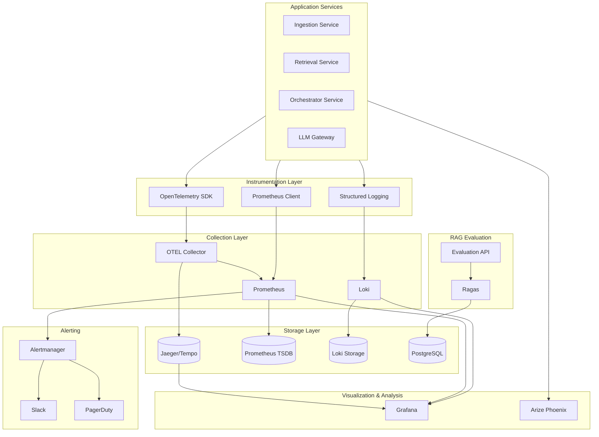

# Observability Stack

> **Version:** 1.0
> **Status:** Production Ready
> **Last Updated:** January 2026

## Overview

The Ultimate RAG Pipeline includes a comprehensive observability stack providing distributed tracing, metrics collection, structured logging, dashboards, alerting, and RAG-specific evaluation capabilities. This documentation covers the architecture, configuration, and usage of all observability components.

---

## Table of Contents

1. [Architecture](#architecture)
2. [OpenTelemetry Integration](#opentelemetry-integration)
3. [Prometheus Metrics](#prometheus-metrics)
4. [Structured Logging](#structured-logging)
5. [Grafana Dashboards](#grafana-dashboards)
6. [Alerting](#alerting)
7. [Ragas Evaluation](#ragas-evaluation)
8. [Arize Phoenix Integration](#arize-phoenix-integration)
9. [Trace/Log Validation](#tracelog-validation)
10. [Configuration Reference](#configuration-reference)
11. [Runbooks](#runbooks)

---

## Architecture



### Data Flow

1. **Services** emit traces, metrics, and logs via instrumentation
2. **OTEL Collector** receives traces and applies tail-based sampling
3. **Prometheus** scrapes metrics from service `/metrics` endpoints
4. **Loki** receives logs via Promtail or direct push
5. **Grafana** provides unified visualization with trace-log correlation
6. **Alertmanager** routes alerts to Slack/PagerDuty based on severity
7. **Ragas** runs scheduled evaluations and stores results in PostgreSQL

---

## OpenTelemetry Integration

The observability stack uses OpenTelemetry for distributed tracing across all services.

### Location

```
services/shared/observability/otel/
├── __init__.py
├── tracer.py          # Configuration and provider setup
├── attributes.py      # RAG-specific semantic attributes
├── spans.py           # @traced decorator and context manager
├── context.py         # Context propagation utilities
└── middleware/
    ├── fastapi.py     # FastAPI middleware
    └── celery.py      # Celery task instrumentation
```

### Quick Start

```python
from shared.observability.otel import setup_tracing, get_tracer
from shared.observability.otel.spans import traced

# Initialize tracing at application startup
setup_tracing(
    service_name="retrieval-service",
    service_version="1.0.0",
    environment="production"
)

# Get a tracer instance
tracer = get_tracer()

# Use the @traced decorator
@traced(name="search_documents", attributes={"search.type": "hybrid"})
async def search_documents(query: str, top_k: int = 10):
    # Your search logic here
    pass
```

### Configuration

| Environment Variable | Description | Default |
|---------------------|-------------|---------|
| `OTEL_EXPORTER_OTLP_ENDPOINT` | OTLP collector endpoint | `localhost:4317` |
| `OTEL_SERVICE_NAME` | Service name for traces | - |
| `OTEL_TRACES_SAMPLER_ARG` | Sample rate (0.0-1.0) | `1.0` |
| `ENVIRONMENT` | Deployment environment | `development` |
| `OTEL_CONSOLE_EXPORT` | Enable console export | `false` |

### Sampling Strategy

| Environment | Sample Rate | Strategy |
|-------------|-------------|----------|
| Development | 100% | `ALWAYS_ON` |
| Staging | 50% | `TraceIdRatioBased(0.5)` |
| Production | 10% | `TraceIdRatioBased(0.1)` |

Production uses tail-based sampling via the OTEL Collector to capture 100% of errors and slow traces.

### RAG Semantic Attributes

Custom semantic attributes for RAG operations:

```python
from shared.observability.otel.attributes import RAGAttributes

# Query attributes
RAGAttributes.QUERY_TEXT           # rag.query.text
RAGAttributes.QUERY_TOKENS         # rag.query.tokens
RAGAttributes.QUERY_TYPE           # rag.query.type

# Retrieval attributes
RAGAttributes.RETRIEVAL_STRATEGY   # rag.retrieval.strategy
RAGAttributes.RETRIEVAL_TOP_K      # rag.retrieval.top_k
RAGAttributes.RETRIEVAL_SCORE      # rag.retrieval.score

# LLM attributes
RAGAttributes.LLM_MODEL            # rag.llm.model
RAGAttributes.LLM_INPUT_TOKENS     # rag.llm.input_tokens
RAGAttributes.LLM_OUTPUT_TOKENS    # rag.llm.output_tokens
RAGAttributes.LLM_TTFT             # rag.llm.time_to_first_token
```

### FastAPI Integration

```python
from fastapi import FastAPI
from shared.observability.otel.middleware.fastapi import OTELMiddleware

app = FastAPI()
app.add_middleware(OTELMiddleware)
```

The middleware automatically:
- Creates spans for each request
- Propagates trace context via headers
- Records HTTP attributes (method, path, status)
- Handles exceptions

---

## Prometheus Metrics

Centralized metrics collection following naming convention: `rag_<subsystem>_<metric>_<unit>`

### Location

```
services/shared/observability/metrics/
├── __init__.py
├── registry.py        # RAGMetrics class
├── middleware.py      # FastAPI middleware
├── collectors.py      # Custom collectors (Qdrant, PostgreSQL)
├── exporters.py       # Metrics export utilities
└── definitions/
    ├── base.py        # MetricDefinition dataclass
    ├── sli.py         # SLI calculations
    └── slo.py         # SLO definitions
```

### Quick Start

```python
from shared.observability.metrics import setup_metrics, get_metrics

# Initialize metrics at application startup
metrics = setup_metrics(
    service_name="retrieval-service",
    service_version="1.0.0"
)

# Record operations
metrics.record_query(mode="hybrid", duration=0.215, result_count=10, status="success")
metrics.record_llm(model="llama-3.1-8b", duration=1.2, input_tokens=500, output_tokens=150)
metrics.record_embedding(duration=0.02, token_count=100, model="bge-large-en-v1.5")
```

### Key Metrics

#### Query Metrics

| Metric | Type | Labels | Description |
|--------|------|--------|-------------|
| `rag_query_total` | Counter | service, mode, status | Total queries processed |
| `rag_query_duration_seconds` | Histogram | service, mode | Query processing duration |
| `rag_query_active` | Gauge | service | Currently active queries |

#### Retrieval Metrics

| Metric | Type | Labels | Description |
|--------|------|--------|-------------|
| `rag_retrieval_duration_seconds` | Histogram | service, search_type | Retrieval duration by type |
| `rag_retrieval_result_count` | Histogram | service, search_type | Results per query |
| `rag_retrieval_zero_results_total` | Counter | service, search_type | Zero-result queries |
| `rag_rerank_duration_seconds` | Histogram | service, model | Reranking duration |

#### Embedding Metrics

| Metric | Type | Labels | Description |
|--------|------|--------|-------------|
| `rag_embedding_duration_seconds` | Histogram | service, model | Embedding generation time |
| `rag_embedding_tokens_total` | Counter | service, model | Total tokens embedded |
| `rag_embedding_batch_size` | Histogram | service | Batch size distribution |

#### LLM Metrics

| Metric | Type | Labels | Description |
|--------|------|--------|-------------|
| `rag_llm_requests_total` | Counter | service, model, provider, status | Total LLM requests |
| `rag_llm_duration_seconds` | Histogram | service, model | LLM inference duration |
| `rag_llm_ttft_seconds` | Histogram | service, model | Time to first token |
| `rag_llm_tokens_total` | Counter | service, model, type | Tokens (input/output) |
| `rag_llm_tokens_per_second` | Gauge | service, model | Token throughput |

#### Ingestion Metrics

| Metric | Type | Labels | Description |
|--------|------|--------|-------------|
| `rag_ingest_documents_total` | Counter | service, source_type, status | Documents ingested |
| `rag_ingest_chunks_total` | Counter | service, strategy | Chunks created |
| `rag_ingest_duration_seconds` | Histogram | service, stage | Duration by stage |
| `rag_ingest_queue_size` | Gauge | service, queue | Queue depth |
| `rag_ingest_bytes_total` | Counter | service, source_type | Data throughput |

#### Cache Metrics

| Metric | Type | Labels | Description |
|--------|------|--------|-------------|
| `rag_cache_hits_total` | Counter | service, cache_type | Cache hits |
| `rag_cache_misses_total` | Counter | service, cache_type | Cache misses |
| `rag_cache_size_bytes` | Gauge | service, cache_type | Cache size |

### SLO Definitions

| SLO | Target | Window | Burn Rate Alert |
|-----|--------|--------|-----------------|
| Query Latency | 99% < 2s | 30 days | 14.4x/1h, 6x/6h |
| Availability | 99.9% | 30 days | 14.4x/1h, 6x/6h |
| LLM TTFT | 95% < 1s | 7 days | 6x/6h |
| Retrieval Latency | 99% < 500ms | 30 days | 6x/6h |

### FastAPI Middleware

```python
from fastapi import FastAPI
from shared.observability.metrics.middleware import PrometheusMiddleware

app = FastAPI()
app.add_middleware(PrometheusMiddleware)

# Exposes /metrics endpoint automatically
```

---

## Structured Logging

JSON-formatted logging with trace context injection and sensitive data filtering.

### Location

```
services/shared/observability/logging/
├── __init__.py
├── config.py          # LoggingConfig dataclass
├── logger.py          # Logger factory
├── formatters.py      # JSON formatters
├── filters.py         # Sensitive data masking
├── context.py         # Context injection
└── middleware/
    └── fastapi.py     # Request/response logging
```

### Quick Start

```python
from shared.observability.logging import setup_logging, get_logger

# Initialize logging at application startup
setup_logging(
    service_name="retrieval-service",
    log_level="INFO",
    json_format=True
)

# Get a logger
logger = get_logger(__name__)

# Log with context
logger.info("Query processed", extra={
    "query_id": "abc123",
    "tenant_id": "tenant-1",
    "result_count": 10
})
```

### Log Format

```json
{
  "timestamp": "2026-01-12T10:30:00.000Z",
  "level": "INFO",
  "message": "Query processed",
  "service": "retrieval-service",
  "trace_id": "abc123def456",
  "span_id": "789xyz",
  "query_id": "abc123",
  "tenant_id": "tenant-1",
  "result_count": 10
}
```

### Configuration

| Environment Variable | Description | Default |
|---------------------|-------------|---------|
| `SERVICE_NAME` | Service name | `unknown-service` |
| `LOG_LEVEL` | Log level | `INFO` |
| `LOG_JSON` | Use JSON format | `true` |
| `LOG_PRETTY` | Pretty-print JSON | `false` |
| `LOG_TRACE_CONTEXT` | Include trace IDs | `true` |
| `LOG_ASYNC` | Async logging | `true` |
| `LOG_SENSITIVE_FIELDS` | Fields to mask | (built-in list) |

### Sensitive Data Masking

Automatically masks fields matching patterns:
- `password`, `passwd`, `secret`, `token`
- `api_key`, `apikey`, `authorization`
- `credential`, `private_key`, `jwt`, `bearer`
- `credit_card`, `cvv`, `ssn`

```python
# Input
{"user": "john", "password": "secret123", "api_key": "sk-abc"}

# Output
{"user": "john", "password": "***MASKED***", "api_key": "***MASKED***"}
```

### Trace-Log Correlation

Logs automatically include `trace_id` and `span_id` when OpenTelemetry is active:

```python
# Automatic correlation
logger.info("Processing query")
# Output includes: "trace_id": "abc123", "span_id": "def456"
```

In Grafana, click on a log line to jump directly to the associated trace.

---

## Grafana Dashboards

Pre-configured dashboards for RAG pipeline monitoring.

### Location

```
services/shared/observability/grafana/
├── provisioning/
│   ├── datasources/
│   │   └── datasources.yaml    # Prometheus, Loki, Jaeger config
│   └── dashboards/
│       ├── dashboards.yaml     # Dashboard provisioning
│       ├── overview.json       # Main overview dashboard
│       ├── retrieval.json      # Retrieval service dashboard
│       ├── llm.json            # LLM service dashboard
│       └── slo.json            # SLO status dashboard
└── templates/
    └── base_dashboard.py       # Dashboard generator
```

### Available Dashboards

#### 1. RAG Pipeline Overview

**Panels:**
- Request rate and error rate
- P95 latency trends
- Active queries gauge
- Token usage by model
- Cache hit rate
- Request breakdown by status code
- Top tenants by query volume

#### 2. Retrieval Service

**Panels:**
- Retrieval rate by strategy (semantic, keyword, hybrid)
- P95 latency comparison
- Result count distribution
- Zero-results rate
- Reranking metrics
- Vector DB (Qdrant) stats

#### 3. LLM Service

**Panels:**
- Request rate by model
- Latency distribution
- Time to first token (TTFT)
- Token throughput (input/output)
- Estimated costs by model
- Model performance comparison

#### 4. SLO Dashboard

**Panels:**
- SLO compliance gauges (green/yellow/red)
- Error budget remaining
- Burn rate trends
- 30-day compliance history
- Alert status

### Accessing Dashboards

- **Local Development:** `http://localhost:3000`
- **Default Credentials:** admin/admin (change on first login)

### Datasource Configuration

```yaml
# datasources.yaml
apiVersion: 1
datasources:
  - name: Prometheus
    type: prometheus
    url: http://prometheus:9090

  - name: Loki
    type: loki
    url: http://loki:3100

  - name: Jaeger
    type: jaeger
    url: http://jaeger:16686
```

---

## Alerting

Production alerting with severity-based routing and runbooks.

### Location

```
services/shared/observability/alerting/
├── alertmanager/
│   ├── alertmanager.yaml       # Alertmanager config
│   └── templates/
│       └── slack.tmpl          # Slack notification template
├── rules/
│   ├── rag_alerts.yaml         # RAG-specific alerts
│   ├── slo_alerts.yaml         # SLO burn rate alerts
│   └── infrastructure_alerts.yaml  # System alerts
└── runbooks/
    └── high_error_rate.md      # Troubleshooting guide
```

### Alert Categories

#### RAG-Specific Alerts

| Alert | Condition | Severity | Action |
|-------|-----------|----------|--------|
| RAGHighErrorRate | Error rate > 5% for 5m | Critical | Page on-call |
| RAGHighLatency | P95 > 2s for 5m | Warning | Investigate |
| LLMProviderErrors | Provider errors > 10% for 5m | Critical | Check LLM provider |
| HighLLMTTFT | P95 TTFT > 2s for 5m | Warning | Scale LLM pods |
| HighZeroResultsRate | Zero results > 20% for 15m | Warning | Check index health |
| IngestionQueueBacklog | Queue > 1000 for 15m | Warning | Scale workers |
| CacheLowHitRate | Hit rate < 50% for 1h | Warning | Investigate patterns |

#### SLO Burn Rate Alerts

| Alert | Condition | Severity | Response |
|-------|-----------|----------|----------|
| SLOFastBurn | 14.4x burn rate for 1h | Critical | Page immediately |
| SLOSlowBurn | 6x burn rate for 6h | Warning | Page |
| SLOVerySlowBurn | 1x burn rate for 3d | Info | Create ticket |
| ErrorBudgetExhausted | Budget < 0 | Critical | Halt deploys |

#### Infrastructure Alerts

| Alert | Condition | Severity |
|-------|-----------|----------|
| HighCPUUsage | CPU > 90% for 5m | Warning |
| HighMemoryUsage | Memory > 90% for 5m | Warning |
| PodRestarts | > 3 restarts in 15m | Warning |
| LowDiskSpace | Disk < 10% free | Critical |
| DatabaseConnectionPoolExhausted | Connections at limit | Critical |
| VectorDBHealthDegraded | Qdrant unhealthy | Critical |

### Alert Routing

```yaml
# Alertmanager routing
route:
  receiver: default
  group_by: [alertname, service]
  group_wait: 30s
  group_interval: 5m
  repeat_interval: 4h

  routes:
    - match:
        severity: critical
      receiver: pagerduty-critical
      continue: true

    - match:
        severity: critical
      receiver: slack-critical

    - match:
        severity: warning
      receiver: slack-warning
```

### Slack Notification Example

```
🔴 CRITICAL: RAGHighErrorRate
Service: retrieval-service
Error Rate: 8.5% (threshold: 5%)
Duration: 5 minutes

📚 Runbook: https://docs.example.com/runbooks/high_error_rate
📊 Dashboard: https://grafana.example.com/d/rag-overview
```

---

## Ragas Evaluation

Automated RAG quality evaluation using the Ragas framework.

### Location

```
services/shared/observability/evaluation/
├── __init__.py
├── config.py              # Evaluation configuration
├── ragas_evaluator.py     # Ragas wrapper
├── datasets.py            # Dataset management
├── pipeline.py            # Evaluation pipeline
├── reporters.py           # Result reporters
├── persistence.py         # PostgreSQL storage
├── api.py                 # REST API endpoints
├── tasks.py               # Celery scheduled tasks
└── metrics.py             # Evaluation metrics
```

### Metrics Evaluated

| Metric | Description | Target |
|--------|-------------|--------|
| Context Precision | Relevance of retrieved chunks to question | > 0.8 |
| Context Recall | Coverage of ground truth by retrieved chunks | > 0.7 |
| Faithfulness | Answer grounded in retrieved context | > 0.9 |
| Answer Relevancy | Answer relevance to original question | > 0.8 |

### Quick Start

```python
from shared.observability.evaluation import (
    EvaluationPipeline,
    EvaluationConfig,
    DatasetManager
)

# Create evaluation config
config = EvaluationConfig(
    evaluator_model="gpt-4",
    metrics=["context_precision", "context_recall", "faithfulness", "answer_relevancy"],
    sample_size=100
)

# Load dataset
dataset_manager = DatasetManager()
dataset = await dataset_manager.load("golden-qa-set")

# Run evaluation
pipeline = EvaluationPipeline(config)
results = await pipeline.run(dataset)

print(f"Context Precision: {results.metrics['context_precision']:.2f}")
print(f"Faithfulness: {results.metrics['faithfulness']:.2f}")
```

### Dataset Format

```json
{
  "name": "golden-qa-set",
  "version": "1.0",
  "examples": [
    {
      "question": "How do I reset my SSO password?",
      "ground_truth": "Navigate to sso.company.com and click Forgot Password...",
      "contexts": ["relevant chunk 1", "relevant chunk 2"]
    }
  ]
}
```

### API Endpoints

| Endpoint | Method | Description |
|----------|--------|-------------|
| `/api/v1/eval/datasets` | GET | List datasets |
| `/api/v1/eval/datasets` | POST | Create dataset |
| `/api/v1/eval/datasets/{id}` | GET | Get dataset |
| `/api/v1/eval/runs` | POST | Start evaluation run |
| `/api/v1/eval/runs/{id}` | GET | Get run results |

### Scheduled Evaluation

Evaluations run automatically via Celery Beat or Kubernetes CronJob:

```yaml
# Kubernetes CronJob - Weekly Sunday 2am
apiVersion: batch/v1
kind: CronJob
metadata:
  name: ragas-evaluation
spec:
  schedule: "0 2 * * 0"
  jobTemplate:
    spec:
      template:
        spec:
          containers:
          - name: evaluator
            image: rag-pipeline/evaluation:latest
            command: ["python", "-m", "evaluation.run"]
```

### Result Storage

Results are stored in PostgreSQL:

```sql
CREATE TABLE eval_runs (
    id UUID PRIMARY KEY,
    dataset_id UUID REFERENCES eval_datasets(id),
    pipeline_version VARCHAR(50),
    embedding_model VARCHAR(100),
    llm_model VARCHAR(100),
    started_at TIMESTAMPTZ,
    completed_at TIMESTAMPTZ,
    metrics JSONB DEFAULT '{}'
);
```

---

## Arize Phoenix Integration

LLM-specific observability for prompt/completion tracking and experiment management.

### Location

```
services/shared/observability/phoenix/
├── __init__.py
├── config.py           # Phoenix configuration
├── tracer.py           # Phoenix tracer
├── callbacks.py        # LLM framework callbacks
├── feedback.py         # User feedback collection
└── experiments.py      # A/B testing tracking
```

### Features

- **Prompt/Completion Capture:** Full request/response logging
- **Token Usage Tracking:** Per-request token counts
- **TTFT Measurement:** Time to first token for streaming
- **Feedback Collection:** Thumbs up/down, ratings, comments
- **A/B Testing:** Prompt version experiments

### Quick Start

```python
from shared.observability.phoenix import PhoenixTracer, PhoenixConfig
from shared.observability.phoenix.callbacks import LangChainCallback

# Initialize Phoenix
config = PhoenixConfig.from_env()
tracer = PhoenixTracer(config)

# Use with LangChain
callback = LangChainCallback(tracer)
llm = ChatOpenAI(callbacks=[callback])
```

### Feedback Collection

```python
from shared.observability.phoenix.feedback import FeedbackCollector

collector = FeedbackCollector()

# Record user feedback
await collector.record_feedback(
    trace_id="abc123",
    rating=5,
    feedback_type="thumbs_up",
    comment="Very helpful response!"
)
```

### A/B Testing

```python
from shared.observability.phoenix.experiments import ExperimentManager

manager = ExperimentManager()

# Get variant for user
variant = manager.get_variant(
    experiment_name="prompt-v2-test",
    user_id="user-123"
)

# Use appropriate prompt
if variant == "treatment":
    prompt = PROMPT_V2
else:
    prompt = PROMPT_V1

# Record result
manager.record_result(
    experiment_name="prompt-v2-test",
    user_id="user-123",
    variant=variant,
    metric_name="user_satisfaction",
    value=0.85
)
```

---

## Trace/Log Validation

Tools for validating end-to-end observability flows.

### Location

```
services/shared/observability/validation/
├── __init__.py
├── otlp.py             # OTLP export validation
├── loki.py             # Loki ingestion validation
├── trace_log.py        # Correlation validation
└── smoke_tests.py      # End-to-end smoke tests
```

### Running Validation

```bash
# Run all validation checks
python -m shared.observability.validation.smoke_tests

# Check OTLP export
python -m shared.observability.validation.otlp

# Check trace-log correlation
python -m shared.observability.validation.trace_log
```

### Validation Checks

1. **OTLP Export:** Verify traces reach Jaeger/Tempo
2. **Loki Ingestion:** Verify logs are indexed
3. **Trace-Log Correlation:** Verify `trace_id` links work
4. **Service Discovery:** Verify all services emit telemetry

---

## Configuration Reference

### Environment Variables

| Variable | Description | Default |
|----------|-------------|---------|
| `OTEL_EXPORTER_OTLP_ENDPOINT` | OTLP collector endpoint | `localhost:4317` |
| `OTEL_SERVICE_NAME` | Service name | - |
| `OTEL_TRACES_SAMPLER_ARG` | Sample rate | `1.0` |
| `ENVIRONMENT` | Environment (dev/staging/prod) | `development` |
| `LOG_LEVEL` | Log level | `INFO` |
| `LOG_JSON` | JSON format logs | `true` |
| `PROMETHEUS_MULTIPROC_DIR` | Multiprocess metrics dir | - |
| `GRAFANA_URL` | Grafana URL | `http://localhost:3000` |
| `ALERTMANAGER_URL` | Alertmanager URL | `http://localhost:9093` |
| `PHOENIX_ENDPOINT` | Phoenix endpoint | `http://localhost:6006` |

### Service Ports

| Service | Port | Protocol |
|---------|------|----------|
| OTEL Collector (gRPC) | 4317 | gRPC |
| OTEL Collector (HTTP) | 4318 | HTTP |
| Prometheus | 9090 | HTTP |
| Grafana | 3000 | HTTP |
| Loki | 3100 | HTTP |
| Jaeger UI | 16686 | HTTP |
| Alertmanager | 9093 | HTTP |
| Phoenix | 6006 | HTTP |

---

## Runbooks

### High Error Rate

**Symptoms:** `RAGHighErrorRate` alert firing

**Investigation:**
1. Check Grafana error breakdown by service
2. Look at recent deployments
3. Check downstream service health (Qdrant, OpenSearch, LLM)
4. Review error logs in Loki

**Resolution:**
1. Roll back recent deployment if applicable
2. Scale affected service if resource-constrained
3. Check and restore downstream dependencies

[Full runbook](../services/shared/observability/alerting/runbooks/high_error_rate.md)

### High Latency

**Symptoms:** `RAGHighLatency` alert firing

**Investigation:**
1. Check which stage is slow (retrieval, reranking, LLM)
2. Look at queue depths
3. Check cache hit rates
4. Review resource utilization

**Resolution:**
1. Scale bottleneck service
2. Increase cache TTL if appropriate
3. Check for slow queries in database

### Zero Results Rate

**Symptoms:** `HighZeroResultsRate` alert firing

**Investigation:**
1. Check recent index operations
2. Verify embedding model health
3. Review query patterns
4. Check ACL configuration

**Resolution:**
1. Reindex if data corruption suspected
2. Restart embedding service
3. Review and fix ACL rules

---

## Performance Targets

| Component | Metric | Target |
|-----------|--------|--------|
| Trace Collection | Overhead per span | < 5ms |
| Metrics Collection | Observation time | < 1ms |
| Log Processing | Async write latency | < 10ms |
| Dashboard Load | Initial render | < 3s |
| Evaluation (100 samples) | Total duration | < 30min |

---

## Additional Resources

- [OpenTelemetry Python Documentation](https://opentelemetry.io/docs/languages/python/)
- [Prometheus Best Practices](https://prometheus.io/docs/practices/)
- [Grafana Dashboard Guide](https://grafana.com/docs/grafana/latest/dashboards/)
- [Ragas Documentation](https://docs.ragas.io/)
- [Arize Phoenix Documentation](https://docs.arize.com/phoenix/)
