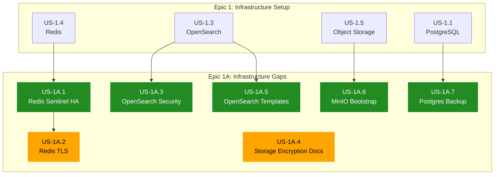

# Epic 1A: Infrastructure Gaps & Hardening - Refined User Stories

> **Epic:** Infrastructure Gaps & Hardening  
> **Priority:** High  
> **Total Estimated Effort:** 3-5 days  
> **Dependencies:** Epic 1 (Infrastructure Setup)  
> **Status:** Partially Complete

## Overview

This folder contains detailed, implementation-ready user stories addressing security, high availability, and operational gaps identified during the Epic 1 implementation review. These items must be resolved before the infrastructure can be considered production-ready.

## Architecture Reference

All stories ensure compliance with [Architecture Document](../../../docs/architecture.md), specifically:

- **Security:** TLS 1.3 for all data in transit, encryption at rest for all PVCs
- **High Availability:** Redis Sentinel for cache failover, OpenSearch 3-node cluster
- **Operations:** Automated backups, bootstrap jobs, monitoring integration
- **Governance:** Namespace-level resource quotas and limit ranges

## User Stories

| Story | Title | Priority | Effort | Status | Dependencies |
|-------|-------|----------|--------|--------|--------------|
| [US-1A.1](US-1A.1-redis-sentinel-ha.md) | Redis Sentinel for HA | Critical | 1 day | ✅ Complete | US-1.4 |
| [US-1A.2](US-1A.2-redis-tls-encryption.md) | Redis TLS Encryption | Critical | 0.5 day | ⏳ Deferred | US-1A.1 |
| [US-1A.3](US-1A.3-opensearch-security-plugin.md) | OpenSearch Security Plugin | Critical | 1 day | ✅ Complete | US-1.3 |
| [US-1A.4](US-1A.4-storage-encryption-documentation.md) | Storage Encryption Documentation | High | 0.5 day | ⏳ Pending | - |
| [US-1A.5](US-1A.5-opensearch-index-templates.md) | OpenSearch Index Templates Bootstrap | High | 0.5 day | ✅ Complete | US-1.3 |
| [US-1A.6](US-1A.6-minio-bootstrap-job.md) | MinIO Bootstrap Job | High | 0.5 day | ✅ Complete | US-1.5 |
| [US-1A.7](US-1A.7-postgres-backup-cronjob.md) | PostgreSQL Backup CronJob | High | 0.5 day | ✅ Complete | US-1.1 |

## Dependency Graph

## Implementation Order

**Recommended sequence:**

1. **US-1A.1: Redis Sentinel HA** ✅ - Automatic failover for cache layer
2. **US-1A.3: OpenSearch Security Plugin** ✅ - Authentication and TLS for search (can parallel with US-1A.1)
3. **US-1A.5: OpenSearch Index Templates** ✅ - Bootstrap analyzers and mappings
4. **US-1A.6: MinIO Bootstrap Job** ✅ - Create buckets and policies
5. **US-1A.7: Postgres Backup CronJob** ✅ - Automated daily backups
6. **US-1A.2: Redis TLS** ⏳ - Requires cert-manager or managed Redis (deferred)
7. **US-1A.4: Storage Encryption Docs** ⏳ - Cloud-provider specific documentation

## Files Created/Modified

### New Files

| File | Description |
|------|-------------|
| `k8s/base/resource-quota.yaml` | Namespace quotas and LimitRanges |
| `k8s/base/pod-disruption-budgets.yaml` | PDBs for all stateful services |
| `k8s/redis/sentinel-statefulset.yaml` | Redis Sentinel for HA failover |
| `k8s/opensearch/security-config.yaml` | Security plugin configuration |
| `k8s/opensearch/bootstrap-job.yaml` | Index templates and analyzers |
| `k8s/qdrant/bootstrap-job.yaml` | Collection creation with HNSW |
| `k8s/minio/bootstrap-job.yaml` | Buckets, policies, lifecycle rules |
| `k8s/postgres/backup-cronjob.yaml` | Automated backup job |
| `k8s/overlays/prod/opensearch-security-patch.yaml` | Production security overlay |
| `docs/infrastructure/postgres-backup-restore.md` | Backup/restore procedures |

## Quick Wins (Completed)

| Item | Description | Status |
|------|-------------|--------|
| QW-1 | Fix redis.conf to enforce `requirepass` | ✅ Complete |
| QW-2 | Add ResourceQuota and LimitRange | ✅ Complete |
| QW-3 | Enhance `.env.example` for local development | ✅ Complete |
| QW-4 | Document postgres restore procedure | ✅ Complete |

## Deferred Items

### Redis TLS (US-1A.2)

Requires certificate provisioning. Options for production deployment:

1. **cert-manager**: Generate certs for Redis pods
2. **stunnel sidecar**: TLS termination proxy
3. **Managed Redis**: ElastiCache/Memorystore with built-in TLS

### Storage Encryption (US-1A.4)

Cloud-provider specific storage classes:

| Provider | Storage Class | Encryption |
|----------|--------------|------------|
| GKE | `premium-rwo` | Default encrypted (CMEK optional) |
| EKS | `gp3` | KMS encryption required |
| AKS | `managed-premium` | Azure Disk Encryption |

## Future Work (Out of Scope)

### Python Client Updates

When deploying with security enabled:

- `OpenSearchClient` - Add TLS and auth support
- `QdrantVectorStore` - Add API key support, fix async blocking
- `RedisCache` - Add Sentinel and TLS support
- `S3Storage` - Default to `secure=True` in production

### DR Documentation

- Qdrant snapshots and rebuild procedures
- OpenSearch snapshot repository configuration
- MinIO cross-region replication

## Definition of Done

- [x] Redis Sentinel configured for automatic failover (GAP-1.1)
- [x] OpenSearch security plugin enabled in production overlay (GAP-1.3)
- [x] OpenSearch index templates bootstrap job created (GAP-1.5)
- [x] MinIO bootstrap job with buckets and policies (GAP-1.6)
- [x] PostgreSQL backup CronJob operational (GAP-1.7)
- [ ] Redis TLS implemented (deferred to production deployment)
- [ ] Storage encryption documented and verified per cloud provider
- [ ] Security scan passes with no critical findings
- [ ] HA tested via chaos engineering (pod deletion)
- [x] Documentation updated with operational runbooks
