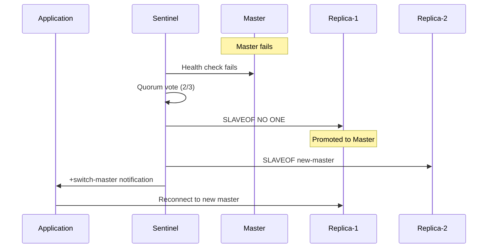

# US-1A.1: Redis Sentinel for High Availability

> **Epic:** Infrastructure Gaps & Hardening  
> **Priority:** Critical  
> **Estimated Effort:** 1 day  
> **Dependencies:** US-1.4 (Redis Cache)  
> **Status:** ✅ Complete

## User Story

**As a** platform operator  
**I want** Redis to automatically failover when the master node fails  
**So that** the caching layer remains available during node failures without manual intervention

## Problem Statement

### Current State

- Redis StatefulSet deployed with 3 replicas
- No leader election mechanism configured
- No automatic failover capability
- Application cannot distinguish between master and replica nodes
- Manual intervention required during master failure

### Impact

- Cache unavailability during master node failure
- Potential data inconsistency if applications write to stale master
- Increased MTTR (Mean Time To Recovery)
- Production SLA violations risk

## Architecture Reference

From `docs/architecture.md`:

> **Redis:** Caching with Sentinel for HA (port 6379)

Sentinel provides:
- Automatic master discovery
- Failover detection and promotion
- Client notification of topology changes

## Solution Design

### High-Level Architecture

```
┌─────────────────────────────────────────────────────────┐
│                   Application Pods                       │
│              (Connect via Sentinel Discovery)            │
└────────────────────────┬────────────────────────────────┘
                         │
                         ▼
┌─────────────────────────────────────────────────────────┐
│                 Redis Sentinel Cluster                   │
│  ┌───────────┐  ┌───────────┐  ┌───────────┐           │
│  │ Sentinel-0│  │ Sentinel-1│  │ Sentinel-2│           │
│  │  :26379   │  │  :26379   │  │  :26379   │           │
│  └─────┬─────┘  └─────┬─────┘  └─────┬─────┘           │
│        │              │              │                  │
│        └──────────────┼──────────────┘                  │
│                       ▼                                  │
│  ┌─────────────────────────────────────────────────┐    │
│  │           Redis Data Nodes                       │    │
│  │  ┌─────────┐  ┌─────────┐  ┌─────────┐         │    │
│  │  │ Master  │  │ Replica │  │ Replica │         │    │
│  │  │ :6379   │◄─│ :6379   │  │ :6379   │         │    │
│  │  └─────────┘  └─────────┘  └─────────┘         │    │
│  └─────────────────────────────────────────────────┘    │
└─────────────────────────────────────────────────────────┘
```

### Failover Sequence



## Implementation Tasks

### 1. Create Sentinel ConfigMap

Create `k8s/redis/sentinel-configmap.yaml`:

```yaml
apiVersion: v1
kind: ConfigMap
metadata:
  name: redis-sentinel-config
  namespace: rag-pipeline
data:
  sentinel.conf: |
    # Sentinel configuration
    port 26379
    
    # Monitor master with name "mymaster"
    # sentinel monitor <master-name> <ip> <port> <quorum>
    sentinel monitor mymaster redis-0.redis-headless.rag-pipeline.svc.cluster.local 6379 2
    
    # Authentication
    sentinel auth-pass mymaster ${REDIS_PASSWORD}
    
    # Failover timing
    sentinel down-after-milliseconds mymaster 5000
    sentinel failover-timeout mymaster 60000
    sentinel parallel-syncs mymaster 1
    
    # Announce IP (for pod networking)
    sentinel announce-hostnames yes
    sentinel resolve-hostnames yes
```

### 2. Create Sentinel StatefulSet

Create `k8s/redis/sentinel-statefulset.yaml`:

```yaml
apiVersion: apps/v1
kind: StatefulSet
metadata:
  name: redis-sentinel
  namespace: rag-pipeline
  labels:
    app: redis-sentinel
spec:
  serviceName: redis-sentinel-headless
  replicas: 3
  selector:
    matchLabels:
      app: redis-sentinel
  template:
    metadata:
      labels:
        app: redis-sentinel
    spec:
      securityContext:
        fsGroup: 1000
        runAsUser: 1000
        runAsNonRoot: true
      
      initContainers:
      - name: init-sentinel-config
        image: redis:7-alpine
        command:
        - /bin/sh
        - -c
        - |
          set -e
          # Copy base config
          cp /etc/redis/sentinel.conf /data/sentinel.conf
          # Replace password placeholder
          sed -i "s/\${REDIS_PASSWORD}/${REDIS_PASSWORD}/g" /data/sentinel.conf
          # Set appropriate permissions
          chmod 640 /data/sentinel.conf
        env:
        - name: REDIS_PASSWORD
          valueFrom:
            secretKeyRef:
              name: rag-secrets
              key: redis-password
        volumeMounts:
        - name: config
          mountPath: /etc/redis
        - name: data
          mountPath: /data
        securityContext:
          allowPrivilegeEscalation: false
          readOnlyRootFilesystem: false
      
      containers:
      - name: sentinel
        image: redis:7-alpine
        command:
        - redis-sentinel
        - /data/sentinel.conf
        ports:
        - containerPort: 26379
          name: sentinel
        resources:
          requests:
            memory: "64Mi"
            cpu: "50m"
          limits:
            memory: "128Mi"
            cpu: "100m"
        volumeMounts:
        - name: data
          mountPath: /data
        livenessProbe:
          exec:
            command:
            - redis-cli
            - -p
            - "26379"
            - ping
          initialDelaySeconds: 10
          periodSeconds: 5
          timeoutSeconds: 3
        readinessProbe:
          exec:
            command:
            - redis-cli
            - -p
            - "26379"
            - ping
          initialDelaySeconds: 5
          periodSeconds: 3
          timeoutSeconds: 2
        securityContext:
          allowPrivilegeEscalation: false
          readOnlyRootFilesystem: false
      
      volumes:
      - name: config
        configMap:
          name: redis-sentinel-config
      - name: data
        emptyDir: {}
      
      affinity:
        podAntiAffinity:
          requiredDuringSchedulingIgnoredDuringExecution:
          - labelSelector:
              matchLabels:
                app: redis-sentinel
            topologyKey: kubernetes.io/hostname
```

### 3. Create Sentinel Service

Create `k8s/redis/sentinel-service.yaml`:

```yaml
apiVersion: v1
kind: Service
metadata:
  name: redis-sentinel
  namespace: rag-pipeline
  labels:
    app: redis-sentinel
spec:
  type: ClusterIP
  ports:
  - port: 26379
    targetPort: 26379
    name: sentinel
  selector:
    app: redis-sentinel
---
apiVersion: v1
kind: Service
metadata:
  name: redis-sentinel-headless
  namespace: rag-pipeline
  labels:
    app: redis-sentinel
spec:
  type: ClusterIP
  clusterIP: None
  ports:
  - port: 26379
    targetPort: 26379
    name: sentinel
  selector:
    app: redis-sentinel
```

### 4. Update Redis StatefulSet for Replication

Update `k8s/redis/statefulset.yaml` to configure master/replica:

```yaml
apiVersion: apps/v1
kind: StatefulSet
metadata:
  name: redis
  namespace: rag-pipeline
spec:
  serviceName: redis-headless
  replicas: 3
  selector:
    matchLabels:
      app: redis
  template:
    metadata:
      labels:
        app: redis
    spec:
      initContainers:
      - name: init-redis
        image: redis:7-alpine
        command:
        - /bin/sh
        - -c
        - |
          set -e
          cp /etc/redis/redis.conf /data/redis.conf
          
          # Get pod ordinal
          ORDINAL=${HOSTNAME##*-}
          
          if [ "$ORDINAL" = "0" ]; then
            echo "Configuring as master"
          else
            echo "Configuring as replica of redis-0"
            echo "replicaof redis-0.redis-headless.rag-pipeline.svc.cluster.local 6379" >> /data/redis.conf
          fi
        volumeMounts:
        - name: config
          mountPath: /etc/redis
        - name: data
          mountPath: /data
      
      containers:
      - name: redis
        image: redis:7-alpine
        command:
        - redis-server
        - /data/redis.conf
        ports:
        - containerPort: 6379
          name: redis
        env:
        - name: REDIS_PASSWORD
          valueFrom:
            secretKeyRef:
              name: rag-secrets
              key: redis-password
        volumeMounts:
        - name: data
          mountPath: /data
        - name: config
          mountPath: /etc/redis
```

### 5. Update Application Connection Configuration

Python Redis client with Sentinel support:

```python
# services/shared/cache/redis_client.py
from redis.sentinel import Sentinel
from redis import Redis
import os

def get_redis_client() -> Redis:
    """Get Redis client with Sentinel support for HA."""
    
    use_sentinel = os.getenv("REDIS_USE_SENTINEL", "false").lower() == "true"
    
    if use_sentinel:
        sentinel_hosts = os.getenv(
            "REDIS_SENTINEL_HOSTS",
            "redis-sentinel.rag-pipeline.svc.cluster.local:26379"
        )
        sentinel_master = os.getenv("REDIS_SENTINEL_MASTER", "mymaster")
        password = os.getenv("REDIS_PASSWORD")
        
        # Parse sentinel hosts
        sentinels = []
        for host in sentinel_hosts.split(","):
            host, port = host.rsplit(":", 1)
            sentinels.append((host.strip(), int(port)))
        
        sentinel = Sentinel(
            sentinels,
            socket_timeout=0.5,
            password=password,
            sentinel_kwargs={"password": password}
        )
        
        # Get master connection
        return sentinel.master_for(
            sentinel_master,
            socket_timeout=0.5,
            password=password
        )
    else:
        # Direct connection for local development
        return Redis(
            host=os.getenv("REDIS_HOST", "localhost"),
            port=int(os.getenv("REDIS_PORT", 6379)),
            password=os.getenv("REDIS_PASSWORD"),
            decode_responses=True
        )


async def get_async_redis_client():
    """Get async Redis client with Sentinel support."""
    from redis.asyncio import Sentinel as AsyncSentinel
    from redis.asyncio import Redis as AsyncRedis
    
    use_sentinel = os.getenv("REDIS_USE_SENTINEL", "false").lower() == "true"
    
    if use_sentinel:
        sentinel_hosts = os.getenv(
            "REDIS_SENTINEL_HOSTS",
            "redis-sentinel.rag-pipeline.svc.cluster.local:26379"
        )
        sentinel_master = os.getenv("REDIS_SENTINEL_MASTER", "mymaster")
        password = os.getenv("REDIS_PASSWORD")
        
        sentinels = []
        for host in sentinel_hosts.split(","):
            host, port = host.rsplit(":", 1)
            sentinels.append((host.strip(), int(port)))
        
        sentinel = AsyncSentinel(
            sentinels,
            password=password,
            sentinel_kwargs={"password": password}
        )
        
        return sentinel.master_for(sentinel_master, password=password)
    else:
        return AsyncRedis(
            host=os.getenv("REDIS_HOST", "localhost"),
            port=int(os.getenv("REDIS_PORT", 6379)),
            password=os.getenv("REDIS_PASSWORD"),
            decode_responses=True
        )
```

### 6. Environment Variables

Add to `.env.example`:

```bash
# Redis Sentinel Configuration
REDIS_USE_SENTINEL=false  # Set to true in production
REDIS_SENTINEL_HOSTS=redis-sentinel.rag-pipeline.svc.cluster.local:26379
REDIS_SENTINEL_MASTER=mymaster
REDIS_PASSWORD=your-secure-password
```

### 7. Pod Disruption Budget

Create `k8s/redis/pdb.yaml`:

```yaml
apiVersion: policy/v1
kind: PodDisruptionBudget
metadata:
  name: redis-pdb
  namespace: rag-pipeline
spec:
  minAvailable: 2
  selector:
    matchLabels:
      app: redis
---
apiVersion: policy/v1
kind: PodDisruptionBudget
metadata:
  name: redis-sentinel-pdb
  namespace: rag-pipeline
spec:
  minAvailable: 2
  selector:
    matchLabels:
      app: redis-sentinel
```

## Acceptance Criteria

- [x] Redis Sentinel StatefulSet deployed with 3 replicas
- [x] Sentinel monitors Redis master and replicas
- [x] Automatic failover occurs within 30 seconds of master failure
- [x] Applications reconnect transparently via Sentinel discovery
- [x] Pod disruption budgets prevent simultaneous evictions
- [x] Anti-affinity rules spread Sentinel pods across nodes
- [x] Health checks configured for both Redis and Sentinel
- [x] Documentation updated with failover procedures

## Verification Commands

```bash
# Check Sentinel status
kubectl exec -it redis-sentinel-0 -n rag-pipeline -- \
  redis-cli -p 26379 SENTINEL master mymaster

# Check master info
kubectl exec -it redis-sentinel-0 -n rag-pipeline -- \
  redis-cli -p 26379 SENTINEL get-master-addr-by-name mymaster

# Check replica count
kubectl exec -it redis-sentinel-0 -n rag-pipeline -- \
  redis-cli -p 26379 SENTINEL replicas mymaster

# Test failover (delete master pod)
kubectl delete pod redis-0 -n rag-pipeline

# Watch failover (in another terminal)
kubectl logs -f redis-sentinel-0 -n rag-pipeline

# Verify new master elected
kubectl exec -it redis-sentinel-0 -n rag-pipeline -- \
  redis-cli -p 26379 SENTINEL get-master-addr-by-name mymaster
```

## Chaos Testing Procedure

```bash
# 1. Get current master
MASTER=$(kubectl exec redis-sentinel-0 -n rag-pipeline -- \
  redis-cli -p 26379 SENTINEL get-master-addr-by-name mymaster | head -1)
echo "Current master: $MASTER"

# 2. Delete master pod
kubectl delete pod redis-0 -n rag-pipeline

# 3. Wait for failover (max 30 seconds)
sleep 35

# 4. Verify new master
NEW_MASTER=$(kubectl exec redis-sentinel-0 -n rag-pipeline -- \
  redis-cli -p 26379 SENTINEL get-master-addr-by-name mymaster | head -1)
echo "New master: $NEW_MASTER"

# 5. Test application connectivity
kubectl exec -it deployment/retrieval-service -n rag-pipeline -- \
  python -c "from cache.redis_client import get_redis_client; r = get_redis_client(); print(r.ping())"
```

## Rollback Procedure

If Sentinel causes issues, revert to standalone Redis:

```bash
# 1. Scale down Sentinel
kubectl scale statefulset redis-sentinel -n rag-pipeline --replicas=0

# 2. Update application config
kubectl set env deployment/retrieval-service -n rag-pipeline \
  REDIS_USE_SENTINEL=false \
  REDIS_HOST=redis-0.redis-headless.rag-pipeline.svc.cluster.local

# 3. Restart applications
kubectl rollout restart deployment -n rag-pipeline
```

## Files Created

| File | Description |
|------|-------------|
| `k8s/redis/sentinel-configmap.yaml` | Sentinel configuration |
| `k8s/redis/sentinel-statefulset.yaml` | Sentinel cluster deployment |
| `k8s/redis/sentinel-service.yaml` | Sentinel service endpoints |
| `k8s/redis/pdb.yaml` | Pod disruption budgets |
| `services/shared/cache/redis_client.py` | Updated client with Sentinel support |

## Related Stories

- **US-1.4:** Redis Cache (prerequisite)
- **US-1A.2:** Redis TLS Encryption (next step)
