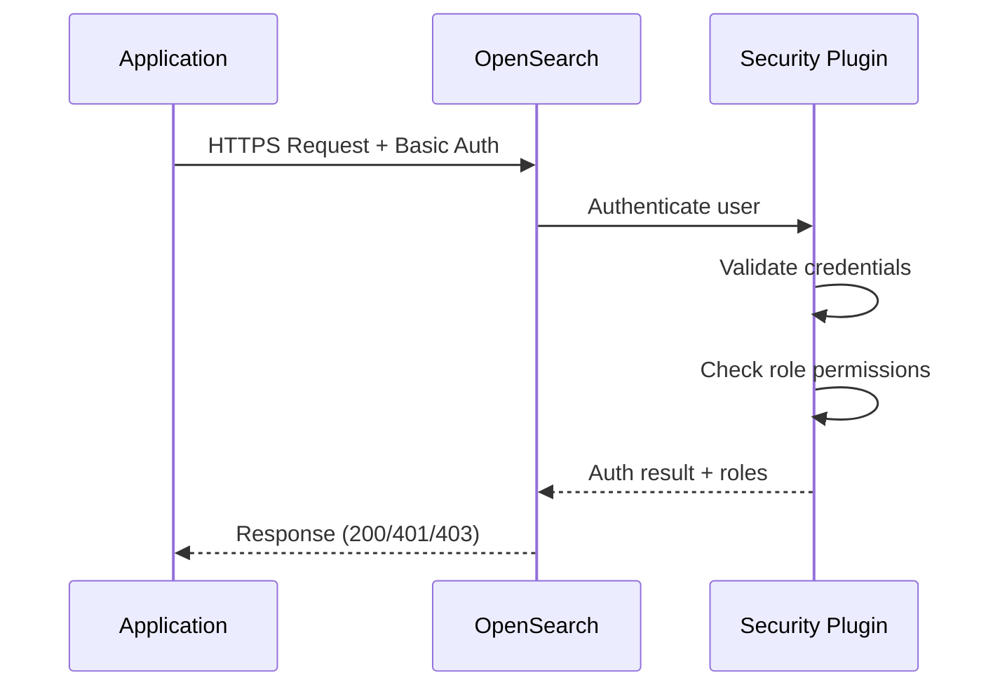

# US-1A.3: OpenSearch Security Plugin

> **Epic:** Infrastructure Gaps & Hardening  
> **Priority:** Critical  
> **Estimated Effort:** 1 day  
> **Dependencies:** US-1.3 (OpenSearch Cluster)  
> **Status:** ✅ Complete

## User Story

**As a** security engineer  
**I want** OpenSearch to require authentication and encrypt all traffic  
**So that** search data is protected from unauthorized access and meets compliance requirements

## Problem Statement

### Current State

- `DISABLE_SECURITY_PLUGIN=true` set in K8s manifests
- No authentication required for OpenSearch API
- HTTP and transport layer communications are unencrypted
- Any pod in the namespace can query/modify search indices
- Development-friendly but production-unsafe

### Impact

- Complete data exposure to any cluster pod
- No audit trail for data access
- Non-compliance with security standards
- Risk of data tampering or deletion

## Architecture Reference

From `docs/architecture.md`:

> **Security:** TLS 1.3 for all data in transit  
> **OpenSearch:** Keyword search with BM25 (port 9200)

Production deployments require:
- HTTPS for all client connections
- TLS for inter-node transport
- Role-based access control (RBAC)

## Solution Design

### Security Plugin Components

```
┌─────────────────────────────────────────────────────────────────┐
│                    OpenSearch Security                           │
├─────────────────────────────────────────────────────────────────┤
│                                                                  │
│  ┌──────────────┐  ┌──────────────┐  ┌──────────────┐          │
│  │  HTTP TLS    │  │  Transport   │  │    RBAC      │          │
│  │  (Port 9200) │  │  TLS (9300)  │  │   Engine     │          │
│  └──────────────┘  └──────────────┘  └──────────────┘          │
│                                                                  │
│  ┌──────────────┐  ┌──────────────┐  ┌──────────────┐          │
│  │   Internal   │  │    Audit     │  │  Document    │          │
│  │    Users     │  │    Logging   │  │ Level Sec    │          │
│  └──────────────┘  └──────────────┘  └──────────────┘          │
│                                                                  │
└─────────────────────────────────────────────────────────────────┘
```

### Authentication Flow



## Implementation Tasks

### 1. Create Security Configuration Secret

Create `k8s/opensearch/security-config.yaml`:

```yaml
apiVersion: v1
kind: Secret
metadata:
  name: opensearch-security-config
  namespace: rag-pipeline
type: Opaque
stringData:
  internal_users.yml: |
    ---
    _meta:
      type: "internalusers"
      config_version: 2
    
    # Admin user for cluster management
    admin:
      hash: "$2y$12$..."  # bcrypt hash of password
      reserved: true
      backend_roles:
      - "admin"
      description: "Admin user for cluster management"
    
    # Service account for RAG pipeline
    rag_service:
      hash: "$2y$12$..."  # bcrypt hash of password
      reserved: false
      backend_roles:
      - "rag_readwrite"
      description: "Service account for RAG pipeline applications"
    
    # Read-only user for monitoring
    monitoring:
      hash: "$2y$12$..."
      reserved: false
      backend_roles:
      - "readall"
      description: "Monitoring and metrics collection"

  roles.yml: |
    ---
    _meta:
      type: "roles"
      config_version: 2
    
    rag_readwrite:
      cluster_permissions:
      - "cluster_composite_ops"
      - "indices:data/read/scroll*"
      index_permissions:
      - index_patterns:
        - "documents*"
        - "chunks*"
        allowed_actions:
        - "crud"
        - "create_index"
      - index_patterns:
        - "*"
        allowed_actions:
        - "indices:admin/aliases*"
    
    rag_readonly:
      cluster_permissions:
      - "cluster_composite_ops_ro"
      index_permissions:
      - index_patterns:
        - "documents*"
        - "chunks*"
        allowed_actions:
        - "read"

  roles_mapping.yml: |
    ---
    _meta:
      type: "rolesmapping"
      config_version: 2
    
    all_access:
      reserved: false
      backend_roles:
      - "admin"
      description: "Maps admin backend role to all_access"
    
    rag_readwrite:
      reserved: false
      backend_roles:
      - "rag_readwrite"
      users:
      - "rag_service"
    
    readall:
      reserved: false
      backend_roles:
      - "readall"
      users:
      - "monitoring"

  config.yml: |
    ---
    _meta:
      type: "config"
      config_version: 2
    
    config:
      dynamic:
        http:
          anonymous_auth_enabled: false
          xff:
            enabled: false
        authc:
          basic_internal_auth:
            description: "Authenticate via HTTP Basic against internal users"
            http_enabled: true
            transport_enabled: true
            order: 0
            http_authenticator:
              type: basic
              challenge: true
            authentication_backend:
              type: intern
        authz:
          roles_from_myldap:
            description: "Authorize via internal roles"
            http_enabled: true
            transport_enabled: true
            authorization_backend:
              type: intern
```

### 2. Generate Password Hashes

Create a script to generate bcrypt hashes:

```bash
#!/bin/bash
# scripts/generate-opensearch-hash.sh

PASSWORD=$1

if [ -z "$PASSWORD" ]; then
    echo "Usage: $0 <password>"
    exit 1
fi

docker run --rm opensearchproject/opensearch:2.11.0 \
    /usr/share/opensearch/plugins/opensearch-security/tools/hash.sh \
    -p "$PASSWORD"
```

### 3. Create TLS Certificates

Create `k8s/opensearch/certificate.yaml`:

```yaml
apiVersion: cert-manager.io/v1
kind: Certificate
metadata:
  name: opensearch-http-tls
  namespace: rag-pipeline
spec:
  secretName: opensearch-http-tls-secret
  duration: 8760h
  renewBefore: 720h
  subject:
    organizations:
    - rag-pipeline
  isCA: false
  privateKey:
    algorithm: RSA
    size: 2048
  usages:
  - server auth
  - client auth
  dnsNames:
  - opensearch
  - opensearch.rag-pipeline.svc
  - opensearch.rag-pipeline.svc.cluster.local
  - opensearch-headless
  - opensearch-headless.rag-pipeline.svc.cluster.local
  - "*.opensearch-headless.rag-pipeline.svc.cluster.local"
  issuerRef:
    name: rag-ca-issuer
    kind: ClusterIssuer
---
apiVersion: cert-manager.io/v1
kind: Certificate
metadata:
  name: opensearch-transport-tls
  namespace: rag-pipeline
spec:
  secretName: opensearch-transport-tls-secret
  duration: 8760h
  renewBefore: 720h
  subject:
    organizations:
    - rag-pipeline
  isCA: false
  privateKey:
    algorithm: RSA
    size: 2048
  usages:
  - server auth
  - client auth
  dnsNames:
  - "*.opensearch-headless.rag-pipeline.svc.cluster.local"
  issuerRef:
    name: rag-ca-issuer
    kind: ClusterIssuer
```

### 4. Create Production Overlay

Create `k8s/overlays/prod/opensearch-security-patch.yaml`:

```yaml
apiVersion: apps/v1
kind: StatefulSet
metadata:
  name: opensearch
  namespace: rag-pipeline
spec:
  template:
    spec:
      initContainers:
      - name: init-security
        image: opensearchproject/opensearch:2.11.0
        command:
        - /bin/bash
        - -c
        - |
          set -e
          # Copy security config to data directory
          mkdir -p /usr/share/opensearch/config/opensearch-security
          cp /security-config/*.yml /usr/share/opensearch/config/opensearch-security/
          
          # Set permissions
          chmod 600 /usr/share/opensearch/config/opensearch-security/*.yml
        volumeMounts:
        - name: security-config
          mountPath: /security-config
          readOnly: true
        - name: data
          mountPath: /usr/share/opensearch/data
      
      containers:
      - name: opensearch
        env:
        # Remove security disable flag
        - name: DISABLE_SECURITY_PLUGIN
          value: "false"
        # Enable security
        - name: plugins.security.ssl.http.enabled
          value: "true"
        - name: plugins.security.ssl.http.pemcert_filepath
          value: "/tls/http/tls.crt"
        - name: plugins.security.ssl.http.pemkey_filepath
          value: "/tls/http/tls.key"
        - name: plugins.security.ssl.http.pemtrustedcas_filepath
          value: "/tls/http/ca.crt"
        - name: plugins.security.ssl.transport.enabled
          value: "true"
        - name: plugins.security.ssl.transport.pemcert_filepath
          value: "/tls/transport/tls.crt"
        - name: plugins.security.ssl.transport.pemkey_filepath
          value: "/tls/transport/tls.key"
        - name: plugins.security.ssl.transport.pemtrustedcas_filepath
          value: "/tls/transport/ca.crt"
        - name: plugins.security.ssl.transport.enforce_hostname_verification
          value: "false"
        - name: plugins.security.authcz.admin_dn
          value: "CN=admin,O=rag-pipeline"
        - name: plugins.security.nodes_dn
          value: "CN=*.opensearch-headless.rag-pipeline.svc.cluster.local,O=rag-pipeline"
        - name: plugins.security.audit.type
          value: "internal_opensearch"
        - name: plugins.security.enable_snapshot_restore_privilege
          value: "true"
        - name: plugins.security.check_snapshot_restore_write_privileges
          value: "true"
        - name: plugins.security.restapi.roles_enabled
          value: "all_access,security_rest_api_access"
        volumeMounts:
        - name: http-tls
          mountPath: /tls/http
          readOnly: true
        - name: transport-tls
          mountPath: /tls/transport
          readOnly: true
        - name: security-config
          mountPath: /security-config
          readOnly: true
      
      volumes:
      - name: http-tls
        secret:
          secretName: opensearch-http-tls-secret
      - name: transport-tls
        secret:
          secretName: opensearch-transport-tls-secret
      - name: security-config
        secret:
          secretName: opensearch-security-config
```

### 5. Security Initialization Job

Create `k8s/opensearch/security-init-job.yaml`:

```yaml
apiVersion: batch/v1
kind: Job
metadata:
  name: opensearch-security-init
  namespace: rag-pipeline
spec:
  ttlSecondsAfterFinished: 300
  template:
    spec:
      restartPolicy: OnFailure
      containers:
      - name: securityadmin
        image: opensearchproject/opensearch:2.11.0
        command:
        - /bin/bash
        - -c
        - |
          set -e
          
          # Wait for OpenSearch to be ready
          until curl -sk https://opensearch:9200 -u admin:$ADMIN_PASSWORD; do
            echo "Waiting for OpenSearch..."
            sleep 5
          done
          
          # Run securityadmin
          /usr/share/opensearch/plugins/opensearch-security/tools/securityadmin.sh \
            -cd /usr/share/opensearch/config/opensearch-security/ \
            -icl -nhnv \
            -cacert /tls/ca.crt \
            -cert /tls/tls.crt \
            -key /tls/tls.key \
            -h opensearch.rag-pipeline.svc.cluster.local
          
          echo "Security configuration applied successfully"
        env:
        - name: ADMIN_PASSWORD
          valueFrom:
            secretKeyRef:
              name: rag-secrets
              key: opensearch-admin-password
        volumeMounts:
        - name: security-config
          mountPath: /usr/share/opensearch/config/opensearch-security
        - name: tls
          mountPath: /tls
          readOnly: true
      volumes:
      - name: security-config
        secret:
          secretName: opensearch-security-config
      - name: tls
        secret:
          secretName: opensearch-http-tls-secret
```

### 6. Update Python Client for Authentication

```python
# services/shared/search/opensearch_client.py
from opensearchpy import OpenSearch
import ssl
import os

def get_opensearch_client() -> OpenSearch:
    """Get OpenSearch client with security configuration."""
    
    host = os.getenv("OPENSEARCH_HOST", "localhost")
    port = int(os.getenv("OPENSEARCH_PORT", 9200))
    use_ssl = os.getenv("OPENSEARCH_USE_SSL", "false").lower() == "true"
    verify_certs = os.getenv("OPENSEARCH_VERIFY_CERTS", "true").lower() == "true"
    
    # Authentication
    username = os.getenv("OPENSEARCH_USERNAME", "admin")
    password = os.getenv("OPENSEARCH_PASSWORD")
    
    # SSL configuration
    ssl_context = None
    if use_ssl:
        ssl_context = ssl.create_default_context()
        
        ca_cert = os.getenv("OPENSEARCH_CA_CERT")
        if ca_cert:
            ssl_context.load_verify_locations(ca_cert)
        
        if not verify_certs:
            ssl_context.check_hostname = False
            ssl_context.verify_mode = ssl.CERT_NONE
    
    return OpenSearch(
        hosts=[{"host": host, "port": port}],
        http_auth=(username, password) if password else None,
        use_ssl=use_ssl,
        verify_certs=verify_certs,
        ssl_context=ssl_context,
        ssl_show_warn=False,
        timeout=30,
        max_retries=3,
        retry_on_timeout=True
    )


async def get_async_opensearch_client():
    """Get async OpenSearch client with security configuration."""
    from opensearchpy import AsyncOpenSearch
    
    host = os.getenv("OPENSEARCH_HOST", "localhost")
    port = int(os.getenv("OPENSEARCH_PORT", 9200))
    use_ssl = os.getenv("OPENSEARCH_USE_SSL", "false").lower() == "true"
    verify_certs = os.getenv("OPENSEARCH_VERIFY_CERTS", "true").lower() == "true"
    
    username = os.getenv("OPENSEARCH_USERNAME", "admin")
    password = os.getenv("OPENSEARCH_PASSWORD")
    
    return AsyncOpenSearch(
        hosts=[{"host": host, "port": port}],
        http_auth=(username, password) if password else None,
        use_ssl=use_ssl,
        verify_certs=verify_certs,
        ssl_show_warn=False,
        timeout=30,
    )
```

### 7. Environment Variables

Add to `.env.example`:

```bash
# OpenSearch Security Configuration
OPENSEARCH_USE_SSL=false  # Set to true in production
OPENSEARCH_VERIFY_CERTS=true
OPENSEARCH_USERNAME=rag_service
OPENSEARCH_PASSWORD=your-secure-password
OPENSEARCH_CA_CERT=/tls/ca.crt
```

## Acceptance Criteria

- [x] Security plugin enabled in production overlay
- [x] HTTP layer requires TLS and authentication
- [x] Transport layer uses TLS for inter-node communication
- [x] Internal users and roles configured
- [x] Service account with least-privilege permissions
- [x] Audit logging enabled
- [x] Application clients updated with authentication
- [x] Local development remains without security (dev overlay)

## Verification Commands

```bash
# Test unauthenticated access (should fail)
curl -k https://opensearch.rag-pipeline.svc.cluster.local:9200

# Test authenticated access
curl -k -u rag_service:$PASSWORD \
  https://opensearch.rag-pipeline.svc.cluster.local:9200/_cluster/health

# Check security status
curl -k -u admin:$ADMIN_PASSWORD \
  https://opensearch.rag-pipeline.svc.cluster.local:9200/_plugins/_security/health

# List users
curl -k -u admin:$ADMIN_PASSWORD \
  https://opensearch.rag-pipeline.svc.cluster.local:9200/_plugins/_security/api/internalusers

# Check audit logs
curl -k -u admin:$ADMIN_PASSWORD \
  https://opensearch.rag-pipeline.svc.cluster.local:9200/.opendistro-security-auditlog*/_search
```

## Development vs Production

| Feature | Development | Production |
|---------|-------------|------------|
| Security Plugin | Disabled | Enabled |
| TLS | None | TLS 1.2+ |
| Authentication | None | Basic Auth |
| Port | 9200 (HTTP) | 9200 (HTTPS) |
| Transport TLS | No | Yes |

Use Kustomize overlays to manage differences:

```bash
# Local development
kubectl apply -k k8s/overlays/dev

# Production
kubectl apply -k k8s/overlays/prod
```

## Files Created

| File | Description |
|------|-------------|
| `k8s/opensearch/security-config.yaml` | Users, roles, and RBAC |
| `k8s/opensearch/certificate.yaml` | TLS certificates |
| `k8s/opensearch/security-init-job.yaml` | Security initialization |
| `k8s/overlays/prod/opensearch-security-patch.yaml` | Production overlay |
| `scripts/generate-opensearch-hash.sh` | Password hash generator |
| `services/shared/search/opensearch_client.py` | Updated client |

## Related Stories

- **US-1.3:** OpenSearch Cluster (prerequisite)
- **US-1A.5:** OpenSearch Index Templates Bootstrap (related)
