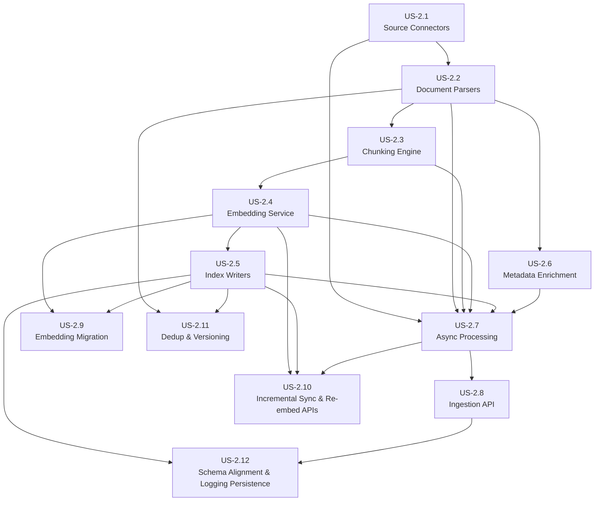

# Epic 2: Ingestion Service - Refined User Stories

> **Epic:** Ingestion Service  
> **Priority:** Critical  
> **Total Estimated Effort:** 3-4 weeks  
> **Dependencies:** Epic 1 (Infrastructure Setup)

## Overview

This folder contains detailed, implementation-ready user stories for the Ingestion Service. Each story is self-contained with technical requirements, code examples, acceptance criteria, and testing guidelines.

## Architecture Reference

All stories adhere to the [Architecture Document](../../../docs/architecture.md), specifically:

- **Framework:** FastAPI + Pydantic v2
- **Task Queue:** Celery + Redis
- **Vector Store:** Qdrant (port 6333)
- **Keyword Store:** OpenSearch (port 9200)
- **Metadata Store:** PostgreSQL (port 5432)
- **Embedding Model:** BAAI/bge-large-en-v1.5 (1024 dimensions)
- **Chunking:** Target 300 tokens (max 512), 50 token overlap
- **LLM Gateway:** Port 8004
- **Ingestion API:** Port 8001

## User Stories

| Story | Title | Priority | Effort | Dependencies |
|-------|-------|----------|--------|--------------|
| [US-2.1](US-2.1-source-connectors.md) | Source Connectors | Critical | 3-4 days | - |
| [US-2.2](US-2.2-document-parsers.md) | Document Parsers | Critical | 3-4 days | US-2.1 |
| [US-2.3](US-2.3-chunking-engine.md) | Chunking Engine | Critical | 2-3 days | US-2.2 |
| [US-2.4](US-2.4-embedding-service.md) | Embedding Service | Critical | 2-3 days | US-2.3 |
| [US-2.5](US-2.5-index-writers.md) | Index Writers | Critical | 2-3 days | US-2.4 |
| [US-2.6](US-2.6-metadata-enrichment.md) | Metadata Enrichment | High | 2 days | US-2.2 |
| [US-2.7](US-2.7-async-processing.md) | Async Processing | Critical | 2-3 days | US-2.1-2.6 |
| [US-2.8](US-2.8-ingestion-api.md) | Ingestion API | Critical | 2 days | US-2.1-2.7 |
| [US-2.9](US-2.9-embedding-model-migration.md) | Embedding Model Migration | Medium | 2-3 days | US-2.4, US-2.5 |
| [US-2.10](US-2.10-incremental-sync-reembed-apis.md) | Incremental Sync & Re-embed APIs | Critical | 2 days | US-2.1-2.5, US-2.7 |
| [US-2.11](US-2.11-dedup-versioning.md) | Deduplication & Versioning (content hash) | High | 2 days | US-2.2, US-2.5 |
| [US-2.12](US-2.12-schema-alignment-logging.md) | Schema Alignment & Logging Persistence | High | 2 days | US-2.5, US-2.8 |

## Dependency Graph



## Implementation Order

**Recommended sequence:**

1. **US-2.1: Source Connectors** - Foundation for loading documents
2. **US-2.2: Document Parsers** - Parse various formats
3. **US-2.3: Chunking Engine** - Split documents for embedding
4. **US-2.6: Metadata Enrichment** - Can be done in parallel with US-2.4
5. **US-2.4: Embedding Service** - Generate vectors
6. **US-2.5: Index Writers** - Store in Qdrant/OpenSearch/PostgreSQL
7. **US-2.7: Async Processing** - Celery tasks for background processing
8. **US-2.8: Ingestion API** - FastAPI endpoints
9. **US-2.9: Embedding Model Migration** - Optional, for model upgrades
10. **US-2.10: Incremental Sync & Re-embed APIs** - `/ingest/sync` and `/ingest/reembed` per architecture contracts
11. **US-2.11: Deduplication & Versioning** - Content-hash dedup/versioning, consistent with `source_documents` and `chunks`
12. **US-2.12: Schema Alignment & Logging Persistence** - Persist to architecture schemas and capture ingestion/retrieval/eval logs

## Service Structure

```
ingestion-service/
├── api/
│   ├── main.py              # FastAPI application
│   ├── routes/
│   │   ├── ingest.py        # Ingestion endpoints
│   │   └── documents.py     # Document management
│   ├── schemas/
│   │   ├── ingest.py        # Request/response models
│   │   └── documents.py     # Document models
│   └── dependencies.py      # Dependency injection
├── connectors/
│   ├── base.py              # Connector interface
│   ├── filesystem.py        # Local + S3
│   ├── database.py          # PostgreSQL, MySQL
│   ├── web.py               # Web scraper
│   └── api.py               # REST API
├── processors/
│   ├── parsers/
│   │   ├── base.py          # Parser interface
│   │   ├── pdf.py           # PDF (PyMuPDF + Unstructured)
│   │   ├── docx.py          # Word documents
│   │   ├── html.py          # HTML
│   │   ├── markdown.py      # Markdown
│   │   └── text.py          # Plain text
│   ├── chunking.py          # Chunking strategies
│   └── enrichment.py        # Metadata enrichment
├── embedding/
│   ├── service.py           # Embedding generation
│   └── cache.py             # Redis cache
├── indexing/
│   ├── qdrant.py            # Vector store writer
│   ├── opensearch.py        # Keyword index writer
│   ├── postgres.py          # Metadata store
│   └── coordinator.py       # Multi-store coordination
├── tasks/
│   ├── celery_app.py        # Celery configuration
│   ├── ingest.py            # Ingestion tasks
│   └── reembed.py           # Re-embedding tasks
├── config.py                # Configuration
├── run.py                   # Entry point
└── requirements.txt         # Dependencies
```

## Key Dependencies

```txt
# Framework
fastapi>=0.104.0
uvicorn>=0.24.0
pydantic>=2.5.0
pydantic-settings>=2.1.0

# Task Queue
celery>=5.3.0
redis>=5.0.0

# Connectors
aiofiles>=23.0.0
aioboto3>=12.0.0
asyncpg>=0.29.0
aiomysql>=0.2.0
aiohttp>=3.9.0

# Parsers
PyMuPDF>=1.23.0
unstructured>=0.11.0
python-docx>=1.1.0
beautifulsoup4>=4.12.0
markdownify>=0.11.0

# NLP
spacy>=3.7.0
tiktoken>=0.5.0
langdetect>=1.0.9
presidio-analyzer>=2.2.0
presidio-anonymizer>=2.2.0

# Vector/Search
qdrant-client>=1.7.0
opensearch-py>=2.4.0

# Utilities
httpx>=0.25.0
tenacity>=8.2.0
python-magic>=0.4.27
```

## Definition of Done (Epic Level)

- [ ] All connectors functional and tested
- [ ] All parsers handle sample documents correctly
- [ ] Chunking produces expected output with configurable strategies
- [ ] Embeddings cached correctly in Redis
- [ ] Documents searchable in Qdrant and OpenSearch
- [ ] Async jobs complete successfully with progress tracking
- [ ] API endpoints documented and tested
- [ ] `/ingest/sync` and `/ingest/reembed` APIs implemented per architecture contract
- [ ] Content hash dedup/versioning enforced; embeddings use 1024-dim model; chunking defaults 300/512/50 overlap
- [ ] Postgres schema alignment validated for `source_documents`, `chunks`, `embedding_jobs`; ingestion/retrieval/eval logs persisted as defined
- [ ] 80%+ test coverage across all modules
- [ ] All type hints validated with mypy
- [ ] Performance requirements met (1000+ docs/hour)
