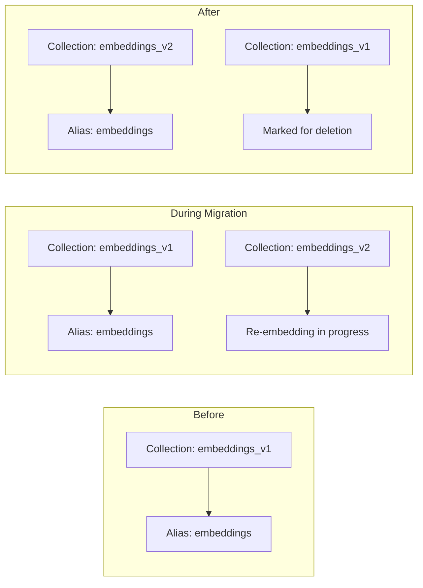

# US-2.9: Embedding Model Migration

> **Story ID:** US-2.9  
> **Epic:** Ingestion Service  
> **Priority:** Medium  
> **Estimated Effort:** 2-3 days  
> **Dependencies:** US-2.4 (Embedding Service), US-2.5 (Index Writers)

## User Story

**As a** system administrator  
**I want** to migrate embeddings to a new model version  
**So that** I can improve retrieval quality without downtime

## Context

Embedding models are periodically updated with better performance. Migrating to a new model requires re-embedding all documents while maintaining system availability. This story implements a zero-downtime migration strategy using collection aliasing and progressive re-embedding.

## Architecture Reference

- **Embedding Models:** `BAAI/bge-large-en-v1.5` (1024 dims), `BAAI/bge-m3` (per `docs/architecture.md`)
- **Vector Database:** Qdrant with collection aliasing
- **Task Queue:** Celery for background re-embedding

## Technical Requirements

### Migration Strategy Overview



### Directory Structure

```
ingestion-service/
├── migrations/
│   ├── __init__.py
│   ├── embedding_migrator.py    # Main migration logic
│   ├── collection_manager.py    # Qdrant collection management
│   └── progress_tracker.py      # Migration progress tracking
└── tasks/
    └── reembed.py               # Celery re-embedding tasks
```

### Data Models

```python
from pydantic import BaseModel, Field
from typing import Optional, Literal
from uuid import UUID
from datetime import datetime
from enum import Enum

class MigrationStatus(str, Enum):
    PENDING = "pending"
    IN_PROGRESS = "in_progress"
    VALIDATING = "validating"
    SWITCHING = "switching"
    COMPLETED = "completed"
    FAILED = "failed"
    ROLLED_BACK = "rolled_back"

class EmbeddingMigration(BaseModel):
    """Tracks an embedding model migration."""
    migration_id: UUID
    
    # Model info
    source_model: str
    target_model: str
    source_dimensions: int
    target_dimensions: int
    
    # Collection info
    source_collection: str
    target_collection: str
    alias_name: str = "rag_chunks"
    
    # Progress
    status: MigrationStatus = MigrationStatus.PENDING
    total_documents: int = 0
    processed_documents: int = 0
    failed_documents: int = 0
    
    # Timestamps
    created_at: datetime = Field(default_factory=datetime.utcnow)
    started_at: Optional[datetime] = None
    completed_at: Optional[datetime] = None
    
    # Validation
    validation_score: Optional[float] = None
    validation_passed: bool = False
    
    # Rollback info
    rollback_enabled: bool = True
    
    @property
    def progress_percentage(self) -> float:
        if self.total_documents == 0:
            return 0.0
        return round(self.processed_documents / self.total_documents * 100, 2)

class MigrationRequest(BaseModel):
    """Request to start an embedding migration."""
    target_model: str = Field(..., description="New embedding model name")
    target_dimensions: Optional[int] = Field(None, description="Dimensions (auto-detected if None)")
    
    # Scope
    tenant_ids: Optional[list[str]] = Field(None, description="Limit to specific tenants")
    document_filters: Optional[dict] = Field(None, description="Filter documents to migrate")
    
    # Options
    batch_size: int = Field(default=100, ge=10, le=1000)
    max_concurrent_batches: int = Field(default=4, ge=1, le=16)
    validate_before_switch: bool = True
    auto_switch: bool = False  # Require manual switch confirmation
    preserve_source: bool = True  # Keep old collection for rollback
```

### Collection Manager

```python
from qdrant_client import QdrantClient
from qdrant_client.models import VectorParams, Distance
from typing import Optional
import logging

logger = logging.getLogger(__name__)

class CollectionManager:
    """Manage Qdrant collections for embedding migrations."""
    
    def __init__(self, client: QdrantClient):
        self.client = client
    
    async def create_migration_collection(
        self,
        collection_name: str,
        dimensions: int,
        distance: Distance = Distance.COSINE
    ) -> bool:
        """Create a new collection for migration target."""
        try:
            await self.client.create_collection(
                collection_name=collection_name,
                vectors_config=VectorParams(
                    size=dimensions,
                    distance=distance
                )
            )
            logger.info(f"Created migration collection: {collection_name}")
            return True
        except Exception as e:
            logger.error(f"Failed to create collection {collection_name}: {e}")
            return False
    
    async def get_alias_target(self, alias_name: str) -> Optional[str]:
        """Get the collection currently pointed to by an alias."""
        aliases = await self.client.get_aliases()
        for alias in aliases.aliases:
            if alias.alias_name == alias_name:
                return alias.collection_name
        return None
    
    async def switch_alias(
        self,
        alias_name: str,
        new_collection: str,
        old_collection: Optional[str] = None
    ) -> bool:
        """Atomically switch alias to new collection."""
        try:
            # Qdrant supports atomic alias updates
            await self.client.update_collection_aliases(
                change_aliases_operations=[
                    # Remove old alias if exists
                    {"action": "delete", "alias": alias_name}
                    if old_collection else None,
                    # Create new alias
                    {
                        "action": "create",
                        "alias": alias_name,
                        "collection_name": new_collection
                    }
                ]
            )
            logger.info(f"Switched alias {alias_name} to {new_collection}")
            return True
        except Exception as e:
            logger.error(f"Failed to switch alias: {e}")
            return False
    
    async def delete_collection(self, collection_name: str) -> bool:
        """Delete a collection (after successful migration)."""
        try:
            await self.client.delete_collection(collection_name)
            logger.info(f"Deleted collection: {collection_name}")
            return True
        except Exception as e:
            logger.error(f"Failed to delete collection: {e}")
            return False
```

### Embedding Migrator

```python
from uuid import UUID, uuid4
from datetime import datetime
from typing import Optional, AsyncIterator
import asyncio
import logging

logger = logging.getLogger(__name__)

class EmbeddingMigrator:
    """Orchestrates embedding model migrations."""
    
    def __init__(
        self,
        collection_manager: CollectionManager,
        embedding_service: "EmbeddingService",
        document_service: "DocumentService",
        progress_store: "MigrationProgressStore"
    ):
        self.collections = collection_manager
        self.embeddings = embedding_service
        self.documents = document_service
        self.progress = progress_store
    
    async def start_migration(
        self,
        request: MigrationRequest
    ) -> EmbeddingMigration:
        """Start a new embedding migration."""
        migration_id = uuid4()
        
        # Detect current model and collection
        current_collection = await self.collections.get_alias_target("rag_chunks")
        current_model = await self._detect_current_model(current_collection)
        
        # Generate new collection name with version
        version = datetime.utcnow().strftime("%Y%m%d%H%M%S")
        target_collection = f"rag_chunks_v{version}"
        
        # Detect dimensions if not specified
        target_dims = request.target_dimensions or await self.embeddings.get_dimensions(
            request.target_model
        )
        
        # Count documents to migrate
        total_docs = await self.documents.count_documents(
            tenant_ids=request.tenant_ids,
            filters=request.document_filters
        )
        
        # Create migration record
        migration = EmbeddingMigration(
            migration_id=migration_id,
            source_model=current_model,
            target_model=request.target_model,
            source_dimensions=await self._get_collection_dims(current_collection),
            target_dimensions=target_dims,
            source_collection=current_collection,
            target_collection=target_collection,
            total_documents=total_docs
        )
        
        # Save migration record
        await self.progress.save_migration(migration)
        
        # Create target collection
        await self.collections.create_migration_collection(
            target_collection,
            target_dims
        )
        
        # Start background re-embedding
        from tasks.reembed import reembed_batch
        await self._start_batch_reembedding(
            migration,
            request.batch_size,
            request.max_concurrent_batches
        )
        
        return migration
    
    async def _start_batch_reembedding(
        self,
        migration: EmbeddingMigration,
        batch_size: int,
        max_concurrent: int
    ):
        """Start Celery tasks for batch re-embedding."""
        from tasks.reembed import reembed_batch
        
        # Get document IDs to process
        document_ids = await self.documents.get_all_document_ids()
        
        # Chunk into batches
        batches = [
            document_ids[i:i+batch_size]
            for i in range(0, len(document_ids), batch_size)
        ]
        
        # Create Celery chord for parallel processing
        from celery import chord, group
        
        job = group(
            reembed_batch.s(
                migration_id=str(migration.migration_id),
                document_ids=[str(d) for d in batch],
                target_collection=migration.target_collection,
                target_model=migration.target_model
            )
            for batch in batches
        )
        
        # Execute with concurrency limit
        job.apply_async()
        
        # Update status
        migration.status = MigrationStatus.IN_PROGRESS
        migration.started_at = datetime.utcnow()
        await self.progress.save_migration(migration)
    
    async def validate_migration(
        self,
        migration_id: UUID,
        sample_size: int = 100
    ) -> dict:
        """Validate migration quality before switching."""
        migration = await self.progress.get_migration(migration_id)
        
        # Sample queries from recent retrieval logs
        sample_queries = await self._get_sample_queries(sample_size)
        
        results = {
            "total_queries": len(sample_queries),
            "overlap_scores": [],
            "avg_overlap": 0.0,
            "validation_passed": False
        }
        
        for query in sample_queries:
            # Search in both collections
            old_results = await self._search_collection(
                migration.source_collection,
                query,
                top_k=10
            )
            new_results = await self._search_collection(
                migration.target_collection,
                query,
                top_k=10
            )
            
            # Calculate overlap
            old_ids = {r.chunk_id for r in old_results}
            new_ids = {r.chunk_id for r in new_results}
            overlap = len(old_ids & new_ids) / max(len(old_ids), 1)
            results["overlap_scores"].append(overlap)
        
        results["avg_overlap"] = sum(results["overlap_scores"]) / len(results["overlap_scores"])
        results["validation_passed"] = results["avg_overlap"] >= 0.7  # 70% overlap threshold
        
        # Update migration record
        migration.validation_score = results["avg_overlap"]
        migration.validation_passed = results["validation_passed"]
        migration.status = MigrationStatus.VALIDATING
        await self.progress.save_migration(migration)
        
        return results
    
    async def switch_to_new_collection(
        self,
        migration_id: UUID
    ) -> bool:
        """Switch the alias to the new collection."""
        migration = await self.progress.get_migration(migration_id)
        
        if not migration.validation_passed:
            logger.warning("Validation not passed, switch not recommended")
        
        # Atomic alias switch
        success = await self.collections.switch_alias(
            alias_name=migration.alias_name,
            new_collection=migration.target_collection,
            old_collection=migration.source_collection
        )
        
        if success:
            migration.status = MigrationStatus.COMPLETED
            migration.completed_at = datetime.utcnow()
        else:
            migration.status = MigrationStatus.FAILED
        
        await self.progress.save_migration(migration)
        return success
    
    async def rollback_migration(
        self,
        migration_id: UUID
    ) -> bool:
        """Rollback to the original collection."""
        migration = await self.progress.get_migration(migration_id)
        
        if not migration.rollback_enabled:
            raise ValueError("Rollback not enabled for this migration")
        
        # Switch alias back
        success = await self.collections.switch_alias(
            alias_name=migration.alias_name,
            new_collection=migration.source_collection,
            old_collection=migration.target_collection
        )
        
        if success:
            migration.status = MigrationStatus.ROLLED_BACK
            await self.progress.save_migration(migration)
            
            # Delete the new collection
            await self.collections.delete_collection(migration.target_collection)
        
        return success
```

### Re-embedding Celery Task

```python
# tasks/reembed.py
from celery import shared_task
from uuid import UUID
import logging

logger = logging.getLogger(__name__)

@shared_task(
    bind=True,
    max_retries=3,
    default_retry_delay=60,
    rate_limit="10/m"  # Prevent overwhelming embedding service
)
def reembed_batch(
    self,
    migration_id: str,
    document_ids: list[str],
    target_collection: str,
    target_model: str
):
    """Re-embed a batch of documents with new model."""
    import asyncio
    from services.embedding import EmbeddingService
    from services.documents import DocumentService
    from qdrant_client import QdrantClient
    
    async def _reembed():
        embedding_service = EmbeddingService(model=target_model)
        document_service = DocumentService()
        qdrant = QdrantClient(url=os.getenv("QDRANT_URL"))
        
        processed = 0
        failed = 0
        
        for doc_id in document_ids:
            try:
                # Get chunks for document
                chunks = await document_service.get_chunks(UUID(doc_id))
                
                # Generate new embeddings
                texts = [c.content for c in chunks]
                embeddings = await embedding_service.embed_batch(texts)
                
                # Upsert to new collection
                points = [
                    {
                        "id": str(chunk.chunk_id),
                        "vector": embedding,
                        "payload": {
                            "document_id": doc_id,
                            "content": chunk.content,
                            "chunk_index": chunk.chunk_index,
                            "tenant_id": chunk.tenant_id,
                            # Copy all existing metadata
                            **chunk.metadata
                        }
                    }
                    for chunk, embedding in zip(chunks, embeddings)
                ]
                
                await qdrant.upsert(
                    collection_name=target_collection,
                    points=points
                )
                
                processed += 1
                
            except Exception as e:
                logger.error(f"Failed to re-embed document {doc_id}: {e}")
                failed += 1
        
        # Update migration progress
        await _update_progress(migration_id, processed, failed)
        
        return {"processed": processed, "failed": failed}
    
    return asyncio.run(_reembed())
```

## API Endpoints

```python
# api/routes/migrations.py
from fastapi import APIRouter, HTTPException, Depends
from uuid import UUID

router = APIRouter(prefix="/migrations", tags=["Migrations"])

@router.post("/embeddings", response_model=EmbeddingMigration)
async def start_embedding_migration(
    request: MigrationRequest,
    migrator: EmbeddingMigrator = Depends(get_migrator)
):
    """Start a new embedding model migration."""
    return await migrator.start_migration(request)

@router.get("/embeddings/{migration_id}", response_model=EmbeddingMigration)
async def get_migration_status(
    migration_id: UUID,
    migrator: EmbeddingMigrator = Depends(get_migrator)
):
    """Get status of an embedding migration."""
    migration = await migrator.progress.get_migration(migration_id)
    if not migration:
        raise HTTPException(status_code=404, detail="Migration not found")
    return migration

@router.post("/embeddings/{migration_id}/validate")
async def validate_migration(
    migration_id: UUID,
    sample_size: int = 100,
    migrator: EmbeddingMigrator = Depends(get_migrator)
):
    """Validate migration quality."""
    return await migrator.validate_migration(migration_id, sample_size)

@router.post("/embeddings/{migration_id}/switch")
async def switch_collection(
    migration_id: UUID,
    migrator: EmbeddingMigrator = Depends(get_migrator)
):
    """Switch to the new collection."""
    success = await migrator.switch_to_new_collection(migration_id)
    if not success:
        raise HTTPException(status_code=500, detail="Switch failed")
    return {"status": "switched"}

@router.post("/embeddings/{migration_id}/rollback")
async def rollback_migration(
    migration_id: UUID,
    migrator: EmbeddingMigrator = Depends(get_migrator)
):
    """Rollback to previous collection."""
    success = await migrator.rollback_migration(migration_id)
    if not success:
        raise HTTPException(status_code=500, detail="Rollback failed")
    return {"status": "rolled_back"}
```

## Acceptance Criteria

- [ ] Migration creates new collection with target model dimensions
- [ ] Collection aliasing enables zero-downtime switch
- [ ] Re-embedding runs in background via Celery
- [ ] Progress tracking shows documents processed/failed
- [ ] Validation compares retrieval results between collections
- [ ] Atomic alias switch completes in < 1 second
- [ ] Rollback restores original collection
- [ ] Migration supports tenant filtering
- [ ] Rate limiting prevents overwhelming embedding service
- [ ] API endpoints for starting, monitoring, and completing migrations

## Testing Requirements

```python
import pytest
from uuid import uuid4

@pytest.mark.asyncio
async def test_migration_creates_collection(collection_manager):
    """Test that migration creates target collection."""
    success = await collection_manager.create_migration_collection(
        "test_collection_v2",
        dimensions=1024
    )
    assert success is True

@pytest.mark.asyncio
async def test_alias_switch_is_atomic(collection_manager):
    """Test atomic alias switching."""
    # Create two collections
    await collection_manager.create_migration_collection("col_v1", 1024)
    await collection_manager.create_migration_collection("col_v2", 1024)
    
    # Set alias to v1
    await collection_manager.switch_alias("test_alias", "col_v1")
    
    # Switch to v2
    await collection_manager.switch_alias("test_alias", "col_v2", "col_v1")
    
    # Verify alias points to v2
    target = await collection_manager.get_alias_target("test_alias")
    assert target == "col_v2"

@pytest.mark.asyncio  
async def test_validation_calculates_overlap(migrator):
    """Test validation calculates result overlap."""
    migration = EmbeddingMigration(
        migration_id=uuid4(),
        source_model="bge-base",
        target_model="bge-large",
        source_collection="col_v1",
        target_collection="col_v2"
    )
    
    results = await migrator.validate_migration(migration.migration_id)
    
    assert "avg_overlap" in results
    assert 0.0 <= results["avg_overlap"] <= 1.0
```

## Definition of Done

- [ ] EmbeddingMigrator implemented with all methods
- [ ] CollectionManager handles Qdrant collection operations
- [ ] Celery task for batch re-embedding
- [ ] API endpoints for migration lifecycle
- [ ] Validation compares retrieval quality
- [ ] Rollback capability tested
- [ ] Documentation for running migrations
- [ ] >80% test coverage for migration logic
