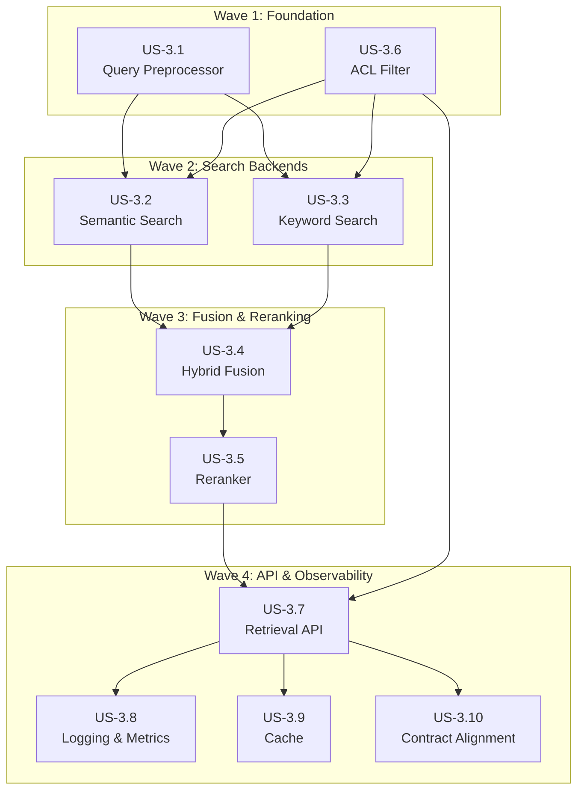

# Retrieval Service Implementation Plan

> **Epic:** Retrieval Service (Epic 3)
> **Approach:** Multi-Agent Wave-Based Execution
> **Total Waves:** 4
> **Maximum Parallel Agents:** 3

## Executive Summary

This plan organizes the 10 user stories of the Retrieval Service epic into 4 implementation waves. Each wave maximizes parallelism while respecting dependencies. Agents work concurrently within each wave, with integration checkpoints between waves to ensure components work together correctly.

## Wave Overview

| Wave | Stories | Agents | Focus Area | Dependencies |
|------|---------|--------|------------|--------------|
| **Wave 1** | US-3.6, US-3.1 | 2 | Foundation | None |
| **Wave 2** | US-3.2, US-3.3 | 2 | Search Backends | Wave 1 |
| **Wave 3** | US-3.4, US-3.5 | 2 | Fusion & Reranking | Wave 2 |
| **Wave 4** | US-3.7, US-3.8, US-3.9, US-3.10 | 3 | API & Observability | Wave 3 |

## Dependency Graph



---

## Wave 1: Foundation Layer

**Parallel Agents:** 2
**Prerequisites:** Infrastructure services running (Qdrant, OpenSearch, Redis, LLM Gateway)

### Agent 1A: ACL Filter (US-3.6)

**Objective:** Implement access control enforcement for search results

**Files to create:**
```
services/retrieval/acl/
├── __init__.py
├── filter.py          # ACLFilter class - builds Qdrant/OpenSearch filters
├── context.py         # UserContextExtractor - JWT parsing
├── models.py          # UserContext, DocumentACL, Visibility enum
└── middleware.py      # FastAPI dependency injection
```

**Key Implementation Details:**

1. **Models (`models.py`):**
   - `Visibility` enum: PUBLIC, PRIVATE, GROUP, TENANT
   - `UserContext`: user_id, tenant_id, groups, roles, permissions
   - `DocumentACL`: tenant_id, visibility, owner_id, allowed_groups, allowed_users, denied_groups, denied_users
   - `ACLFilterConfig`: enabled, admin_bypass, super_tenant_id, default_visibility

2. **ACL Filter (`filter.py`):**
   - `build_filter(user_context, additional_filters)` → unified dict format
   - `build_qdrant_filter(user_context, additional_filters)` → Qdrant Filter object
   - `build_opensearch_filter(user_context, additional_filters)` → OpenSearch clauses
   - ACL logic: tenant isolation + visibility options + denied access enforcement
   - Admin bypass when configured

3. **User Context Extraction (`context.py`):**
   - `UserContextExtractor`: JWT validation with python-jose
   - Extract claims: sub, tenant_id, groups, roles, permissions
   - `create_anonymous_context()` for unauthenticated access
   - `AnonymousAccessFilter` for public-only documents

4. **Middleware (`middleware.py`):**
   - `ACLMiddleware` for FastAPI dependency injection
   - `get_user_context()` dependency function
   - `create_acl_dependencies()` factory function

**Tests:**
- Tenant isolation enforced
- All visibility levels work
- Group and user-based access
- Admin bypass configurable
- Filter conversion for both backends

**Exit Criteria:**
- [ ] All acceptance criteria from US-3.6 met
- [ ] Filter builders produce valid Qdrant/OpenSearch queries
- [ ] JWT extraction works with proper error handling (401 on invalid)
- [ ] >90% test coverage

---

### Agent 1B: Query Preprocessor (US-3.1)

**Objective:** Implement query preprocessing pipeline for retrieval optimization

**Files to create:**
```
services/retrieval/query/
├── __init__.py
├── preprocessor.py    # QueryPreprocessor - main pipeline
├── expander.py        # QueryExpander - synonym/LLM expansion
├── hyde.py            # HyDEGenerator, MultiQueryGenerator
├── models.py          # ProcessedQuery, QueryType, configs
└── cache.py           # QueryCache - Redis caching
```

**Key Implementation Details:**

1. **Models (`models.py`):**
   - `QueryType` enum: SIMPLE, QUESTION, SEMANTIC, HYBRID
   - `ProcessedQuery`: query_id, original_query, normalized_query, expanded_queries, hyde_document, embedding, query_type, tokens, processing_time_ms
   - `QueryPreprocessorConfig`: normalization options, expansion settings, HyDE settings, embedding config, cache settings

2. **Query Preprocessor (`preprocessor.py`):**
   - `process(query)` → ProcessedQuery
   - Pipeline: normalize → classify → expand → HyDE (optional) → embed
   - `_normalize()`: lowercase, strip whitespace, collapse spaces, remove special chars
   - `_classify_query()`: detect question patterns, semantic indicators
   - `_generate_embedding()`: call LLM Gateway with BGE prefix "query: "
   - Cache check at start, cache set at end
   - Retry logic with tenacity

3. **Query Expander (`expander.py`):**
   - `SynonymDatabase`: domain-specific synonym lookup
   - `QueryExpander.expand()`: synonym-based or LLM-based expansion
   - `_expand_with_synonyms()`: substitute one word at a time
   - `_expand_with_llm()`: generate alternatives via LLM Gateway

4. **HyDE Generator (`hyde.py`):**
   - `HyDEGenerator.generate()`: create hypothetical document
   - Prompt template for document generation
   - `MultiQueryGenerator.generate()`: create query variations

5. **Query Cache (`cache.py`):**
   - `QueryCache`: Redis-backed cache for ProcessedQuery
   - Key format: `query:{config_hash}:{query_hash}`
   - TTL configurable (default 3600s)

**Tests:**
- Query normalization edge cases
- Query classification accuracy
- Synonym expansion generates alternatives
- HyDE produces coherent documents
- Embedding has correct dimensions (1024)
- Cache prevents duplicate embedding calls

**Exit Criteria:**
- [ ] All acceptance criteria from US-3.1 met
- [ ] Embeddings generated correctly with BGE prefix
- [ ] Cache hit rate measurable
- [ ] Processing time < 150ms without HyDE, < 700ms with HyDE
- [ ] >90% test coverage

---

### Wave 1 Integration Checkpoint

**Verification Steps:**
1. Import `UserContext` from `acl.models` in other modules
2. Import `ProcessedQuery` from `query.models`
3. Run combined unit tests: `pytest services/retrieval/acl/ services/retrieval/query/`
4. Verify no circular import issues
5. Test JWT parsing with sample tokens

**Integration Test:**
```python
# Verify modules work together
from acl.models import UserContext
from acl.filter import ACLFilter
from query.preprocessor import QueryPreprocessor

user = UserContext(user_id=uuid4(), tenant_id=uuid4(), groups=["team-a"])
acl = ACLFilter()
filters = acl.build_filter(user)
assert "must" in filters  # tenant isolation

preprocessor = QueryPreprocessor()
result = await preprocessor.process("test query")
assert len(result.embedding) == 1024
```

---

## Wave 2: Search Backends

**Parallel Agents:** 2
**Prerequisites:** Wave 1 complete

### Agent 2A: Semantic Search (US-3.2)

**Objective:** Implement vector similarity search using Qdrant

**Files to create:**
```
services/retrieval/search/
├── __init__.py
├── base.py            # BaseSearcher abstract interface
├── semantic.py        # SemanticSearcher - Qdrant implementation
├── models.py          # SearchResultItem, SemanticSearchResponse, configs
└── exceptions.py      # SearchException, ConnectionError, etc.
```

**Key Implementation Details:**

1. **Base Interface (`base.py`):**
   ```python
   class BaseSearcher(ABC):
       @abstractmethod
       async def search(self, query, top_k, filters, **kwargs) -> list[SearchResultItem]
       @abstractmethod
       async def health_check(self) -> bool
       @abstractmethod
       async def close(self)
   ```

2. **Models (`models.py`):**
   - `SearchResultItem`: chunk_id, document_id, content, score, metadata, title, source, chunk_index, total_chunks, created_at, updated_at
   - `SemanticSearchRequest`: query_embedding, top_k, score_threshold, filters, include_metadata
   - `SemanticSearchResponse`: results, total_found, search_time_ms
   - `QdrantConfig`: url, api_key, collection_name, timeout, hnsw_ef, exact_search, quantization settings

3. **Semantic Searcher (`semantic.py`):**
   - `SemanticSearcher(BaseSearcher)` with `AsyncQdrantClient`
   - `search()`: vector search with filters, score threshold, HNSW params
   - `_build_filter()`: convert unified dict to Qdrant Filter
   - `_build_condition()`: handle match value, match any, range
   - `_convert_result()`: Qdrant result → SearchResultItem
   - `_normalize_score()`: cosine [-1,1] → [0,1]
   - `search_multi_vector()`: aggregate results from multiple embeddings
   - `_aggregate_results()`: max, avg, or RRF aggregation
   - `get_collection_info()`: vectors count, status
   - Context manager support (`__aenter__`, `__aexit__`)

4. **Score Normalizer (`models.py` or separate):**
   - `ScoreNormalizer.min_max()`: normalize to [0,1]
   - `ScoreNormalizer.z_score()`: z-score with sigmoid
   - `ScoreNormalizer.rank_based()`: linear rank-based scores

**Tests:**
- Search returns properly formatted results
- Scores normalized to 0-1 range
- Filters built correctly for Qdrant
- Multi-vector aggregation works
- Health check validates connectivity

**Exit Criteria:**
- [ ] All acceptance criteria from US-3.2 met
- [ ] Search latency < 50ms for 10 results
- [ ] HNSW parameters configurable
- [ ] >90% test coverage

---

### Agent 2B: Keyword Search (US-3.3)

**Objective:** Implement BM25 keyword search using OpenSearch

**Files to create:**
```
services/retrieval/search/
├── keyword.py         # KeywordSearcher - OpenSearch implementation
└── analyzers.py       # AnalyzerConfig for custom analyzers (optional)
```

**Note:** Shares `base.py`, `models.py`, `exceptions.py` from Agent 2A

**Key Implementation Details:**

1. **Additional Models (extend `models.py`):**
   - `KeywordSearchRequest`: query, top_k, filters, fields, field_boosts, highlight, min_score
   - `KeywordSearchResponse`: results, total_found, search_time_ms
   - `OpenSearchConfig`: url, username, password, index_name, timeout, default_operator, fuzziness, analyzer

2. **Keyword Searcher (`keyword.py`):**
   - `KeywordSearcher(BaseSearcher)` with `AsyncOpenSearch`
   - `search()`: multi_match query with boosted fields
   - `_build_query()`: construct bool query with text and filters
   - `_build_filter_clauses()`: convert unified dict to OpenSearch filters
   - `_convert_hit()`: OpenSearch hit → SearchResultItem
   - `_normalize_scores()`: BM25 min-max normalization
   - `search_phrase()`: match_phrase with configurable slop
   - `search_with_expansion()`: combine multiple queries with should
   - `get_index_info()`: docs count, store size
   - Highlighting: pre/post tags, fragment size, number of fragments

3. **Custom Analyzers (`analyzers.py`):**
   - `AnalyzerConfig.get_index_settings()`: technical synonyms, edge n-gram for autocomplete
   - Synonym mappings: api↔endpoint, auth↔authentication, db↔database, etc.

**Tests:**
- Search returns results with highlighting
- Field boosting applied correctly
- Fuzzy matching handles typos
- Phrase search with slop works
- Score normalization to 0-1 range
- Filter clauses built correctly

**Exit Criteria:**
- [ ] All acceptance criteria from US-3.3 met
- [ ] Search latency < 50ms for 10 results
- [ ] Highlighting marks matched terms
- [ ] >90% test coverage

---

### Wave 2 Integration Checkpoint

**Verification Steps:**
1. Both searchers implement `BaseSearcher` interface
2. `SearchResultItem` model compatible for both backends
3. ACL filters apply correctly to both Qdrant and OpenSearch
4. Score normalization produces comparable 0-1 scores

**Integration Test:**
```python
from search.semantic import SemanticSearcher
from search.keyword import KeywordSearcher
from acl.filter import ACLFilter
from acl.models import UserContext

user = UserContext(user_id=uuid4(), tenant_id=uuid4(), groups=["team-a"])
acl = ACLFilter()

# Test with Qdrant
semantic = SemanticSearcher()
await semantic.connect()
qdrant_filter = acl.build_qdrant_filter(user)
sem_results = await semantic.search(embedding, top_k=10, filters=qdrant_filter)

# Test with OpenSearch
keyword = KeywordSearcher()
await keyword.connect()
os_filter = acl.build_opensearch_filter(user)
kw_results = await keyword.search("test query", top_k=10, filters=os_filter)

# Verify compatible result format
assert type(sem_results.results[0]) == type(kw_results.results[0])
```

---

## Wave 3: Fusion & Reranking

**Parallel Agents:** 2
**Prerequisites:** Wave 2 complete

### Agent 3A: Hybrid Fusion (US-3.4)

**Objective:** Combine semantic and keyword search results using fusion algorithms

**Files to create:**
```
services/retrieval/search/
├── fusion.py          # ReciprocalRankFusion, LinearFusion, DBSF
└── hybrid.py          # HybridSearcher orchestrator
```

**Key Implementation Details:**

1. **Additional Models (extend `models.py`):**
   - `FusionMethod` enum: RRF, LINEAR, CONVEX, DBSF
   - `HybridSearchConfig`: semantic_weight (0.7), keyword_weight (0.3), fusion_method, rrf_k (60), top_k, semantic_top_k (50), keyword_top_k (50), min_score, deduplicate
   - `FusedResult`: chunk_id, document_id, content, fused_score, semantic_score, semantic_rank, keyword_score, keyword_rank, metadata, title, source
   - `HybridSearchResponse`: results, total_semantic, total_keyword, search_time_ms, fusion_method

2. **Fusion Algorithms (`fusion.py`):**
   - `ReciprocalRankFusion`:
     - `fuse(semantic_results, keyword_results, top_k)` → list[FusedResult]
     - Formula: `RRF_score(d) = Σ 1/(k + rank)`
     - Track provenance: original scores and ranks
   - `LinearFusion`:
     - Weighted combination: `w_sem * sem_score + w_kw * kw_score`
     - Requires normalized scores
   - `DistributionBasedScoreFusion`:
     - Z-score normalization per retriever
     - Sigmoid to [0,1] after combining

3. **Hybrid Searcher (`hybrid.py`):**
   - `HybridSearcher.__init__(semantic_searcher, keyword_searcher, config)`
   - `search(query, query_embedding, top_k, filters, config)`:
     - Run both searches in parallel: `asyncio.gather()`
     - Apply fusion algorithm
     - Score threshold filtering
     - Deduplication by document_id
   - `_deduplicate()`: keep highest-scored chunk per document
   - `search_semantic_only()`: bypass fusion
   - `search_keyword_only()`: bypass fusion

**Tests:**
- RRF score calculation matches formula
- Linear fusion with correct weights
- Parallel search execution (timing test)
- Deduplication keeps highest-scored chunk
- Provenance tracking shows original scores/ranks

**Exit Criteria:**
- [ ] All acceptance criteria from US-3.4 met
- [ ] Parallel search faster than sequential
- [ ] Fusion computation < 5ms for 100 results
- [ ] >90% test coverage

---

### Agent 3B: Reranker Integration (US-3.5)

**Objective:** Implement cross-encoder reranking via LLM Gateway

**Files to create:**
```
services/retrieval/reranking/
├── __init__.py
├── reranker.py        # RerankerService
├── client.py          # LocalRerankerFallback, HybridReranker
├── models.py          # RerankRequest, RerankResult, RerankResponse, RerankerConfig
└── cache.py           # CachedReranker
```

**Key Implementation Details:**

1. **Models (`models.py`):**
   - `RerankRequest`: query, documents, document_ids, top_k, return_documents
   - `RerankResult`: document_id, index, relevance_score, document
   - `RerankResponse`: results, model, processing_time_ms
   - `RerankerConfig`: model (BAAI/bge-reranker-v2-m3), llm_gateway_url, rerank_endpoint, max_batch_size (32), max_documents (100), max_query_length (512), max_document_length (512), timeout, score_threshold, retry settings

2. **Reranker Service (`reranker.py`):**
   - `RerankerService.__init__(config)`
   - `rerank(query, documents, document_ids, top_k, return_documents)`:
     - Validate inputs (length checks)
     - Truncate query and documents
     - Batch processing if > max_batch_size
     - Call `_rerank_batch()` for each batch
     - Sort by relevance_score descending
     - Apply top_k limit
   - `_rerank_batch()`: POST to LLM Gateway /v1/rerank
   - `_truncate()`: ~4 chars per token estimation
   - `rerank_fused_results()`: convenience method for FusedResult list
   - `health_check()`: test rerank call

3. **Fallback Reranker (`client.py`):**
   - `LocalRerankerFallback`: transformers-based local inference
   - `_load_model()`: lazy load AutoModelForSequenceClassification
   - `rerank_sync()`: synchronous for thread pool execution
   - `HybridReranker`: try LLM Gateway, fallback to local

4. **Cached Reranker (`cache.py`):**
   - `CachedReranker.__init__(reranker, redis_url, cache_ttl, key_prefix)`
   - `_cache_key(query, document)`: SHA256 hash
   - `rerank()`: check cache per document, rerank uncached, store results

**Tests:**
- Rerank returns sorted results
- Top-k limits results
- Score threshold filtering
- Batch processing for large sets
- Truncation works correctly
- FusedResult convenience method works

**Exit Criteria:**
- [ ] All acceptance criteria from US-3.5 met
- [ ] Latency < 100ms for 20 documents
- [ ] Retry logic handles transient failures
- [ ] >90% test coverage

---

### Wave 3 Integration Checkpoint

**Verification Steps:**
1. Full pipeline: Query → Hybrid Search → Fusion → Rerank
2. FusedResult flows correctly through reranker
3. Reranked scores stored in metadata
4. Combined latency within P95 target

**Integration Test:**
```python
from query.preprocessor import QueryPreprocessor
from search.hybrid import HybridSearcher
from reranking.reranker import RerankerService
from acl.filter import ACLFilter

preprocessor = QueryPreprocessor()
hybrid = HybridSearcher(semantic_searcher, keyword_searcher)
reranker = RerankerService()
acl = ACLFilter()

# Full pipeline test
processed = await preprocessor.process("machine learning")
filters = acl.build_filter(user_context)

fused = await hybrid.search(
    query="machine learning",
    query_embedding=processed.embedding,
    filters=filters
)

reranked = await reranker.rerank_fused_results(
    query="machine learning",
    fused_results=fused.results,
    top_k=10
)

assert len(reranked) <= 10
assert all(r.metadata.get("rerank_score") is not None for r in reranked)
```

---

## Wave 4: API Layer & Observability

**Parallel Agents:** 3
**Prerequisites:** Wave 3 complete

### Agent 4A: Retrieval API (US-3.7)

**Objective:** Implement FastAPI REST endpoints for retrieval

**Files to create:**
```
services/retrieval/
├── api/
│   ├── __init__.py
│   ├── main.py            # FastAPI app with lifespan
│   ├── routes/
│   │   ├── __init__.py
│   │   ├── retrieve.py    # Retrieval endpoints
│   │   └── health.py      # Health check endpoints
│   ├── schemas/
│   │   ├── __init__.py
│   │   ├── retrieve.py    # Request/response models
│   │   └── common.py      # Shared models
│   └── dependencies.py    # DI setup
├── config.py              # RetrievalConfig
├── run.py                 # Entry point
└── requirements.txt       # Dependencies
```

**Key Implementation Details:**

1. **Configuration (`config.py`):**
   ```python
   class RetrievalConfig(BaseSettings):
       service_name: str = "retrieval-service"
       service_port: int = 8002
       debug: bool = False
       qdrant_url: str = "http://localhost:6333"
       qdrant_collection: str = "documents"
       opensearch_url: str = "http://localhost:9200"
       opensearch_index: str = "documents"
       llm_gateway_url: str = "http://localhost:8004"
       redis_url: str = "redis://localhost:6379"
       jwt_secret: str
       semantic_weight: float = 0.7
       keyword_weight: float = 0.3
       # ... more settings
   ```

2. **API Schemas (`schemas/retrieve.py`):**
   - `SearchMode` enum: HYBRID, SEMANTIC, KEYWORD
   - `RetrieveRequest`: query, mode, top_k, semantic_weight, keyword_weight, rerank, rerank_top_k, filters, min_score, include_metadata, include_highlights
   - `RetrievedDocument`: chunk_id, document_id, content, score, title, source, semantic_score, keyword_score, rerank_score, metadata, highlights
   - `SearchMetrics`: query_preprocessing_ms, semantic_search_ms, keyword_search_ms, fusion_ms, rerank_ms, total_ms, counts per stage
   - `RetrieveResponse`: results, total_results, query, mode, metrics, query_id, processed_at

3. **Main App (`main.py`):**
   - Lifespan handler: initialize all components, store in app.state
   - CORS middleware
   - Request timing middleware (X-Process-Time-Ms header)
   - Exception handler
   - Include routers: retrieve, health

4. **Retrieve Routes (`routes/retrieve.py`):**
   - `POST /api/v1/retrieve`: main hybrid search
   - `POST /api/v1/retrieve/multi`: multi-query search
   - `GET /api/v1/retrieve/explain/{chunk_id}`: relevance explanation
   - `get_user_context()` dependency for JWT extraction

5. **Health Routes (`routes/health.py`):**
   - `GET /health`: full health check with component status
   - `GET /health/live`: Kubernetes liveness probe
   - `GET /health/ready`: Kubernetes readiness probe

**Tests:**
- Retrieve endpoint returns results
- All search modes work (hybrid, semantic, keyword)
- Filters applied correctly
- Auth required (401 without token)
- Request validation (422 on invalid input)
- Metrics included in response

**Exit Criteria:**
- [ ] All acceptance criteria from US-3.7 met
- [ ] P95 latency < 200ms
- [ ] OpenAPI docs at /docs
- [ ] >90% test coverage

---

### Agent 4B: Retrieval Logging & Metrics (US-3.8)

**Objective:** Implement structured logging, Prometheus metrics, and OpenTelemetry tracing

**Files to create:**
```
services/retrieval/logging/
├── __init__.py
├── retrieval_logger.py   # Structured JSON logging
├── metrics.py            # Prometheus metrics
├── tracing.py            # OpenTelemetry setup
└── middleware.py         # FastAPI middleware
```

**Key Implementation Details:**

1. **Structured Logger (`retrieval_logger.py`):**
   - `RetrievalLogger` using structlog
   - JSON output format for log aggregation
   - `log_retrieval()`: query_id, timing, result counts, user_id_hash
   - `log_query_expansion()`: expansion method, duration
   - `log_cache_operation()`: hit/miss, cache type
   - `log_error()`: exception with context
   - User ID hashing for privacy (SHA256, truncated)

2. **Prometheus Metrics (`metrics.py`):**
   - `RetrievalMetrics` class with:
     - `requests_total` Counter (mode, status)
     - `results_total` Counter (mode)
     - `request_duration` Histogram (mode, component)
     - `preprocessing_duration` Histogram
     - `search_duration` Histogram (search_type)
     - `rerank_duration` Histogram (doc_count_bucket)
     - `top_score` Histogram (mode)
     - `result_count` Histogram (mode)
     - `cache_hits` / `cache_misses` Counters (cache_type)
     - `active_requests` Gauge
     - `component_health` Gauge (component)
     - `service_info` Info
   - Appropriate histogram buckets for latency (10ms-1s)

3. **OpenTelemetry Tracing (`tracing.py`):**
   - `TracingSetup` class
   - OTLP exporter for Jaeger
   - FastAPI and HTTPX instrumentation
   - `instrument_app()`: apply to FastAPI
   - `span()` decorator for custom spans
   - `get_current_trace_id()` / `get_current_span_id()`
   - `traced_retrieval()` decorator with custom attributes

4. **Middleware (`middleware.py`):**
   - `LoggingMiddleware`: auto-log HTTP requests
   - `setup_observability()`: configure all components, add /metrics endpoint

**Tests:**
- Structured JSON logging format
- User IDs hashed in logs
- Prometheus metrics recorded
- Latency falls in correct buckets
- Cache hit/miss tracking
- Trace IDs propagate

**Exit Criteria:**
- [ ] All acceptance criteria from US-3.8 met
- [ ] /metrics endpoint returns Prometheus format
- [ ] Structured logs contain all required fields
- [ ] >90% test coverage

---

### Agent 4C: Cache & Contract Alignment (US-3.9 + US-3.10)

**Objective:** Implement Redis retrieval cache and ensure API contract alignment

**Files to create:**
```
services/retrieval/
├── cache/
│   ├── __init__.py
│   └── retrieval_cache.py  # RetrievalCache
└── (updates to api/routes/retrieve.py)
```

**Key Implementation Details:**

1. **Retrieval Cache (`cache/retrieval_cache.py`):**
   - `RetrievalCache.__init__(redis_url, ttl, enabled)`
   - Cache key: `rag:query:<sha256(canonical_json(query, filters, options, tenant_id))>`
   - `get(key)` → Optional[RetrieveResponse]
   - `set(key, response, ttl)`
   - `invalidate_pattern(pattern)` for bulk invalidation
   - Feature flag: `RETRIEVAL_CACHE_ENABLED` env var
   - Metrics integration: cache_hits, cache_misses

2. **Contract Alignment (updates to `routes/retrieve.py`):**
   - Enforce ordering: RRF → rerank → ACL (apply ACL post-rerank)
   - Default weights: semantic 0.7, keyword 0.3
   - Default RRF k=60, semantic_top_k=50, keyword_top_k=50, rerank_top_k=20, final top_k=10
   - Debug block in response:
     ```python
     class DebugInfo(BaseModel):
         retrieval_id: UUID
         semantic_count: int
         keyword_count: int
         fused_count: int
         reranked_count: int
         final_count: int
         preprocessing_ms: float
         semantic_ms: float
         keyword_ms: float
         fusion_ms: float
         rerank_ms: float
         acl_ms: float
         total_ms: float
         models: dict[str, str]  # embedding_model, reranker_model
     ```
   - Request validation with bounds:
     - top_k: 1-100
     - rerank_top_k: 1-100
     - weights: 0.0-1.0

3. **Integration Test (`tests/api/test_retrieve_contract.py`):**
   - Verify ordering (ACL applied after rerank)
   - Verify scores reflect weights
   - Verify debug block fields present
   - Verify P95 < 200ms

**Tests:**
- Cache hit returns correct response
- Cache key includes tenant scoping
- Cache respects TTL
- Feature flag disables cache
- Debug block in response
- Ordering verified (ACL post-rerank)

**Exit Criteria:**
- [ ] All acceptance criteria from US-3.9 met
- [ ] All acceptance criteria from US-3.10 met
- [ ] Cache hit rate measurable
- [ ] Debug block in all responses
- [ ] P95 latency < 200ms maintained
- [ ] >90% test coverage

---

### Wave 4 Integration Checkpoint

**Verification Steps:**
1. Full end-to-end test: Request → Cache → Preprocess → Search → Fuse → Rerank → ACL → Response
2. All metrics exposed at /metrics
3. Structured logs contain trace IDs
4. Debug block in API response
5. Kubernetes probes work (/health/live, /health/ready)

**Final Integration Test:**
```bash
# Start service
cd services/retrieval && python run.py

# Test health
curl http://localhost:8002/health

# Test retrieval
curl -X POST http://localhost:8002/api/v1/retrieve \
  -H "Authorization: Bearer <token>" \
  -H "Content-Type: application/json" \
  -d '{"query": "machine learning", "top_k": 10}'

# Check metrics
curl http://localhost:8002/metrics | grep retrieval

# Run full test suite
pytest services/retrieval/tests/ -v
```

**Load Test:**
```bash
# Verify P95 < 200ms and 100+ QPS
ab -n 1000 -c 10 -p request.json -T application/json \
  -H "Authorization: Bearer <token>" \
  http://localhost:8002/api/v1/retrieve
```

---

## Final Checklist

### Code Quality
- [ ] All modules have >90% test coverage
- [ ] Type hints on all functions
- [ ] mypy passes with no errors
- [ ] Docstrings on all public methods
- [ ] No circular imports

### Performance
- [ ] P95 latency < 200ms
- [ ] Throughput > 100 QPS
- [ ] Query preprocessing < 150ms (without HyDE)
- [ ] Search latency < 50ms each
- [ ] Reranking < 100ms for 20 docs
- [ ] Fusion < 5ms for 100 results

### Observability
- [ ] Structured JSON logs
- [ ] Prometheus metrics at /metrics
- [ ] OpenTelemetry traces to Jaeger
- [ ] Health endpoints for K8s

### Documentation
- [ ] OpenAPI docs at /docs
- [ ] README with setup instructions
- [ ] Architecture alignment verified

---

## Appendix: Agent Prompts

### Agent 1A Prompt (ACL Filter)
```
Implement US-3.6 ACL Filter for the Retrieval Service.

Create the following files in services/retrieval/acl/:
- models.py: UserContext, DocumentACL, Visibility, ACLFilterConfig
- filter.py: ACLFilter with build_filter, build_qdrant_filter, build_opensearch_filter
- context.py: UserContextExtractor for JWT parsing
- middleware.py: FastAPI dependencies

Requirements:
- Tenant isolation always enforced
- Support visibility levels: PUBLIC, PRIVATE, GROUP, TENANT
- Group and user-based access control
- Admin bypass when configured
- python-jose for JWT validation
- >90% test coverage

Reference: workflow/refined/03-retrieval-service/US-3.6-acl-filter.md
```

### Agent 1B Prompt (Query Preprocessor)
```
Implement US-3.1 Query Preprocessor for the Retrieval Service.

Create the following files in services/retrieval/query/:
- models.py: ProcessedQuery, QueryType, QueryPreprocessorConfig
- preprocessor.py: QueryPreprocessor with process() pipeline
- expander.py: QueryExpander with synonym and LLM-based expansion
- hyde.py: HyDEGenerator, MultiQueryGenerator
- cache.py: QueryCache with Redis

Requirements:
- Pipeline: normalize → classify → expand → HyDE (optional) → embed
- BGE query prefix "query: " for embeddings
- Redis caching for processed queries
- Retry logic with tenacity
- >90% test coverage

Reference: workflow/refined/03-retrieval-service/US-3.1-query-preprocessor.md
```

### Agent 2A Prompt (Semantic Search)
```
Implement US-3.2 Semantic Search for the Retrieval Service.

Create the following files in services/retrieval/search/:
- base.py: BaseSearcher abstract interface
- models.py: SearchResultItem, SemanticSearchResponse, QdrantConfig
- semantic.py: SemanticSearcher with Qdrant AsyncClient
- exceptions.py: Custom exceptions

Requirements:
- Implement BaseSearcher interface
- Vector search with filters, score threshold, HNSW params
- Score normalization cosine [-1,1] → [0,1]
- Multi-vector search with aggregation
- ACL filter integration from acl/filter.py
- >90% test coverage

Reference: workflow/refined/03-retrieval-service/US-3.2-semantic-search.md
```

### Agent 2B Prompt (Keyword Search)
```
Implement US-3.3 Keyword Search for the Retrieval Service.

Create/extend in services/retrieval/search/:
- keyword.py: KeywordSearcher with OpenSearch AsyncClient

Requirements:
- Implement BaseSearcher interface (from Agent 2A)
- Use SearchResultItem model (from Agent 2A)
- Multi-field BM25 search with boosting
- Fuzzy matching, phrase search
- Highlighting support
- BM25 score normalization to [0,1]
- ACL filter integration
- >90% test coverage

Reference: workflow/refined/03-retrieval-service/US-3.3-keyword-search.md
```

### Agent 3A Prompt (Hybrid Fusion)
```
Implement US-3.4 Hybrid Fusion for the Retrieval Service.

Create in services/retrieval/search/:
- fusion.py: ReciprocalRankFusion, LinearFusion, DBSF
- hybrid.py: HybridSearcher orchestrator

Requirements:
- RRF with configurable k (default 60)
- Parallel search execution with asyncio.gather
- Configurable weights (default 0.7 semantic, 0.3 keyword)
- FusedResult with provenance (original scores, ranks)
- Deduplication by document_id
- semantic_only and keyword_only bypass methods
- >90% test coverage

Reference: workflow/refined/03-retrieval-service/US-3.4-hybrid-fusion.md
```

### Agent 3B Prompt (Reranker)
```
Implement US-3.5 Reranker Integration for the Retrieval Service.

Create in services/retrieval/reranking/:
- models.py: RerankRequest, RerankResult, RerankResponse, RerankerConfig
- reranker.py: RerankerService calling LLM Gateway
- client.py: LocalRerankerFallback, HybridReranker
- cache.py: CachedReranker with Redis

Requirements:
- BGE-reranker-v2-m3 model
- Batch processing (max 32)
- Truncation to max length
- rerank_fused_results() convenience method
- Retry logic with tenacity
- Optional local fallback with transformers
- >90% test coverage

Reference: workflow/refined/03-retrieval-service/US-3.5-reranker.md
```

### Agent 4A Prompt (Retrieval API)
```
Implement US-3.7 Retrieval API for the Retrieval Service.

Create in services/retrieval/:
- config.py: RetrievalConfig with pydantic-settings
- api/main.py: FastAPI app with lifespan
- api/routes/retrieve.py: POST /retrieve, /retrieve/multi
- api/routes/health.py: Health endpoints
- api/schemas/: Request/response models
- run.py: Uvicorn entry point
- requirements.txt: All dependencies

Requirements:
- Hybrid, semantic, keyword modes
- ACL filtering from JWT
- Reranking toggle
- SearchMetrics in response
- Health endpoints for K8s
- P95 < 200ms
- >90% test coverage

Reference: workflow/refined/03-retrieval-service/US-3.7-retrieval-api.md
```

### Agent 4B Prompt (Logging & Metrics)
```
Implement US-3.8 Retrieval Logging for the Retrieval Service.

Create in services/retrieval/logging/:
- retrieval_logger.py: RetrievalLogger with structlog
- metrics.py: RetrievalMetrics with Prometheus
- tracing.py: TracingSetup with OpenTelemetry
- middleware.py: LoggingMiddleware, setup_observability()

Requirements:
- Structured JSON logging
- User ID hashing for privacy
- Prometheus metrics at /metrics
- OpenTelemetry tracing to Jaeger
- FastAPI middleware integration
- >90% test coverage

Reference: workflow/refined/03-retrieval-service/US-3.8-retrieval-logging.md
```

### Agent 4C Prompt (Cache & Contract)
```
Implement US-3.9 Retrieval Cache and US-3.10 API Contract Alignment.

Create/update in services/retrieval/:
- cache/retrieval_cache.py: RetrievalCache with Redis
- Update api/routes/retrieve.py: Debug block, ordering enforcement

Requirements for US-3.9:
- Cache key: rag:query:<hash>
- Tenant/user scoping
- Configurable TTL
- Feature flag to disable
- Cache metrics

Requirements for US-3.10:
- Enforce RRF → rerank → ACL ordering
- Default weights per architecture
- Debug block with counts, latency, model names
- Request validation with bounds
- P95 < 200ms

Reference:
- workflow/refined/03-retrieval-service/US-3.9-retrieval-cache.md
- workflow/refined/03-retrieval-service/US-3.10-api-contract-hybrid-alignment.md
```
