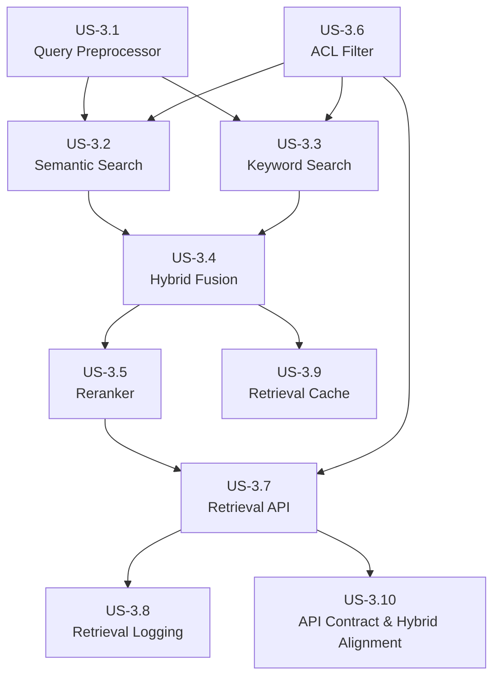
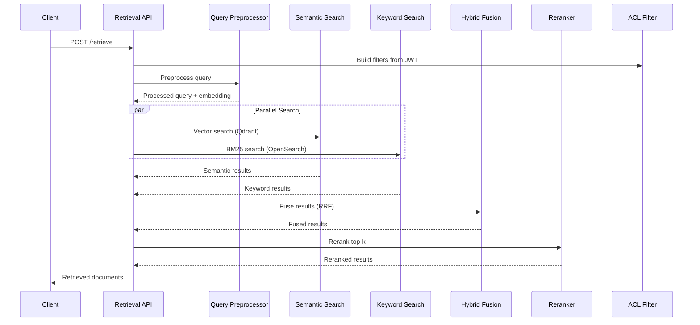

# Epic 3: Retrieval Service - Refined User Stories

> **Epic:** Retrieval Service  
> **Priority:** Critical  
> **Total Estimated Effort:** 2-3 weeks  
> **Dependencies:** Epic 1 (Infrastructure Setup), Epic 2 (Ingestion Service)

## Overview

This folder contains detailed, implementation-ready user stories for the Retrieval Service. Each story is self-contained with technical requirements, code examples, acceptance criteria, and testing guidelines.

The Retrieval Service is responsible for finding relevant documents given a user query. It combines semantic search (vector similarity) with keyword search (BM25) using hybrid fusion, then reranks results using a cross-encoder model while enforcing access control.

## Architecture Reference

All stories adhere to the [Architecture Document](../../../docs/architecture.md), specifically:

- **Framework:** FastAPI + Pydantic v2
- **Vector Store:** Qdrant (port 6333)
- **Keyword Store:** OpenSearch (port 9200)
- **Metadata Store:** PostgreSQL (port 5432)
- **Cache:** Redis (port 6379)
- **Embedding Model:** BAAI/bge-large-en-v1.5 (1024 dimensions)
- **Reranker Model:** BAAI/bge-reranker-v2-m3
- **LLM Gateway:** Port 8004
- **Retrieval API:** Port 8002

### Performance Requirements

| Metric | Target |
|--------|--------|
| P95 Latency | < 200ms |
| Reranking Latency | < 100ms for 20 documents |
| Throughput | 100+ QPS |

## User Stories

| Story | Title | Priority | Effort | Dependencies |
|-------|-------|----------|--------|--------------|
| [US-3.1](US-3.1-query-preprocessor.md) | Query Preprocessor | Critical | 2-3 days | - |
| [US-3.2](US-3.2-semantic-search.md) | Semantic Search | Critical | 2-3 days | US-3.1 |
| [US-3.3](US-3.3-keyword-search.md) | Keyword Search | Critical | 2-3 days | US-3.1 |
| [US-3.4](US-3.4-hybrid-fusion.md) | Hybrid Fusion | Critical | 1-2 days | US-3.2, US-3.3 |
| [US-3.5](US-3.5-reranker.md) | Reranker Integration | High | 2-3 days | US-3.4 |
| [US-3.6](US-3.6-acl-filter.md) | ACL Filter | Critical | 1-2 days | - |
| [US-3.7](US-3.7-retrieval-api.md) | Retrieval API | Critical | 2 days | US-3.1-3.6 |
| [US-3.8](US-3.8-retrieval-logging.md) | Retrieval Logging | High | 1-2 days | US-3.7 |
| US-3.9 | Retrieval Cache (Redis) | High | 1-2 days | US-3.1-3.4, US-3.6 |
| US-3.10 | API Contract & Hybrid Alignment | High | 1-2 days | US-3.1-3.7 |

## Dependency Graph



## Implementation Order

**Recommended sequence:**

1. **US-3.6: ACL Filter** - Foundation for access control (can start immediately)
2. **US-3.1: Query Preprocessor** - Foundation for query understanding
3. **US-3.2: Semantic Search** - Vector search with Qdrant
4. **US-3.3: Keyword Search** - BM25 search with OpenSearch (can parallel with US-3.2)
5. **US-3.4: Hybrid Fusion** - Combine results from both search methods
6. **US-3.5: Reranker Integration** - Cross-encoder reranking
7. **US-3.7: Retrieval API** - FastAPI endpoints
8. **US-3.8: Retrieval Logging** - Observability and metrics
9. **US-3.9: Retrieval Cache (Redis)** - Cache keys/TTL per architecture caching strategy
10. **US-3.10: API Contract & Hybrid Alignment** - Enforce RRF→rerank→ACL ordering, weights/top-k, and debug payload per architecture

## Service Structure

```
retrieval-service/
├── api/
│   ├── main.py              # FastAPI application
│   ├── routes/
│   │   ├── retrieve.py      # Retrieval endpoints
│   │   └── health.py        # Health check endpoints
│   ├── schemas/
│   │   ├── retrieve.py      # Request/response models
│   │   └── common.py        # Shared models
│   └── dependencies.py      # Dependency injection
├── query/
│   ├── __init__.py
│   ├── preprocessor.py      # Query preprocessing
│   ├── expander.py          # Query expansion
│   └── hyde.py              # HyDE implementation
├── search/
│   ├── __init__.py
│   ├── semantic.py          # Qdrant vector search
│   ├── keyword.py           # OpenSearch BM25 search
│   ├── fusion.py            # RRF hybrid fusion
│   └── base.py              # Search interface
├── reranking/
│   ├── __init__.py
│   ├── reranker.py          # Reranker service
│   └── client.py            # LLM gateway client
├── acl/
│   ├── __init__.py
│   ├── filter.py            # ACL filter builder
│   └── context.py           # User context extraction
├── logging/
│   ├── __init__.py
│   ├── retrieval_logger.py  # Structured logging
│   └── metrics.py           # Prometheus metrics
├── config.py                # Configuration
├── run.py                   # Entry point
└── requirements.txt         # Dependencies
```

## Data Flow



## Key Dependencies

```txt
# Framework
fastapi>=0.104.0
uvicorn>=0.24.0
pydantic>=2.5.0
pydantic-settings>=2.1.0

# Search Clients
qdrant-client>=1.7.0
opensearch-py>=2.4.0

# HTTP Client
httpx>=0.25.0

# Cache
redis>=5.0.0

# Utilities
tenacity>=8.2.0
numpy>=1.26.0

# Observability
opentelemetry-api>=1.21.0
opentelemetry-sdk>=1.21.0
opentelemetry-instrumentation-fastapi>=0.42b0
prometheus-client>=0.19.0
structlog>=23.2.0

# Auth
python-jose[cryptography]>=3.3.0
```

## Configuration

```python
from pydantic_settings import BaseSettings
from typing import Optional

class RetrievalConfig(BaseSettings):
    # Service
    service_name: str = "retrieval-service"
    service_port: int = 8002
    debug: bool = False
    
    # Qdrant
    qdrant_url: str = "http://localhost:6333"
    qdrant_collection: str = "documents"
    qdrant_timeout: float = 30.0
    
    # OpenSearch
    opensearch_url: str = "http://localhost:9200"
    opensearch_index: str = "documents"
    opensearch_timeout: float = 30.0
    
    # LLM Gateway (embeddings & reranking)
    llm_gateway_url: str = "http://localhost:8004"
    embedding_model: str = "BAAI/bge-large-en-v1.5"
    embedding_dimensions: int = 1024
    reranker_model: str = "BAAI/bge-reranker-v2-m3"
    
    # Redis
    redis_url: str = "redis://localhost:6379"
    cache_ttl: int = 3600
    
    # Search Settings
    default_top_k: int = 10
    max_top_k: int = 100
    semantic_weight: float = 0.7
    keyword_weight: float = 0.3
    rerank_top_k: int = 20
    score_threshold: float = 0.0
    
    # Performance
    search_timeout: float = 5.0
    rerank_timeout: float = 3.0
    
    class Config:
        env_prefix = "RETRIEVAL_"
```

## Definition of Done (Epic Level)

- [ ] Query preprocessor handles normalization, expansion, and HyDE
- [ ] Semantic search returns relevant results from Qdrant
- [ ] Keyword search returns BM25 results from OpenSearch
- [ ] Hybrid fusion combines results with configurable RRF
- [ ] Reranker improves result ordering
- [ ] ACL filtering enforces access control
- [ ] API endpoints documented and tested
- [ ] Cache hit rate target defined and measured; Redis cache used for query/response as per architecture strategy
- [ ] Hybrid ordering, weights, and top-k validated (RRF → rerank → ACL) and reflected in API debug block
- [ ] P95 latency < 200ms achieved
- [ ] 80%+ test coverage across all modules
- [ ] All type hints validated with mypy
- [ ] OpenTelemetry tracing implemented
- [ ] Prometheus metrics exposed
