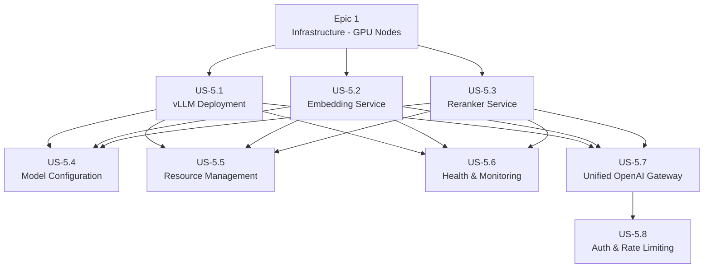

# Epic 5: LLM Serving Layer - Refined User Stories

> **Epic:** LLM Serving Layer  
> **Priority:** Critical  
> **Total Estimated Effort:** 2 weeks  
> **Dependencies:** Epic 1 (Infrastructure - GPU nodes)

## Overview

This folder contains detailed, implementation-ready user stories for the LLM Serving Layer. Each story is self-contained with technical requirements, code examples, acceptance criteria, and testing guidelines.

The LLM Serving Layer provides high-throughput inference capabilities for language models, embedding generation, and reranking. It exposes OpenAI-compatible APIs for seamless integration with the orchestrator service.

## Architecture Reference

All stories adhere to the [Architecture Document](../../../docs/architecture.md), specifically:

- **LLM Framework:** vLLM for high-throughput inference
- **LLM Model:** meta-llama/Llama-3.1-8B-Instruct (8192 max tokens)
- **Embedding Model:** BAAI/bge-large-en-v1.5 (1024 dimensions)
- **Reranker Model:** BAAI/bge-reranker-v2-m3
- **Embedding Framework:** Text Embeddings Inference (TEI) or custom FastAPI
- **LLM Gateway Port:** 8004
- **GPU:** NVIDIA A100 or equivalent
- **Kubernetes:** GPU node pool with NVIDIA device plugin

## User Stories

| Story                                       | Title                                           | Priority | Effort   | Dependencies           |
| ------------------------------------------- | ----------------------------------------------- | -------- | -------- | ---------------------- |
| [US-5.1](US-5.1-vllm-deployment.md)         | vLLM Deployment                                 | Critical | 3-4 days | Epic 1 (GPU nodes)     |
| [US-5.2](US-5.2-embedding-model-service.md) | Embedding Model Service                         | Critical | 2-3 days | Epic 1 (GPU nodes)     |
| [US-5.3](US-5.3-reranker-model-service.md)  | Reranker Model Service                          | Critical | 2-3 days | Epic 1 (GPU nodes)     |
| [US-5.4](US-5.4-model-configuration.md)     | Model Configuration                             | High     | 2 days   | US-5.1, US-5.2, US-5.3 |
| [US-5.5](US-5.5-resource-management.md)     | Resource Management                             | High     | 2-3 days | US-5.1, US-5.2, US-5.3 |
| [US-5.6](US-5.6-model-health-monitoring.md) | Model Health & Monitoring                       | Critical | 2-3 days | US-5.1, US-5.2, US-5.3 |
| [US-5.7](US-5.7-unified-openai-gateway.md)  | Unified OpenAI Gateway (chat/embeddings/rerank) | Critical | 2-3 days | US-5.1, US-5.2, US-5.3 |
| [US-5.8](US-5.8-auth-rate-limiting.md)      | Auth & Rate Limiting for Gateway                | High     | 1-2 days | US-5.7                 |

## Dependency Graph



## Implementation Order

**Recommended sequence:**

1. **US-5.1: vLLM Deployment** - Core LLM serving (can be done in parallel with US-5.2, US-5.3)
2. **US-5.2: Embedding Model Service** - Embedding generation (can be done in parallel with US-5.1, US-5.3)
3. **US-5.3: Reranker Model Service** - Reranking capability (can be done in parallel with US-5.1, US-5.2)
4. **US-5.4: Model Configuration** - Configurable model settings
5. **US-5.5: Resource Management** - GPU optimization and cost control
6. **US-5.6: Model Health & Monitoring** - Observability and alerting
7. **US-5.7: Unified OpenAI Gateway** - OpenAI-compatible chat/embeddings/rerank endpoints
8. **US-5.8: Auth & Rate Limiting** - JWT validation and rate limits consistent with Security epic

## Service Structure

```
llm-serving/
├── vllm/
│   ├── Dockerfile                 # vLLM container
│   ├── k8s/
│   │   ├── deployment.yaml        # Kubernetes deployment
│   │   ├── service.yaml           # Kubernetes service
│   │   ├── hpa.yaml               # Horizontal Pod Autoscaler
│   │   └── configmap.yaml         # Configuration
│   └── scripts/
│       ├── healthcheck.py         # Health check script
│       └── benchmark.py           # Performance benchmark
├── embedding-service/
│   ├── Dockerfile                 # Embedding service container
│   ├── api/
│   │   ├── main.py                # FastAPI application
│   │   ├── routes.py              # API routes
│   │   └── models.py              # Pydantic models
│   ├── core/
│   │   ├── embedder.py            # Embedding generation
│   │   └── batching.py            # Batch processing
│   └── k8s/
│       ├── deployment.yaml
│       ├── service.yaml
│       └── hpa.yaml
├── reranker-service/
│   ├── Dockerfile                 # Reranker service container
│   ├── api/
│   │   ├── main.py                # FastAPI application
│   │   ├── routes.py              # API routes
│   │   └── models.py              # Pydantic models
│   ├── core/
│   │   ├── reranker.py            # Reranking logic
│   │   └── batching.py            # Batch processing
│   └── k8s/
│       ├── deployment.yaml
│       ├── service.yaml
│       └── hpa.yaml
├── gateway/
│   ├── api/
│   │   ├── main.py                # Unified gateway
│   │   ├── routes/
│   │   │   ├── completions.py     # Chat completions
│   │   │   ├── embeddings.py      # Embeddings
│   │   │   └── rerank.py          # Reranking
│   │   └── config.py              # Model configurations
│   └── k8s/
│       ├── deployment.yaml
│       └── service.yaml
├── monitoring/
│   ├── prometheus/
│   │   └── rules.yaml             # Alerting rules
│   └── grafana/
│       └── dashboards/
│           ├── llm-overview.json
│           ├── embedding-metrics.json
│           └── gpu-utilization.json
└── docs/
    ├── deployment.md              # Deployment guide
    ├── api-reference.md           # API documentation
    └── performance-tuning.md      # Performance guide
```

## Key Dependencies

### vLLM Service

```txt
# Core
vllm>=0.4.0
torch>=2.1.0
transformers>=4.37.0
accelerate>=0.25.0

# Serving
ray>=2.9.0
uvicorn>=0.24.0
fastapi>=0.104.0
```

### Embedding Service

```txt
# Core
sentence-transformers>=2.3.0
torch>=2.1.0
transformers>=4.37.0

# API
fastapi>=0.104.0
uvicorn>=0.24.0
pydantic>=2.5.0

# Utilities
numpy>=1.24.0
httpx>=0.25.0
```

### Reranker Service

```txt
# Core
sentence-transformers>=2.3.0
torch>=2.1.0
transformers>=4.37.0

# API
fastapi>=0.104.0
uvicorn>=0.24.0
pydantic>=2.5.0
```

### Monitoring

```txt
prometheus-client>=0.19.0
opentelemetry-api>=1.22.0
opentelemetry-sdk>=1.22.0
opentelemetry-exporter-prometheus>=0.43b0
```

## Performance Targets

| Metric                  | Target          | Notes                     |
| ----------------------- | --------------- | ------------------------- |
| LLM Throughput          | >100 tokens/sec | Per request, streaming    |
| LLM Latency (TTFT)      | <500ms          | Time to first token       |
| Embedding Latency       | <50ms           | Single embedding, batch 1 |
| Embedding Batch Latency | <200ms          | Batch of 32 texts         |
| Reranker Latency        | <100ms          | 20 document pairs         |
| GPU Utilization         | >70%            | Under normal load         |
| Memory Efficiency       | >80%            | KV cache utilization      |

## GPU Requirements

| Model                 | VRAM Required | Recommended GPU     |
| --------------------- | ------------- | ------------------- |
| Llama-3.1-8B-Instruct | 16-24GB       | A100 40GB, A10 24GB |
| BGE-large-en-v1.5     | 2-4GB         | A100, A10, T4       |
| BGE-reranker-v2-m3    | 2-4GB         | A100, A10, T4       |

**Note:** vLLM supports tensor parallelism for larger models. For 8B model, single GPU is sufficient.

## Definition of Done (Epic Level)

- [ ] vLLM deployed and serving Llama-3.1-8B-Instruct
- [ ] OpenAI-compatible API working for chat completions
- [ ] Embedding service generating 1024-dim vectors
- [ ] Reranker service scoring document pairs
- [ ] Unified OpenAI-compatible endpoints for chat, embeddings, and rerank implemented in gateway
- [ ] Gateway enforces JWT auth and rate limiting aligned with Security epic
- [ ] All services have health check endpoints
- [ ] Prometheus metrics exposed and scraped
- [ ] Grafana dashboards created
- [ ] HPA configured for auto-scaling
- [ ] GPU utilization monitored
- [ ] Latency within SLA targets
- [ ] Documentation complete
- [ ] Load testing performed
- [ ] Failover and recovery tested
