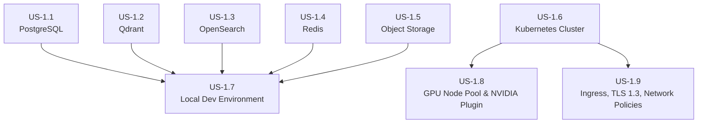

# Epic 1: Infrastructure Setup - Refined User Stories

> **Epic:** Infrastructure Setup  
> **Priority:** Critical  
> **Total Estimated Effort:** 2-3 weeks  
> **Dependencies:** None

## Overview

This folder contains detailed, implementation-ready user stories for the Infrastructure Setup. Each story is self-contained with technical requirements, code examples, acceptance criteria, and verification commands.

## Architecture Reference

All stories adhere to the [Architecture Document](../../../docs/architecture.md), specifically:

- **PostgreSQL:** 16+ with PgBouncer connection pooling (port 5432)
- **Qdrant:** Vector database for embeddings (port 6333)
- **OpenSearch:** Keyword search with BM25 (port 9200)
- **Redis:** Caching with Sentinel for HA (port 6379)
- **MinIO/S3:** Object storage for raw documents
- **Kubernetes:** Container orchestration with GPU node pools

## User Stories

| Story                                             | Title                              | Priority | Effort   | Dependencies |
| ------------------------------------------------- | ---------------------------------- | -------- | -------- | ------------ |
| [US-1.1](US-1.1-postgresql-setup.md)              | PostgreSQL Setup                   | Critical | 2-3 days | -            |
| [US-1.2](US-1.2-qdrant-vector-database.md)        | Qdrant Vector Database             | Critical | 2-3 days | -            |
| [US-1.3](US-1.3-opensearch-cluster.md)            | OpenSearch Cluster                 | Critical | 2-3 days | -            |
| [US-1.4](US-1.4-redis-cache.md)                   | Redis Cache                        | Critical | 1-2 days | -            |
| [US-1.5](US-1.5-object-storage.md)                | Object Storage (MinIO/S3)          | Critical | 1-2 days | -            |
| [US-1.6](US-1.6-kubernetes-cluster.md)            | Kubernetes Cluster                 | Critical | 3-4 days | -            |
| [US-1.7](US-1.7-local-development-environment.md) | Local Development Environment      | High     | 2-3 days | US-1.1-1.5   |
| (US-1.8)(US-1.8-gpu-node-pool.md)                 | GPU Node Pool & NVIDIA Plugin      | High     | 2-3 days | US-1.6       |
| (US-1.9)(US-1.9-ingress-tls-network-policies.md)  | Ingress, TLS 1.3, Network Policies | High     | 2-3 days | US-1.6       |

## Dependency Graph



## Implementation Order

**Recommended sequence:**

1. **US-1.1: PostgreSQL Setup** - Core metadata store
2. **US-1.2: Qdrant Vector Database** - Vector storage (can parallel with US-1.1)
3. **US-1.3: OpenSearch Cluster** - Keyword search (can parallel with US-1.1, US-1.2)
4. **US-1.4: Redis Cache** - Caching layer (can parallel with above)
5. **US-1.5: Object Storage** - Raw document storage (can parallel with above)
6. **US-1.6: Kubernetes Cluster** - Production orchestration
7. **US-1.7: Local Development Environment** - Docker Compose setup (requires US-1.1-1.5)
8. **US-1.8: GPU Node Pool & NVIDIA Plugin** - GPU scheduling, taints/tolerations, device plugin
9. **US-1.9: Ingress, TLS 1.3, Network Policies** - cert-manager/ingress TLS, mTLS readiness, namespace/network isolation

## Infrastructure Structure

```
infrastructure/
├── docker-compose.yml           # Local development
├── .env.example                 # Environment variables template
├── k8s/
│   ├── namespace.yaml           # rag-pipeline namespace
│   ├── secrets/
│   │   └── rag-secrets.yaml     # Sealed secrets
│   ├── postgres/
│   │   ├── deployment.yaml
│   │   ├── service.yaml
│   │   └── pvc.yaml
│   ├── pgbouncer/
│   │   └── deployment.yaml
│   ├── qdrant/
│   │   ├── statefulset.yaml
│   │   ├── service.yaml
│   │   └── pvc.yaml
│   ├── opensearch/
│   │   ├── statefulset.yaml
│   │   ├── service.yaml
│   │   └── configmap.yaml
│   ├── redis/
│   │   ├── statefulset.yaml
│   │   ├── sentinel.yaml
│   │   └── service.yaml
│   ├── minio/
│   │   ├── deployment.yaml
│   │   ├── service.yaml
│   │   └── pvc.yaml
│   └── ingress/
│       └── ingress.yaml
├── scripts/
│   ├── postgres-backup.sh
│   ├── qdrant-backup.sh
│   └── health-check.sh
└── terraform/                   # Optional cloud provisioning
    ├── main.tf
    ├── variables.tf
    └── outputs.tf
```

## Key Dependencies

```txt
# Database Clients
asyncpg>=0.29.0
sqlalchemy[asyncio]>=2.0.0
alembic>=1.13.0

# Vector Store
qdrant-client>=1.7.0

# Search
opensearch-py>=2.4.0

# Cache
redis>=5.0.0

# Object Storage
aioboto3>=12.0.0
minio>=7.2.0

# Kubernetes
kubernetes>=28.0.0
```

## Definition of Done (Epic Level)

- [ ] PostgreSQL 16+ deployed with connection pooling
- [ ] Qdrant cluster running with 3 replicas
- [ ] OpenSearch 3-node cluster operational
- [ ] Redis Sentinel configured for HA
- [ ] MinIO/S3 object storage accessible
- [ ] Kubernetes namespace and resource quotas configured
- [ ] Local Docker Compose environment functional
- [ ] GPU node pool available with NVIDIA device plugin, taints/tolerations, and resource classes
- [ ] Ingress with cert-manager TLS 1.3 enabled; network policies isolating data plane services
- [ ] All health checks passing
- [ ] Backup procedures documented and tested
- [ ] Infrastructure documentation complete
- [ ] PgBouncer/connection pooling configured and validated
