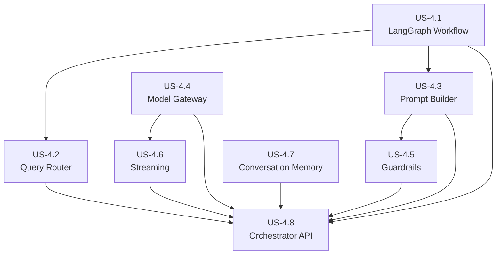
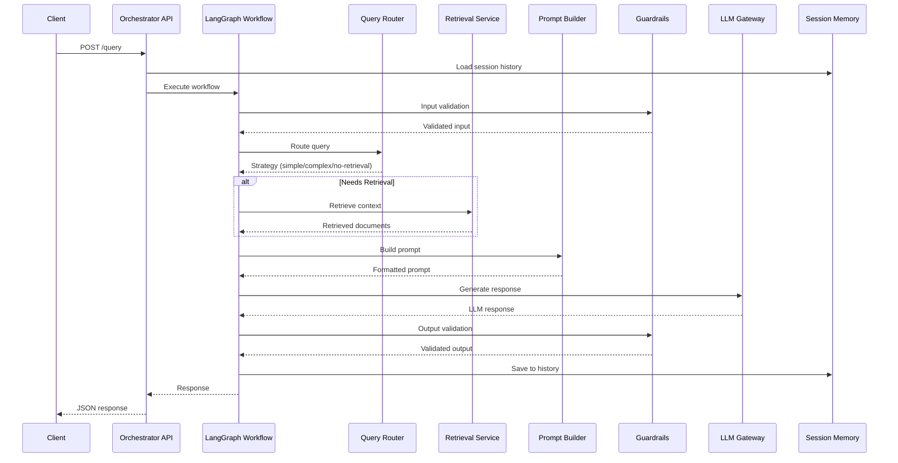
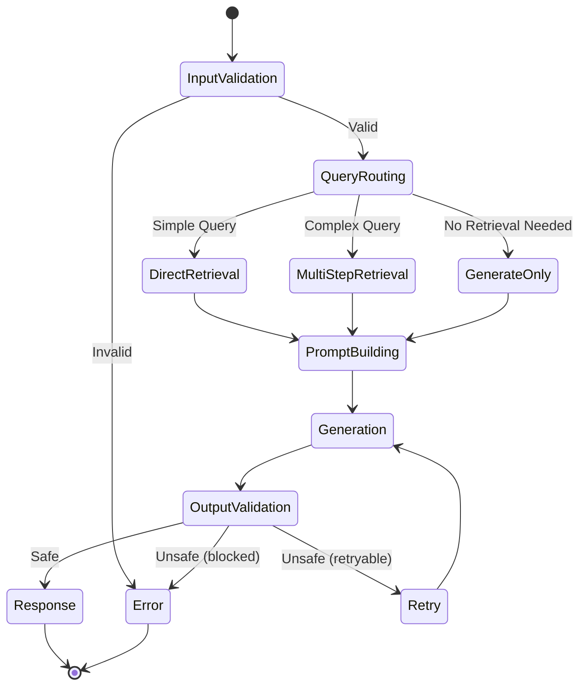

# Epic 4: Orchestrator Service - Refined User Stories

> **Epic:** Orchestrator Service  
> **Priority:** Critical  
> **Total Estimated Effort:** 3-4 weeks  
> **Dependencies:** Epic 3 (Retrieval Service), Epic 5 (LLM Serving)

## Overview

This folder contains detailed, implementation-ready user stories for the Orchestrator Service. Each story is self-contained with technical requirements, code examples, acceptance criteria, and testing guidelines.

The Orchestrator Service coordinates the end-to-end RAG workflow using LangGraph for stateful graph-based orchestration. It handles query routing, retrieval coordination, prompt construction, LLM interaction, guardrails enforcement, and streaming response generation.

## Architecture Reference

All stories adhere to the [Architecture Document](../../../docs/architecture.md), specifically:

- **Framework:** FastAPI + Pydantic v2
- **Orchestration:** LangGraph (LangChain)
- **LLM Serving:** vLLM with OpenAI-compatible API
- **Primary LLM:** meta-llama/Llama-3.1-8B-Instruct
- **Fallback LLM:** meta-llama/Llama-3.1-70B-Instruct
- **Session Storage:** Redis
- **Retrieval Service:** Port 8002
- **LLM Gateway:** Port 8004
- **Orchestrator API:** Port 8003

### Performance Requirements

| Metric | Target |
|--------|--------|
| Time to First Token (TTFT) | < 500ms |
| End-to-End Latency | < 3s for typical queries |
| Streaming Throughput | 50+ tokens/second |
| Concurrent Sessions | 1000+ |

## User Stories

| Story | Title | Priority | Effort | Dependencies |
|-------|-------|----------|--------|--------------|
| [US-4.1](US-4.1-langgraph-workflow.md) | LangGraph Workflow | Critical | 3-4 days | - |
| [US-4.2](US-4.2-query-router.md) | Query Router | Critical | 2-3 days | US-4.1 |
| [US-4.3](US-4.3-prompt-builder.md) | Prompt Builder | Critical | 2 days | US-4.1 |
| [US-4.4](US-4.4-model-gateway.md) | Model Gateway | Critical | 2-3 days | - |
| [US-4.5](US-4.5-guardrails.md) | Guardrails | High | 2-3 days | US-4.3 |
| [US-4.6](US-4.6-streaming.md) | Streaming Support | Critical | 2 days | US-4.4 |
| [US-4.7](US-4.7-conversation-memory.md) | Conversation Memory | High | 2 days | - |
| [US-4.8](US-4.8-orchestrator-api.md) | Orchestrator API | Critical | 2-3 days | US-4.1-4.7 |

## Dependency Graph



## Implementation Order

**Recommended sequence:**

1. **US-4.4: Model Gateway** - Foundation for LLM interaction (can start immediately)
2. **US-4.7: Conversation Memory** - Redis session storage (can parallel with US-4.4)
3. **US-4.1: LangGraph Workflow** - Core state machine
4. **US-4.3: Prompt Builder** - Template-based prompt construction
5. **US-4.2: Query Router** - Intelligent routing logic
6. **US-4.5: Guardrails** - Safety checks
7. **US-4.6: Streaming Support** - SSE streaming
8. **US-4.8: Orchestrator API** - FastAPI endpoints

## Service Structure

```
orchestrator-service/
├── api/
│   ├── main.py              # FastAPI application
│   ├── routes/
│   │   ├── query.py         # Query endpoints
│   │   ├── sessions.py      # Session management
│   │   └── health.py        # Health checks
│   ├── schemas/
│   │   ├── query.py         # Request/response models
│   │   └── sessions.py      # Session models
│   └── dependencies.py      # Dependency injection
├── workflow/
│   ├── __init__.py
│   ├── graph.py             # LangGraph definition
│   ├── state.py             # State models
│   └── nodes/
│       ├── router.py        # Query routing node
│       ├── retriever.py     # Retrieval node
│       ├── generator.py     # Generation node
│       └── guardrails.py    # Safety check nodes
├── routing/
│   ├── __init__.py
│   ├── router.py            # Query router
│   └── classifiers.py       # Query classifiers
├── prompts/
│   ├── __init__.py
│   ├── builder.py           # Prompt builder
│   ├── templates.py         # Prompt templates
│   └── context.py           # Context formatting
├── gateway/
│   ├── __init__.py
│   ├── client.py            # LLM gateway client
│   ├── streaming.py         # Streaming handler
│   └── models.py            # Model configurations
├── guardrails/
│   ├── __init__.py
│   ├── input.py             # Input validation
│   ├── output.py            # Output filtering
│   └── detection.py         # Safety detection
├── memory/
│   ├── __init__.py
│   ├── session.py           # Session manager
│   ├── history.py           # Conversation history
│   └── summarizer.py        # History summarization
├── config.py                # Configuration
├── run.py                   # Entry point
└── requirements.txt         # Dependencies
```

## Data Flow



## Key Dependencies

```txt
# Framework
fastapi>=0.104.0
uvicorn>=0.24.0
pydantic>=2.5.0
pydantic-settings>=2.1.0

# Orchestration
langgraph>=0.0.40
langchain-core>=0.1.0

# LLM Client
httpx>=0.25.0
openai>=1.6.0

# Session Storage
redis>=5.0.0

# Streaming
sse-starlette>=1.8.0

# Guardrails
presidio-analyzer>=2.2.0
presidio-anonymizer>=2.2.0

# Utilities
tenacity>=8.2.0
tiktoken>=0.5.0
jinja2>=3.1.0

# Observability
opentelemetry-api>=1.21.0
opentelemetry-sdk>=1.21.0
opentelemetry-instrumentation-fastapi>=0.42b0
prometheus-client>=0.19.0
structlog>=23.2.0
```

## Configuration

```python
from pydantic_settings import BaseSettings
from typing import Optional

class OrchestratorConfig(BaseSettings):
    # Service
    service_name: str = "orchestrator-service"
    service_port: int = 8003
    debug: bool = False
    
    # Retrieval Service
    retrieval_url: str = "http://localhost:8002"
    retrieval_timeout: float = 10.0
    
    # LLM Gateway
    llm_gateway_url: str = "http://localhost:8004"
    default_model: str = "meta-llama/Llama-3.1-8B-Instruct"
    fallback_model: str = "meta-llama/Llama-3.1-70B-Instruct"
    max_tokens: int = 1024
    temperature: float = 0.7
    
    # Redis
    redis_url: str = "redis://localhost:6379"
    session_ttl: int = 3600  # 1 hour
    max_history_length: int = 20
    
    # Guardrails
    enable_input_guardrails: bool = True
    enable_output_guardrails: bool = True
    max_input_length: int = 4000
    
    # Streaming
    stream_timeout: float = 60.0
    
    # JWT
    jwt_secret: str = "secret"
    
    class Config:
        env_prefix = "ORCHESTRATOR_"
```

## LangGraph State Machine



## Definition of Done (Epic Level)

- [ ] LangGraph workflow executes correctly with all node types
- [ ] Query router classifies queries accurately
- [ ] Prompt builder constructs optimal prompts with context
- [ ] Model gateway handles LLM calls with retry logic
- [ ] Guardrails block harmful input/output
- [ ] Streaming works end-to-end with SSE
- [ ] Conversation history persists in Redis
- [ ] API endpoints documented and tested
- [ ] P95 TTFT < 500ms achieved
- [ ] 80%+ test coverage across all modules
- [ ] All type hints validated with mypy
- [ ] OpenTelemetry tracing implemented
