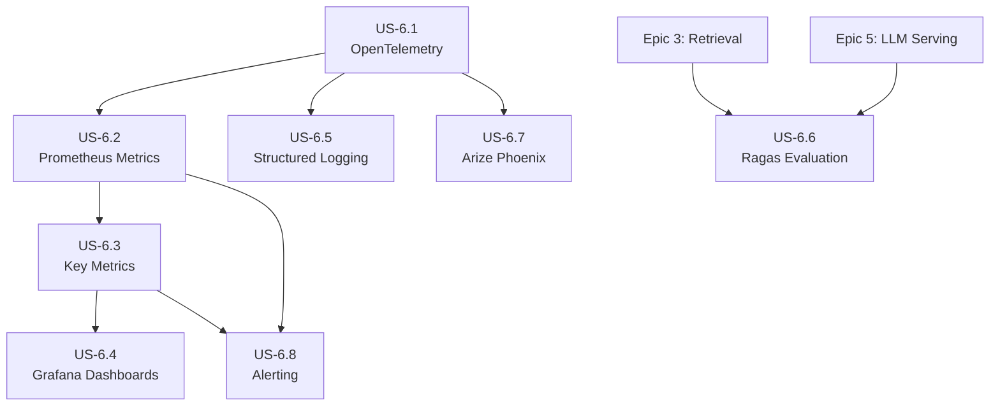
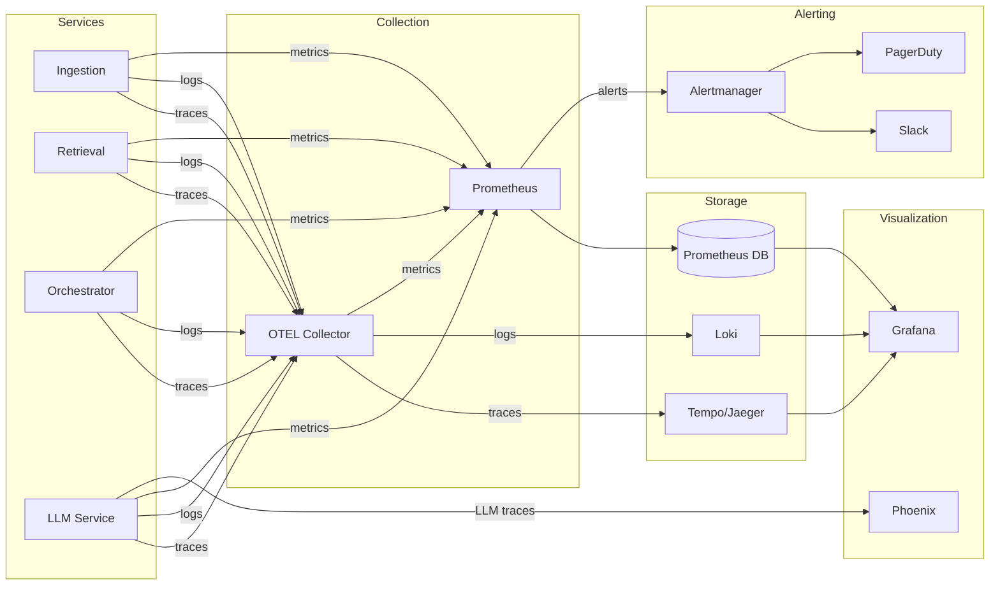

# Epic 6: Observability Stack - Refined User Stories

> **Epic:** Observability Stack  
> **Priority:** High  
> **Total Estimated Effort:** 2-3 weeks  
> **Dependencies:** Epic 1 (Infrastructure Setup)

## Overview

This folder contains detailed, implementation-ready user stories for the Observability Stack. Each story is self-contained with technical requirements, code examples, acceptance criteria, and testing guidelines.

The Observability Stack provides comprehensive visibility into the RAG pipeline through distributed tracing, metrics collection, structured logging, and RAG-specific quality evaluation. It enables debugging, performance monitoring, and continuous quality improvement.

## Architecture Reference

All stories adhere to the [Architecture Document](../../../docs/architecture.md), specifically:

- **Tracing:** OpenTelemetry SDK → OTEL Collector → Jaeger/Tempo
- **Metrics:** Prometheus with custom RAG metrics
- **Logging:** Structured JSON → Loki
- **Dashboards:** Grafana
- **LLM Observability:** Arize Phoenix
- **RAG Evaluation:** Ragas framework
- **Alerting:** Alertmanager → Slack/PagerDuty

### Performance Requirements

| Metric | Target |
|--------|--------|
| Trace sampling | 10% production, 100% errors |
| Metrics scrape interval | 15s |
| Log retention | 30 days |
| Dashboard refresh | 30s |
| Alert evaluation | 30s |

### SLO Targets

| SLO | Target | Window |
|-----|--------|--------|
| Query Latency | 99% < 2s | 30d |
| Availability | 99.9% | 30d |
| LLM TTFT | 95% < 1s | 7d |

## User Stories

| Story | Title | Priority | Effort | Dependencies |
|-------|-------|----------|--------|--------------|
| [US-6.1](US-6.1-opentelemetry-integration.md) | OpenTelemetry Integration | High | 3-4 days | Epic 1 |
| [US-6.2](US-6.2-prometheus-metrics.md) | Prometheus Metrics | High | 2-3 days | US-6.1 |
| [US-6.3](US-6.3-key-metrics-definition.md) | Key Metrics Definition | High | 2 days | US-6.2 |
| [US-6.4](US-6.4-grafana-dashboards.md) | Grafana Dashboards | High | 3-4 days | US-6.2, US-6.3 |
| [US-6.5](US-6.5-structured-logging.md) | Structured Logging | High | 2-3 days | US-6.1 |
| [US-6.6](US-6.6-ragas-evaluation.md) | Ragas Evaluation | High | 3-4 days | Epic 3, Epic 5 |
| [US-6.7](US-6.7-arize-phoenix-integration.md) | Arize Phoenix Integration | Medium | 2-3 days | US-6.1 |
| [US-6.8](US-6.8-alerting.md) | Alerting | High | 2-3 days | US-6.2, US-6.3 |

## Dependency Graph



## Implementation Order

**Recommended sequence:**

1. **US-6.1: OpenTelemetry Integration** - Foundation for all observability
2. **US-6.2: Prometheus Metrics** - Metrics collection infrastructure
3. **US-6.3: Key Metrics Definition** - Define canonical metrics and SLIs
4. **US-6.5: Structured Logging** - JSON logging with trace context (can parallel with US-6.3)
5. **US-6.4: Grafana Dashboards** - Visualization layer
6. **US-6.8: Alerting** - Proactive notification (can parallel with US-6.4)
7. **US-6.7: Arize Phoenix Integration** - LLM-specific observability
8. **US-6.6: Ragas Evaluation** - RAG quality evaluation (requires retrieval/LLM services)

## Service Structure

```
observability/
├── otel/
│   ├── __init__.py
│   ├── tracer.py              # OTEL tracer configuration
│   ├── context.py             # Context propagation
│   ├── spans.py               # Span helpers and decorators
│   ├── attributes.py          # RAG semantic attributes
│   └── middleware/
│       ├── fastapi.py         # FastAPI instrumentation
│       └── celery.py          # Celery task instrumentation
├── metrics/
│   ├── __init__.py
│   ├── registry.py            # Prometheus registry
│   ├── collectors.py          # Custom collectors
│   ├── middleware.py          # FastAPI metrics middleware
│   └── definitions/
│       ├── query_metrics.py
│       ├── retrieval_metrics.py
│       ├── llm_metrics.py
│       └── ingestion_metrics.py
├── logging/
│   ├── __init__.py
│   ├── config.py              # Logging configuration
│   ├── logger.py              # Logger factory
│   ├── formatters.py          # JSON formatters
│   ├── filters.py             # Sensitive data filters
│   └── context.py             # Context injection
├── evaluation/
│   ├── __init__.py
│   ├── ragas_evaluator.py     # Ragas integration
│   ├── datasets.py            # Evaluation datasets
│   ├── pipeline.py            # Evaluation pipeline
│   └── reporters.py           # Result reporters
├── phoenix/
│   ├── __init__.py
│   ├── tracer.py              # Phoenix tracer
│   ├── callbacks.py           # LLM callbacks
│   ├── feedback.py            # Feedback collection
│   └── experiments.py         # A/B tracking
├── alerting/
│   └── rules/
│       ├── rag_alerts.yaml
│       ├── slo_alerts.yaml
│       └── infrastructure_alerts.yaml
├── grafana/
│   └── provisioning/
│       ├── dashboards/
│       │   ├── overview.json
│       │   ├── retrieval.json
│       │   ├── llm.json
│       │   └── slo.json
│       └── datasources/
└── k8s/
    ├── otel-collector.yaml
    ├── prometheus.yaml
    ├── grafana.yaml
    ├── loki.yaml
    ├── alertmanager.yaml
    └── phoenix.yaml
```

## Data Flow



## Key Metrics

| Metric | Type | Description |
|--------|------|-------------|
| `rag_query_duration_seconds` | Histogram | End-to-end query latency |
| `rag_query_total` | Counter | Total queries by status |
| `rag_retrieval_duration_seconds` | Histogram | Retrieval latency by strategy |
| `rag_llm_duration_seconds` | Histogram | LLM inference latency |
| `rag_llm_tokens_total` | Counter | Token usage by model/type |
| `rag_llm_time_to_first_token_seconds` | Histogram | Streaming TTFT |
| `rag_documents_ingested_total` | Counter | Ingestion count |
| `rag_cache_hits_total` | Counter | Cache effectiveness |

## Key Dependencies

```txt
# OpenTelemetry
opentelemetry-api>=1.22.0
opentelemetry-sdk>=1.22.0
opentelemetry-exporter-otlp>=1.22.0
opentelemetry-instrumentation-fastapi>=0.43b0
opentelemetry-instrumentation-httpx>=0.43b0

# Metrics
prometheus-client>=0.19.0

# Logging
python-json-logger>=2.0.0

# Evaluation
ragas>=0.1.0
langchain-openai>=0.0.5
datasets>=2.14.0

# Phoenix
arize-phoenix>=4.0.0
openinference-instrumentation-openai>=0.1.0

# Visualization
grafana>=10.0.0

# Alerting
prometheus>=2.45.0
alertmanager>=0.26.0
```

## Configuration

```python
from pydantic_settings import BaseSettings
from typing import Optional, List

class ObservabilityConfig(BaseSettings):
    # Service
    service_name: str = "rag-pipeline"
    service_version: str = "1.0.0"
    environment: str = "development"
    
    # OpenTelemetry
    otel_collector_endpoint: str = "http://otel-collector:4317"
    otel_sampling_ratio: float = 0.1  # 10% in production
    enable_tracing: bool = True
    enable_metrics: bool = True
    enable_logs: bool = True
    
    # Prometheus
    prometheus_port: int = 9090
    metrics_path: str = "/metrics"
    
    # Logging
    log_level: str = "INFO"
    log_json: bool = True
    log_trace_context: bool = True
    
    # Loki
    loki_url: str = "http://loki:3100"
    
    # Phoenix
    phoenix_enabled: bool = True
    phoenix_endpoint: str = "http://phoenix:6006"
    
    # Alerting
    alertmanager_url: str = "http://alertmanager:9093"
    slack_webhook_url: Optional[str] = None
    pagerduty_key: Optional[str] = None
    
    # Evaluation
    ragas_enabled: bool = True
    ragas_evaluator_model: str = "gpt-4-turbo"
    evaluation_schedule: str = "0 2 * * 0"  # Weekly Sunday 2am
    
    class Config:
        env_prefix = "OBSERVABILITY_"
```

## Dashboards

| Dashboard | Purpose |
|-----------|---------|
| RAG Overview | High-level health: request rate, errors, latency, tokens |
| Retrieval Service | Retrieval latency by strategy, result counts, scores |
| LLM Service | Model latency, TTFT, token usage, costs |
| Ingestion Pipeline | Throughput, queue depth, failures |
| Cache Performance | Hit rates, latency, evictions |
| SLO Dashboard | SLO compliance, error budgets, burn rates |

## Alert Categories

| Category | Examples | Severity |
|----------|----------|----------|
| Request Alerts | High error rate, high latency | Critical/Warning |
| LLM Alerts | Provider errors, rate limiting, high TTFT | Critical/Warning |
| Retrieval Alerts | Low result counts, vector DB issues | Warning |
| Ingestion Alerts | Queue backlog, high failure rate | Warning/Critical |
| SLO Alerts | Fast/slow burn rate on error budget | Critical/Warning |
| Infrastructure | High CPU/memory, disk space, pod restarts | Warning |

## Definition of Done (Epic Level)

- [ ] OTEL SDK integrated in all services
- [ ] Trace context propagates across service boundaries
- [ ] Prometheus scraping all services
- [ ] Custom RAG metrics defined and exposed
- [ ] Grafana dashboards for all components
- [ ] Structured JSON logging with trace correlation
- [ ] Logs aggregated in Loki
- [ ] Ragas evaluation pipeline running weekly
- [ ] Phoenix capturing LLM traces
- [ ] Feedback collection implemented
- [ ] Alert rules for all critical scenarios
- [ ] Alertmanager routing to Slack/PagerDuty
- [ ] Runbooks for all critical alerts
- [ ] SLO burn rate alerts configured
- [ ] 80%+ test coverage across all modules
