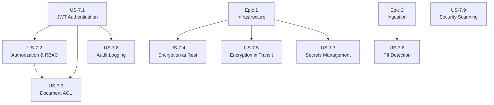

# Epic 7: Security & Compliance - Refined User Stories

> **Epic:** Security & Compliance  
> **Priority:** High  
> **Total Estimated Effort:** 2 weeks  
> **Dependencies:** Epic 1 (Infrastructure), Epic 2-4 (Services)

## Overview

This folder contains detailed, implementation-ready user stories for Security & Compliance. Each story is self-contained with technical requirements, code examples, acceptance criteria, and verification commands to ensure the RAG pipeline meets enterprise security requirements.

## Architecture Reference

All stories adhere to the [Architecture Document](../../../docs/architecture.md), specifically:

- **Authentication:** JWT-based with RS256 signing
- **Authorization:** RBAC with tenant isolation
- **Encryption:** TLS 1.3 in transit, AES-256 at rest
- **PII Detection:** Microsoft Presidio integration
- **Secrets:** HashiCorp Vault or Kubernetes Secrets
- **Audit:** Structured logging with tamper-evident storage

## User Stories

| Story | Title | Priority | Effort | Dependencies |
|-------|-------|----------|--------|--------------|
| [US-7.1](US-7.1-jwt-authentication.md) | JWT Authentication | Critical | 2-3 days | Epic 1 |
| [US-7.2](US-7.2-authorization-rbac.md) | Authorization & RBAC | Critical | 2-3 days | US-7.1 |
| [US-7.3](US-7.3-document-acl.md) | Document ACL | High | 2-3 days | US-7.1, US-7.2 |
| [US-7.4](US-7.4-encryption-at-rest.md) | Encryption at Rest | High | 1-2 days | Epic 1 |
| [US-7.5](US-7.5-encryption-in-transit.md) | Encryption in Transit | High | 1-2 days | Epic 1 |
| [US-7.6](US-7.6-pii-detection.md) | PII Detection & Handling | High | 2-3 days | Epic 2 (Ingestion) |
| [US-7.7](US-7.7-secrets-management.md) | Secrets Management | Critical | 1-2 days | Epic 1 |
| [US-7.8](US-7.8-audit-logging.md) | Audit Logging | High | 2 days | US-7.1 |
| [US-7.9](US-7.9-security-scanning.md) | Security Scanning | Medium | 1-2 days | - |

## Dependency Graph



## Implementation Order

**Recommended sequence:**

1. **US-7.7: Secrets Management** - Foundation for secure credential handling
2. **US-7.4: Encryption at Rest** - Configure data store encryption (can parallel with US-7.7)
3. **US-7.5: Encryption in Transit** - TLS configuration (can parallel with above)
4. **US-7.1: JWT Authentication** - Core authentication layer
5. **US-7.2: Authorization & RBAC** - Permission system (requires US-7.1)
6. **US-7.3: Document ACL** - Document-level access control (requires US-7.1, US-7.2)
7. **US-7.6: PII Detection** - Sensitive data handling (can parallel after US-7.1)
8. **US-7.8: Audit Logging** - Comprehensive audit trail (requires US-7.1)
9. **US-7.9: Security Scanning** - CI/CD security integration

## Security Architecture Structure

```
services/
├── shared/
│   ├── security/
│   │   ├── __init__.py
│   │   ├── jwt/
│   │   │   ├── __init__.py
│   │   │   ├── handler.py          # JWT validation & generation
│   │   │   ├── middleware.py       # FastAPI JWT middleware
│   │   │   └── models.py           # Token claims models
│   │   ├── rbac/
│   │   │   ├── __init__.py
│   │   │   ├── permissions.py      # Permission definitions
│   │   │   ├── roles.py            # Role definitions
│   │   │   └── middleware.py       # Authorization middleware
│   │   ├── acl/
│   │   │   ├── __init__.py
│   │   │   ├── models.py           # ACL data models
│   │   │   ├── service.py          # ACL service
│   │   │   └── filters.py          # Query filters for ACL
│   │   ├── pii/
│   │   │   ├── __init__.py
│   │   │   ├── detector.py         # Presidio integration
│   │   │   ├── handlers.py         # PII handling strategies
│   │   │   └── config.py           # PII detection config
│   │   ├── encryption/
│   │   │   ├── __init__.py
│   │   │   ├── at_rest.py          # Encryption utilities
│   │   │   └── field_encryption.py # Field-level encryption
│   │   ├── audit/
│   │   │   ├── __init__.py
│   │   │   ├── logger.py           # Audit logger
│   │   │   ├── middleware.py       # Audit middleware
│   │   │   └── models.py           # Audit log models
│   │   └── secrets/
│   │       ├── __init__.py
│   │       ├── vault.py            # HashiCorp Vault client
│   │       └── k8s_secrets.py      # K8s secrets client
│   └── database/
│       └── models/
│           ├── audit_log.py        # Audit log table
│           └── acl.py              # ACL tables
├── api-gateway/
│   └── middleware/
│       ├── auth.py                 # Authentication middleware
│       ├── authz.py                # Authorization middleware
│       └── audit.py                # Audit logging middleware
└── ingestion/
    └── processors/
        └── pii_processor.py        # PII processing in pipeline
infrastructure/
├── k8s/
│   ├── secrets/
│   │   ├── sealed-secrets.yaml     # Sealed secrets controller
│   │   └── rag-secrets.yaml        # Application secrets
│   ├── certificates/
│   │   ├── cert-manager.yaml       # Cert-manager config
│   │   └── cluster-issuer.yaml     # Let's Encrypt issuer
│   └── vault/
│       ├── deployment.yaml         # Vault deployment
│       ├── service.yaml            # Vault service
│       └── policies/               # Vault policies
├── security/
│   ├── trivy-config.yaml           # Container scanning config
│   ├── snyk-config.yaml            # Dependency scanning config
│   └── security-policies.yaml      # OPA/Gatekeeper policies
└── scripts/
    ├── rotate-secrets.sh           # Secret rotation script
    ├── audit-export.sh             # Audit log export
    └── security-scan.sh            # Manual security scan
.github/
└── workflows/
    └── security.yml                # Security scanning workflow
```

## Key Dependencies

```txt
# Authentication & Authorization
python-jose[cryptography]>=3.3.0
passlib[bcrypt]>=1.7.4
PyJWT>=2.8.0

# PII Detection
presidio-analyzer>=2.2.0
presidio-anonymizer>=2.2.0
spacy>=3.7.0

# Secrets Management
hvac>=2.1.0                    # HashiCorp Vault client
kubernetes>=28.0.0             # K8s secrets access

# Encryption
cryptography>=41.0.0

# Audit & Logging
structlog>=23.2.0
python-json-logger>=2.0.0

# Security Scanning (CI/CD)
# trivy (container scanning)
# snyk (dependency scanning)
# bandit (SAST for Python)
# semgrep (code analysis)
```

## Security Configuration

### Environment Variables

```bash
# JWT Configuration
JWT_SECRET_KEY=                 # From Vault/Secrets
JWT_ALGORITHM=RS256
JWT_ACCESS_TOKEN_EXPIRE_MINUTES=30
JWT_REFRESH_TOKEN_EXPIRE_DAYS=7
JWT_ISSUER=rag-pipeline
JWT_AUDIENCE=rag-api

# Vault Configuration
VAULT_ADDR=https://vault.rag-pipeline.svc:8200
VAULT_TOKEN=                    # Service token
VAULT_NAMESPACE=rag

# Encryption
ENCRYPTION_KEY=                 # From Vault/Secrets
FIELD_ENCRYPTION_ENABLED=true

# PII Detection
PII_DETECTION_ENABLED=true
PII_HANDLING_MODE=redact        # redact, flag, reject
PII_CONFIDENCE_THRESHOLD=0.8

# Audit
AUDIT_LOG_LEVEL=INFO
AUDIT_RETENTION_DAYS=365
```

## Definition of Done (Epic Level)

- [ ] All endpoints require JWT authentication
- [ ] RBAC enforced with role-based permissions
- [ ] Document ACL filtering working in retrieval
- [ ] All data stores encrypted at rest
- [ ] TLS 1.3 on all external connections
- [ ] mTLS configured for internal services (optional)
- [ ] PII detection integrated in ingestion pipeline
- [ ] Secrets managed via Vault or K8s Secrets
- [ ] Comprehensive audit logs with user identity
- [ ] Security scanning integrated in CI/CD
- [ ] Security runbooks documented
- [ ] Penetration testing scheduled/completed
